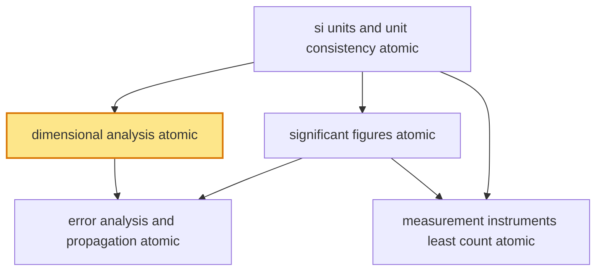

# T2 — Units Measurements  *(Class 11)*

> Dependency-ordered teaching pathway for physics-teacher review.
> **5 atomic + 15 nano = 20 concept-simulations.**  1 💎 diamond (highest-impact).

**How to use this:** teach top-to-bottom. Everything in a level only depends on earlier levels. Each **atomic** is a full teachable idea (= one simulation); the **↳ nanos** under it are its sub-points (one symbol / term / edge-case each).

**Foundations (teach first, nothing in this chapter comes before them):** si_units_and_unit_consistency_atomic

## Concept dependency graph (atomic backbone)

## Teaching pathway (dependency-ordered)

### Level 0 — foundations

- **`si_units_and_unit_consistency_atomic`** — The **7 SI base units** (metre, kilogram, second, ampere, kelvin, mole, candela) and how every **derived unit** (N = kg·m/s², J = N·m, ...) is built from them. **Unit consistency** is the zeroth-order check on any equation; the **factor-label method** uses units as an algebraic derivation tool.  _(targets misconception: units are droppable labels)_
  - ↳ `seven_base_units_nano` — The 7 base quantities + their SI units + symbols; every other physical quantity is derived. Why exactly 7 (independence — none derivable from the others).
  - ↳ `unit_conversion_factor_label_nano` — Convert via multiplying by 1 in disguise (e.g., 72 km/h × (1000 m/km) × (1 h/3600 s) = 20 m/s). Units cancel like algebra; the method PREVENTS conversion errors.
  - ↳ `si_redefinition_2019_nano` — 2019 SI redefinition: kg now fixed via Planck constant h (no physical artefact); ampere via electron charge e; kelvin via Boltzmann k. **Modern Indian-relevant anchor**: CSIR-NPL realises the new kg with a Kibble balance. Constants, not objects, define units.

### Level 1

- **`dimensional_analysis_atomic`** 💎 — The **dimensional formula** [MᵃLᵇTᶜ...] of a quantity; the **principle of homogeneity** (every additive term in a valid equation has identical dimensions). Three legitimate uses: (1) CHECK an equation; (2) CONVERT units between systems; (3) DERIVE a relation UP TO a dimensionless constant. The universal sanity-check applied implicitly across all of physics.  _(targets misconception: gives complete formula incl. constants)_
  - ↳ `principle_of_homogeneity_nano` — Every additive term in a physically valid equation carries the SAME dimensions (you cannot add a length to a time). The instant equation-validity test: if the terms don't match dimensionally, the equation is WRONG (necessary, not sufficient).
  - ↳ `deriving_relations_dimensionally_nano` — Find the FORM of a relation by matching powers: T = k·mᵃ·lᵇ·gᶜ → solve a,b,c by dimensional balance → T = k√(l/g). **The k (= 2π here) is NOT obtainable** — must come from theory/experiment. The power-matching method.
  - ↳ `dimensional_limitations_nano` — Three hard failures: (a) cannot find dimensionless constants (½, 2π, sin's coefficient); (b) cannot handle multi-term-of-unknown-form equations; (c) arguments of sin/cos/log/exp MUST be dimensionless (ωt is fine; t alone inside sin is dimensionally illegal). **The single most-tested conceptual trap.**
- **`significant_figures_atomic`** — The digits that carry real measurement information. Counting rules (non-zero always count; captive zeros count; leading zeros never; trailing zeros after a decimal count). The **asymmetric arithmetic rule**: +/− keeps the least DECIMAL PLACES; ×/÷ keeps the least SIG-FIG COUNT.  _(targets misconception: decimal places = precision)_
  - ↳ `sig_fig_counting_rules_nano` — Leading zeros (0.0025 → 2 sf) vs captive zeros (1002 → 4 sf) vs trailing zeros (2.50 → 3 sf; 2500 → ambiguous, use scientific notation 2.5×10³). Scientific notation removes ambiguity.
  - ↳ `sig_figs_in_arithmetic_nano` — The asymmetric rule in action: 12.11 + 0.3 = 12.4 (1 decimal place); 4.32 × 1.1 = 4.8 (2 sf). The weakest measurement caps the result's precision.
  - ↳ `rounding_convention_nano` — Standard rounding (≥5 rounds up); only round the FINAL answer, never intermediate steps (intermediate rounding compounds error). Carry a guard digit.

### Level 2

- **`error_analysis_and_propagation_atomic`** — **Absolute error** Δx, **relative error** Δx/x, **percentage error** (Δx/x)×100. Propagation: errors ADD (absolute) for sums/differences; RELATIVE errors add for products/quotients; for Z = (A^p B^q)/C^r the relative error = p(ΔA/A) + q(ΔB/B) + r(ΔC/C). The exponent MULTIPLIES the relative error.  _(targets misconception: errors always just add)_
  - ↳ `combination_of_errors_nano` — Derivation of the propagation rules from differentials: for Z = A·B, dZ/Z = dA/A + dB/B (relative errors add). The power rule from Z = Aⁿ: ΔZ/Z = n·(ΔA/A).
  - ↳ `percentage_error_worked_nano` — Worked: density ρ = m/V; m = 5.00 ± 0.01 g (0.2%), V = 4.0 ± 0.1 cm³ (2.5%) → Δρ/ρ = 0.2% + 2.5% = 2.7%. **The volume measurement dominates** — improving the balance is wasted effort. Error budgeting.
  - ↳ `least_count_sets_minimum_error_nano` — The instrument's least count is the floor on absolute error for a single reading. A vernier reading to 0.01 cm cannot claim 0.001 cm precision. Connects instrument choice → achievable error.
- **`measurement_instruments_least_count_atomic`** — **Least count** = smallest measurable division. **Vernier caliper** LC = 1 MSD − 1 VSD (typically 0.01 cm). **Screw gauge** LC = pitch / number-of-circular-divisions (typically 0.001 cm). **Zero error** (systematic; subtract it). **Accuracy** (closeness to true value) vs **precision** (repeatability/spread) — independent qualities.  _(targets misconception: accuracy = precision)_
  - ↳ `vernier_screw_gauge_reading_nano` — Vernier: main-scale reading + (coinciding vernier division × LC). Screw gauge: main-scale + (circular-scale × LC), watch for backlash. The two workhorse Indian-physics-lab instruments.
  - ↳ `accuracy_vs_precision_nano` — Bullseye picture: tight cluster off-centre = precise-but-inaccurate (systematic error / zero error); scattered around centre = accurate-but-imprecise (random error). The two are independent; good measurement needs both.
  - ↳ `zero_error_correction_nano` — A screw gauge reading 0.002 cm with jaws closed has +0.002 cm zero error → SUBTRACT from every reading. Systematic (not random) — repeating the measurement does NOT average it out.
