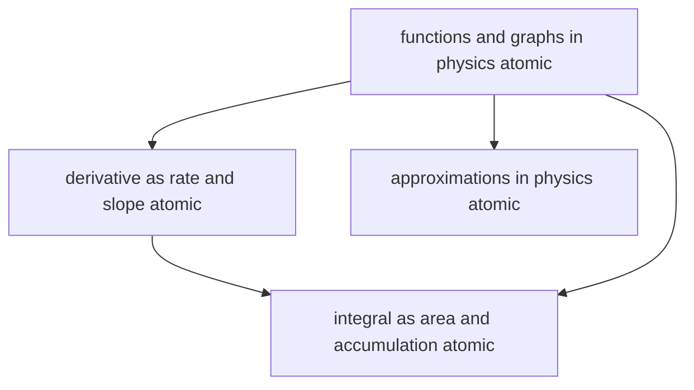

# T3 — Mathematical Tools  *(Class 11)*

> Dependency-ordered teaching pathway for physics-teacher review.
> **4 atomic + 11 nano = 15 concept-simulations.**

**How to use this:** teach top-to-bottom. Everything in a level only depends on earlier levels. Each **atomic** is a full teachable idea (= one simulation); the **↳ nanos** under it are its sub-points (one symbol / term / edge-case each).

**Foundations (teach first, nothing in this chapter comes before them):** functions_and_graphs_in_physics_atomic

## Concept dependency graph (atomic backbone)

## Teaching pathway (dependency-ordered)

### Level 0 — foundations

- **`functions_and_graphs_in_physics_atomic`** — The 5 canonical physics function-shapes and how to READ them: **linear** (y = mx + c — slope m + intercept c), **quadratic** (parabola — e.g. projectile y vs x), **inverse** (1/x — e.g. Coulomb, Boyle), **sinusoidal** (A sin(ωt + φ) — SHM, waves, AC), **exponential** (e^(±t/τ) — decay/growth). Extract physics from slope, intercept, area, and curvature.  _(targets misconception: graph is just a picture)_
  - ↳ `slope_and_intercept_reading_nano` — From a straight-line graph: slope = Δy/Δx (with composite units, e.g. v-t slope is m/s² = acceleration); intercept = value at x = 0 (physical initial condition). Reading physics OFF the line.
  - ↳ `common_physics_function_shapes_nano` — The 5 shapes mapped to physics: linear (uniform motion), parabola (projectile/accelerated), 1/x (inverse-square fields, Boyle), sine (oscillation/wave), exponential (RC/radioactivity). Recognising the shape names the physics.
  - ↳ `linearising_graphs_nano` — Convert a curved relation to a straight line to extract constants: plot T² vs l (not T vs l) for a pendulum → slope gives g; log-log plots for power laws. **The core Indian-physics-lab data-analysis skill.**

### Level 1

- **`derivative_as_rate_and_slope_atomic`** — The derivative dy/dx = **slope of the tangent** to the y(x) curve; d/dt = **instantaneous rate of change**. Physics meaning: v = dx/dt, a = dv/dt, I = dq/dt, P = dW/dt, F = dp/dt. The standard-derivatives table (xⁿ, sin, cos, eˣ) is downstream of this geometric/rate meaning.  _(targets misconception: derivative is just a formula to memorise)_
  - ↳ `slope_of_tangent_nano` — Geometric meaning: the derivative at a point = the slope of the line just touching the curve there. Secant → tangent as Δx → 0. The limit definition made visual.
  - ↳ `standard_derivatives_table_nano` — d(xⁿ)/dx = nxⁿ⁻¹; d(sin x)/dx = cos x; d(cos x)/dx = −sin x; d(eˣ)/dx = eˣ; chain + product rule. The operational toolkit — but taught AFTER the slope/rate meaning.
  - ↳ `derivative_in_physics_nano` — The recurring physics derivatives: v = dx/dt (speedometer reads this), a = dv/dt, I = dq/dt, P = dW/dt, F = dp/dt. Each is a RATE the student already intuits before the calculus.
- **`approximations_in_physics_atomic`** — **Controlled** approximations that extract leading behaviour: **small-angle** (sin θ ≈ tan θ ≈ θ, cos θ ≈ 1 for θ ≪ 1 rad) and **binomial** ((1 + x)ⁿ ≈ 1 + nx for x ≪ 1). The WHY (keep the dominant term, drop negligible ones) and the validity boundary (~0.1 rad ≈ 6° for ~1% error). Physics is BUILT on these (SHM, paraxial optics, g at small height).  _(targets misconception: approximations are sloppy / less correct)_
  - ↳ `small_angle_approximation_nano` — For θ ≪ 1 rad: sin θ ≈ θ, tan θ ≈ θ, cos θ ≈ 1 − θ²/2 ≈ 1. Validity ~0.1 rad (≈ 6°) for ~1% accuracy. The reason the pendulum is SHM ONLY for small swings. **Must use radians.**
  - ↳ `binomial_first_order_nano` — (1 + x)ⁿ ≈ 1 + nx for x ≪ 1 (any real n). Used for g(h) = g(1 + h/R)⁻² ≈ g(1 − 2h/R) at small height; relativistic + index-of-refraction expansions. Keep the leading correction, drop x².

### Level 2

- **`integral_as_area_and_accumulation_atomic`** — The definite integral ∫ₐᵇ f(x) dx = **area under the f(x) curve** = **accumulated total**. Physics meaning: displacement = ∫v dt (area under v-t), work = ∫F dx (area under F-x), charge = ∫I dt, impulse = ∫F dt. The **Fundamental Theorem** links it to the derivative as the inverse operation.  _(targets misconception: integration & differentiation unrelated)_
  - ↳ `area_under_curve_nano` — The integral as the limit of summed rectangles (Riemann sum) → exact area. For a v-t graph the area IS the displacement; for an F-x graph the area IS the work. Area carries physical meaning.
  - ↳ `fundamental_theorem_link_nano` — Integration UNDOES differentiation: if v = dx/dt then x = ∫v dt + x₀. The derivative gives the rate; the integral accumulates it back. **The two operations are inverses** — the deepest conceptual point of T3.
  - ↳ `integral_in_physics_nano` — The recurring physics integrals: displacement = ∫v dt (odometer accumulates this), work = ∫F·dx, charge = ∫I dt, impulse = ∫F dt, ISRO trajectory = numerically-integrated acceleration.
