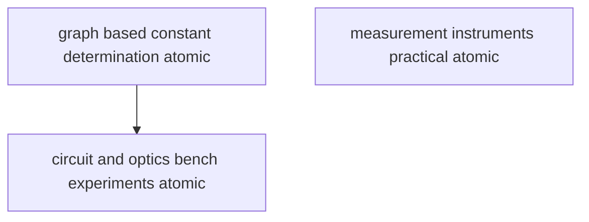

# T4 — Lab Experiments  *(Class 11)*

> Dependency-ordered teaching pathway for physics-teacher review.
> **3 atomic + 10 nano = 13 concept-simulations.**

**How to use this:** teach top-to-bottom. Everything in a level only depends on earlier levels. Each **atomic** is a full teachable idea (= one simulation); the **↳ nanos** under it are its sub-points (one symbol / term / edge-case each).

**Foundations (teach first, nothing in this chapter comes before them):** graph_based_constant_determination_atomic, measurement_instruments_practical_atomic

## Concept dependency graph (atomic backbone)

## Teaching pathway (dependency-ordered)

### Level 0 — foundations

- **`graph_based_constant_determination_atomic`** — THE core experimental skill: take a physical relation, **linearise** it (choose axes so the plot is a straight line), plot the data, draw the **best-fit line**, and extract a physical constant from the **slope** (or intercept). The graph IS the measurement instrument — it averages out random scatter and exposes systematic trends.  _(targets misconception: the graph is just for plotting marks)_
  - ↳ `pendulum_g_nano` — Simple pendulum: time N oscillations (reduces reaction-time error), compute T, plot **T² vs l** (a straight line through origin), slope = 4π²/g → solve for g. Amplitude must stay small (SHM validity, links to T17 + T3 small-angle). The canonical "find a constant from a slope" experiment.
  - ↳ `youngs_modulus_searle_nano` — Searle's apparatus: hang increasing loads on a wire, measure extension with a vernier/micrometer, plot **extension vs load** (straight line), slope + wire geometry → Young's modulus Y. Links to T18 elasticity (stress/strain).
  - ↳ `spring_constant_nano` — Loaded spring: plot **extension vs load** → slope = 1/k (Hooke's law); OR oscillation **T² vs mass** → slope = 4π²/k. Two routes to k; cross-check. Links to T17 SHM.
- **`measurement_instruments_practical_atomic`** — The PROCEDURAL skill of reading precision instruments: **vernier caliper** (main-scale reading + coinciding-vernier-division × least count), **screw gauge** (main-scale + circular-scale × least count, watch for backlash), **spherometer** (for radius of curvature). Distinct from the least-count CONCEPT (T2) — this is the hands-on reading technique.  _(targets misconception: knowing the LC formula = being able to read it)_
  - ↳ `vernier_reading_technique_nano` — Read the main scale just before the zero of the vernier; find the vernier division that COINCIDES with a main-scale line; reading = MSR + (coinciding division × LC). Parallax-free viewing (eye perpendicular).
  - ↳ `screw_gauge_reading_technique_nano` — Rotate the ratchet (not the thimble) to avoid over-tightening; read main-scale + (circular-scale × LC); account for backlash error (always rotate one way). Watch for zero error (correct per T2).
  - ↳ `error_sources_per_experiment_nano` — Every experiment has characteristic error sources: pendulum (large amplitude breaks SHM; reaction-time → time many oscillations); Searle's (temperature drift, wire kinks); metre-bridge (end-corrections, jockey pressure). **Repetition cuts RANDOM error but NOT systematic error** — systematic sources must be identified + corrected separately.  _(targets misconception: more readings = more accuracy)_

### Level 1

- **`circuit_and_optics_bench_experiments_atomic`** — The bench-experiment skill set: **electrical** (metre bridge + potentiometer for resistance/EMF comparison; Ohm's-law verification) and **optical** (focal length of lens/mirror by u-v method; refractive index by real/apparent-depth or by travelling microscope). Each combines an instrument-reading skill with a graph/calculation.
  - ↳ `metre_bridge_resistance_nano` — Wheatstone-bridge principle on a 1 m wire: balance point gives unknown resistance R = R_known × (l/(100−l)). End-corrections are the key systematic error (interchange known/unknown to cancel). Links to T34 Kirchhoff/Wheatstone.
  - ↳ `potentiometer_emf_nano` — Potentiometer compares EMFs (or measures internal resistance) by null-deflection — no current drawn at balance, so it reads TRUE EMF (unlike a voltmeter). Balance length ∝ EMF. Links to T34.
  - ↳ `lens_focal_length_uv_nano` — Lens u-v method: measure several (u, v) pairs, plot **1/v vs 1/u** (straight line) → intercepts give 1/f; OR plot v vs u and use the lens formula. Combines bench-reading + graph-method. Links to T42.
  - ↳ `refractive_index_real_apparent_depth_nano` — Travelling microscope: focus on a mark, then on it through a glass slab; real depth / apparent depth = refractive index n. A direct single-measurement n. Links to T42 refraction.
