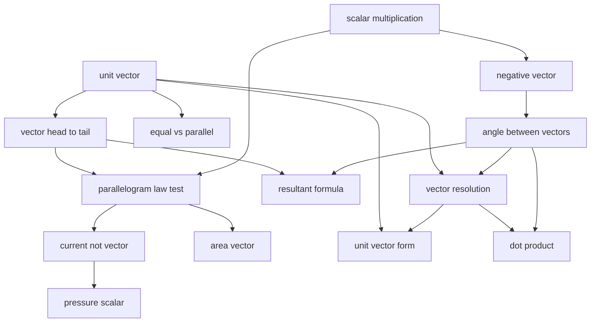

# T5 — Vectors  *(Class 11)*

> Dependency-ordered teaching pathway for physics-teacher review.
> **14 atomic + 5 nano = 19 concept-simulations.**

**How to use this:** teach top-to-bottom. Everything in a level only depends on earlier levels. Each **atomic** is a full teachable idea (= one simulation); the **↳ nanos** under it are its sub-points (one symbol / term / edge-case each).

**Foundations (teach first, nothing in this chapter comes before them):** unit_vector, scalar_multiplication

## Concept dependency graph (atomic backbone)

## Teaching pathway (dependency-ordered)

### Level 0 — foundations

- **`unit_vector`** — A vector of magnitude 1 that carries direction only; any vector = (magnitude) × (unit vector). Notation â = A/\|A\|. The basis of all component work.
- **`scalar_multiplication`** — Multiplying a vector by scalar k scales its magnitude by \|k\| and keeps direction if k>0, reverses it if k<0.

### Level 1

- **`negative_vector`** — −A is A with the same magnitude but opposite direction (the k=−1 case of scalar multiplication). A + (−A) = 0.
- **`vector_head_to_tail`** — Geometric (triangle) addition: place the tail of B at the head of A; the arrow from A's tail to B's head is the resultant. Generalises to the polygon law.
- **`equal_vs_parallel`** — Equal vectors: same magnitude AND direction (position irrelevant). Parallel: same direction, any magnitude. Distinguishes "equal" from "parallel/collinear."  _(targets misconception: vectors at different points can't be equal)_

### Level 2

- **`angle_between_vectors`** — Protocol: bring both vectors to a common tail, arrows pointing outward; the angle between them is ≤ 180°. Critical for dot/cross products and resultant direction.  _(targets misconception: measure the angle without moving both to one tail)_
- **`parallelogram_law_test`** — The definitive test for whether a quantity is a vector: it must add by the parallelogram (equivalently triangle) law AND obey scalar multiplication. Direction alone is not enough.

### Level 3

- **`current_not_vector`** — Electric current has a direction (along the wire) yet is a SCALAR — at a junction currents add algebraically (Kirchhoff), not by the parallelogram law. The counterexample that defines "vector."  _(targets misconception: anything with direction is a vector)_
- **`area_vector`** — Area is a scalar (size of a surface) but can be promoted to a vector A = A n̂ (magnitude × outward normal) — the form used for flux. Two faces of one quantity.
- **`resultant_formula`** — Magnitude of A + B from the law of cosines: \|R\| = √(A² + B² + 2AB cos θ). Why scalar addition fails when θ ≠ 0.
  - ↳ `special_cases` — The three shortcuts: θ=0° → R = A+B; θ=90° → R = √(A²+B²); θ=180° → R = \|A−B\|.
  - ↳ `range_inequality` — The resultant is bounded: \|A−B\| ≤ R ≤ A+B. Maximum when parallel, minimum when antiparallel.
  - ↳ `direction_of_resultant` — The resultant's direction: tan α = B sin θ / (A + B cos θ), measured from A.
- **`vector_resolution`** — Splitting a vector into perpendicular components A_x = A cos θ, A_y = A sin θ; choosing axes to simplify a problem; recovering the vector by Pythagoras. The workhorse of all 2D physics.
  - ↳ `inclined_plane_components` — Resolving weight on a slope: mg sin θ along the incline, mg cos θ perpendicular. The canonical resolution application.
  - ↳ `negative_components` — Components carry signs that track direction (e.g. a vector in the 2nd quadrant has negative x-component); sign ≠ size.

### Level 4

- **`pressure_scalar`** — Pressure pushes in all directions at a point yet is a SCALAR; the vector is the FORCE on a chosen surface, F = P·(A n̂). Distinguishes the scalar field from the vector it generates.  _(targets misconception: pressure has a direction so it's a vector)_
- **`unit_vector_form`** — Writing a vector in î, ĵ, k̂ form: A = A_x î + A_y ĵ + A_z k̂. The algebraic representation behind component addition and products.
- **`dot_product`** — Scalar product A·B = \|A\|\|B\| cos θ = A_x B_x + A_y B_y + A_z B_z. Geometric meaning (projection/overlap); zero ⇔ perpendicular.
