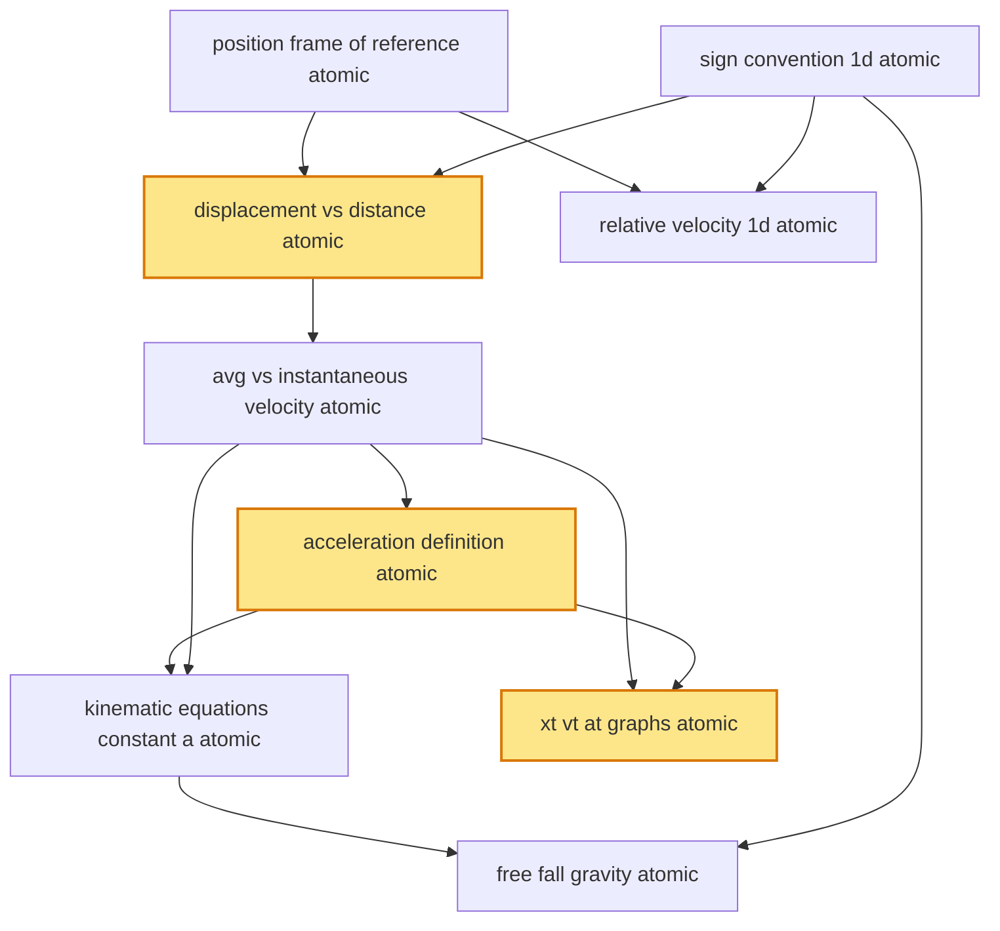

# T6 — Kinematics 1D  *(Class 11)*

> Dependency-ordered teaching pathway for physics-teacher review.
> **9 atomic + 17 nano = 26 concept-simulations.**  3 💎 diamond (highest-impact).

**How to use this:** teach top-to-bottom. Everything in a level only depends on earlier levels. Each **atomic** is a full teachable idea (= one simulation); the **↳ nanos** under it are its sub-points (one symbol / term / edge-case each).

**Foundations (teach first, nothing in this chapter comes before them):** position_frame_of_reference_atomic, sign_convention_1d_atomic

## Concept dependency graph (atomic backbone)

## Teaching pathway (dependency-ordered)

### Level 0 — foundations

- **`position_frame_of_reference_atomic`** — A particle's location specified by coordinates relative to a chosen origin + axes. **Frame of reference** = the coordinate system + clock from which observations are made. Motion is always relative to a frame; "absolute" rest does not exist.
  - ↳ `origin_choice_arbitrary_nano` — Choice of origin is arbitrary — physics doesn't change. **What changes**: numerical values of x, v(if moving frame), a(if accelerating frame). **What stays the same**: relative-positions, time-intervals, accelerations between inertial frames.
  - ↳ `inertial_vs_noninertial_frame_nano` — **Inertial frame**: a frame in which Newton's 1st law holds (free particle moves uniformly). **Non-inertial frame**: accelerating frame (e.g., braking-car frame); pseudo-forces appear. Examples: ground-frame, train-moving-uniform-velocity = inertial; train-braking = non-inertial.
- **`sign_convention_1d_atomic`** — **Pick a positive direction** (typically +x to the right, +y up). **EVERY quantity carries that sign**: position x, velocity v, acceleration a, force F, displacement Δx. Once chosen, stay consistent throughout the problem. **Foundation rule for all sign-bearing physics quantities downstream** (E, B, I, q, P, M_torque).  _(targets misconception: g is always −9.81)_
  - ↳ `pick_axis_first_then_substitute_nano` — Worked-example pedagogy: **(a) declare** "+x to the right"; **(b) write** all knowns with explicit sign (u = +5 m/s, a = −2 m/s²); **(c) substitute** into kinematic eq. **Common error**: dropping signs midway through problem. Mandatory checklist nano.

### Level 1

- **`displacement_vs_distance_atomic`** 💎 — **Displacement** Δx = x_final − x_initial (vector in 1D = signed scalar). **Distance** = path length traversed (scalar, always ≥ 0). For round-trip: displacement = 0; distance = 2·(path length). Distance ≥ |displacement| always.  _(targets misconception: displacement = distance always)_
  - ↳ `round_trip_displacement_zero_nano` — Bengaluru→Mumbai→Bengaluru: distance = 2 × 980 km ≈ 1960 km; displacement = 0. Tabla-player travels back-and-forth between two notes: musically meaningful path; net displacement zero. **Cognitive scaffold** distinguishing scalar accumulation from vector return.
  - ↳ `negative_displacement_meaning_nano` — Choose +x to the right. Object moves 3m right then 7m left: x_final − x_initial = (0+3−7) − 0 = −4 m. Negative displacement = position now LEFT of start. Sign carries direction.
- **`relative_velocity_1d_atomic`** — Velocity of A relative to B: **v_AB = v_A − v_B**. If A moves at +30 m/s and B at +20 m/s (both rightward): v_AB = +10 m/s (A appears to recede from B at 10 m/s). If they move toward each other: signs differ → magnitudes add. **1D preview of T7 2D vector relative motion.**  _(targets misconception: subtract speeds, ignore direction)_
  - ↳ `train_passing_observer_nano` — Two-train passing: same-direction (Mumbai-Delhi Rajdhani 110 km/hr passes goods 50 km/hr): relative speed = 60 km/hr; time to pass = (sum of lengths)/(rel speed). Opposite-direction: speeds add. **Classic Indian-railway-context problem.**
  - ↳ `pursuit_problem_nano` — Pursuer at distance d, speed v_p; target at speed v_t (same direction, v_p > v_t). Catch-up time = d / (v_p − v_t). **Common JEE/NEET pattern.**

### Level 2

- **`avg_vs_instantaneous_velocity_atomic`** — **Average velocity** v_avg = Δx/Δt over finite interval. **Instantaneous velocity** v = dx/dt = lim_{Δt→0} Δx/Δt. **Speed** = |v| = magnitude only (scalar). Average velocity ≠ average speed in general (round-trip: v_avg = 0 but avg speed ≠ 0).  _(targets misconception: v_avg = (v₁+v₂)/2 always)_
  - ↳ `instantaneous_as_slope_of_xt_nano` — Geometrically: v(t) at instant t = slope of x-t graph at that point. Tangent-line construction. **CBSE/ISC physics-practical lab**: students sketch x-t curves and compute slopes at chosen instants.
  - ↳ `average_velocity_vs_average_speed_nano` — Mumbai-Pune Expressway: drive 150 km in 3 hr (Mumbai→Pune). Then drive back 150 km in 2 hr. **Average velocity** = (0 km displacement) / (5 hr) = 0. **Average speed** = (300 km) / (5 hr) = 60 km/hr. Two different scalars; both useful, different questions.

### Level 3

- **`acceleration_definition_atomic`** 💎 — **Acceleration** a = dv/dt = rate of change of velocity. Average acceleration a_avg = Δv/Δt; instantaneous a = lim_{Δt→0} Δv/Δt. **Sign carries direction**: positive a means v increasing in +x direction (if v already +); but if v is −, positive a means v becoming LESS NEGATIVE (slowing down then reversing).  _(targets misconception: negative a always means slowing down)_
  - ↳ `sign_of_a_vs_sign_of_v_2x2_matrix_nano` — **4 cases** (with +x as positive): (a>0, v>0) → speeding up forward; (a>0, v<0) → slowing down then reversing forward; (a<0, v>0) → slowing down then reversing backward; (a<0, v<0) → speeding up backward. **Diamond-candidate animation**: 2×2 grid showing object behaviour each case.
  - ↳ `deceleration_vs_negative_acceleration_nano` — **Deceleration** = magnitude of acceleration opposing velocity. **Negative acceleration** = a < 0 in chosen sign convention. These are NOT synonyms. A car moving left (v < 0) with brakes (a > 0): "decelerating" but positive a.

### Level 4

- **`kinematic_equations_constant_a_atomic`** — When acceleration is constant: **(1) v = u + at**; **(2) s = ut + ½at²**; **(3) v² = u² + 2as**. All three derive from integrating a = constant; they are three rearrangements (one for each unknown). **Use what's given.** Also **s_n = u + ½a(2n−1)** for displacement in nth second.  _(targets misconception: memorise three formulas)_
  - ↳ `s_n_displacement_in_nth_second_nano` — Displacement during the nth second (between t=n−1 and t=n) = u + ½a(2n−1). **Common JEE/NEET problem-template**. Derive from s_n = s(n) − s(n−1) using eq.(2).
  - ↳ `choice_of_equation_by_given_unknown_nano` — If given (u, a, t) → use (1) for v. If given (u, a, t) → use (2) for s. If given (u, a, s) → use (3) for v. If given (v, u, s) → use (3) for a. **Decision-tree pedagogy** rather than blind memorisation.
- **`xt_vt_at_graphs_atomic`** 💎 — Three synchronised views of same motion: **x-t graph** position vs time; **v-t graph** velocity vs time; **a-t graph** acceleration vs time. Relationships: slope of x-t = v(t); slope of v-t = a(t); area under v-t between t₁ and t₂ = Δx; area under a-t = Δv.
  - ↳ `shape_decoder_table_nano` — x-t straight line = uniform v; x-t parabola opening up = positive a; x-t curve flattening = decelerating; v-t horizontal = zero a (uniform motion); v-t straight rising = constant positive a; v-t straight falling = constant negative a. **Cognitive scaffold**: shape ↔ physical meaning table.
  - ↳ `area_under_vt_equals_displacement_nano` — ∫_{t₁}^{t₂} v(t) dt = x(t₂) − x(t₁) = Δx. Geometric interpretation: signed area under v-t curve gives signed displacement. **Negative areas** (below t-axis) = negative displacement (motion in −x direction).

### Level 5

- **`free_fall_gravity_atomic`** — Specialisation of constant-a kinematics: a = g downward (= 9.81 m/s² near Earth surface; round to 10 for problems). Drop from rest: v = gt; s = ½gt²; v² = 2gs. Throw up with u: max-height at t = u/g; max-height = u²/(2g); time-of-flight (return to start) = 2u/g.  _(targets misconception: heavier objects fall faster)_
  - ↳ `feather_coin_vacuum_demo_nano` — Aristotle: heavier falls faster (incorrect). Galileo (~1590): all bodies fall at same rate in absence of air. **Bell-jar + feather + coin demonstration**: with air, coin lands first; with vacuum, both land together. **CBSE Class-11 lab demo** + Apollo-15 hammer-feather on Moon (David Scott, 1971; relevant for Chandrayaan-curious students).
  - ↳ `thrown_up_kinematics_nano` — Object thrown up with u (+y up): max-height at t = u/g, v = 0; max-height = u²/(2g); returns with same speed |u| at t = 2u/g, v = −u. **Symmetric in time** (up-down) but NOT in distance (max-height reached once).
