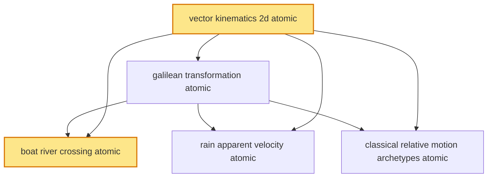

# T7 — Kinematics 2D Relative Motion  *(Class 11)*

> Dependency-ordered teaching pathway for physics-teacher review.
> **5 atomic + 16 nano = 21 concept-simulations.**  2 💎 diamond (highest-impact).

**How to use this:** teach top-to-bottom. Everything in a level only depends on earlier levels. Each **atomic** is a full teachable idea (= one simulation); the **↳ nanos** under it are its sub-points (one symbol / term / edge-case each).

**Foundations (teach first, nothing in this chapter comes before them):** vector_kinematics_2d_atomic

## Concept dependency graph (atomic backbone)

## Teaching pathway (dependency-ordered)

### Level 0 — foundations

- **`vector_kinematics_2d_atomic`** 💎 — Position **r⃗(t) = x(t) î + y(t) ĵ**; velocity **v⃗ = dr⃗/dt = (dx/dt) î + (dy/dt) ĵ**; acceleration **a⃗ = dv⃗/dt**. **Componentwise principle**: in absence of constraints, x-motion and y-motion are INDEPENDENT — each obeys 1D kinematics separately.
  - ↳ `2d_kinematic_equations_componentwise_nano` — Same three kinematic equations as 1D applied independently to x and y: v_x = u_x + a_x·t; v_y = u_y + a_y·t; x = x₀ + u_x·t + ½·a_x·t²; y = y₀ + u_y·t + ½·a_y·t². **No new formulas** — just two parallel applications of 1D machinery.  _(targets misconception: 2D needs new formulas)_
  - ↳ `parametric_2d_trajectory_nano` — Eliminate t between x(t) and y(t) → trajectory y(x). For constant a⃗: trajectory is parabola in general. **Geometric vs kinematic dual representation.** Bridge to T8 projectile-motion trajectory derivation.
  - ↳ `vector_displacement_magnitude_direction_nano` — |Δr⃗| = √(Δx² + Δy²); direction θ = arctan(Δy/Δx). **Pythagoras + arctan applied to displacement**. Same idea applies to velocity, acceleration.

### Level 1

- **`galilean_transformation_atomic`** — Two inertial frames S and S' with S' moving at constant velocity v⃗_S'S relative to S. **Velocity transformation:** v⃗_PS = v⃗_PS' + v⃗_S'S (velocity of particle in S = velocity in S' + velocity of S' wrt S). **Acceleration is invariant:** a⃗ same in all inertial frames. **Time is invariant** (classical, pre-relativistic).
  - ↳ `velocity_subtraction_for_relative_v_nano` — **v⃗_AB = v⃗_A − v⃗_B** (velocity of A in B's frame). Same formula in 1D and 2D. Vector subtraction = magnitude + direction (not just magnitude).
  - ↳ `acceleration_invariance_inertial_nano` — a⃗_PS = a⃗_PS' (acceleration the same in all inertial frames). **Why F⃗ = ma⃗ holds in any inertial frame** (Newton 1st-law statement). Bridge to T11.
  - ↳ `time_invariance_classical_nano` — Δt is the same for all inertial observers (classical). **Breaks down in special relativity** (v approaching c) — flagged for V2 advanced extension. For all Indian-curriculum physics (NCERT, JEE, NEET): time-invariance holds.

### Level 2

- **`boat_river_crossing_atomic`** 💎 — Boat velocity v_b in still water; river current v_r downstream. **Resultant velocity** v⃗_actual = v⃗_b + v⃗_r. **Two distinct optimisations:** (a) **Shortest time**: boat heads straight across (perpendicular to bank); time = w/v_b; drift downstream = (v_r·w)/v_b. (b) **Shortest path** (= width w, no drift): boat heads upstream at angle θ such that v_b·sin(θ) = v_r; time = w/(v_b·cos(θ)) > w/v_b.  _(targets misconception: shortest time = shortest path)_
  - ↳ `shortest_time_drift_calculation_nano` — Shortest time: head perpendicular. **Crossing-time t = w / v_b** (independent of river current). **Drift x = v_r · t = (v_r · w) / v_b**. Lands x downstream of starting point. Goa-river-tourism-context-anchor.
  - ↳ `shortest_path_angle_calculation_nano` — Shortest path (no drift): need v⃗_actual perpendicular to current → v_b·sin(θ) = v_r → **θ = arcsin(v_r / v_b)**. Requires v_b > v_r (else cannot avoid drift). Crossing time = w / (v_b · cos(θ)) > w/v_b. **Slower crossing trades time for zero drift.**
  - ↳ `feasibility_v_b_greater_v_r_nano` — If v_b ≤ v_r: shortest-path solution doesn't exist (boat cannot make headway upstream). Boat drifts regardless of heading. **Real-world example**: Brahmaputra in monsoon (current ~10 km/hr, slow boat 5 km/hr) — boats CANNOT cross straight; drift is unavoidable.
- **`rain_apparent_velocity_atomic`** — Rain falls with v⃗_rain (typically vertical, downward); observer moves with v⃗_obs (typically horizontal). **Apparent rain velocity** as seen by observer = v⃗_apparent = v⃗_rain − v⃗_obs (Galilean transformation in observer's frame). **Apparent direction** makes angle θ with vertical: tan(θ) = v_obs / v_rain.  _(targets misconception: umbrella-tilt-direction)_
  - ↳ `umbrella_tilt_into_apparent_rain_nano` — **Tilt umbrella INTO direction of apparent rain** (toward direction of motion). Common mis-intuition: "tilt umbrella backward to keep dry" — WRONG; that tilts away from rain. **Mandatory diagram**: stationary observer sees vertical rain → walks east → apparent rain tilts from east-down → umbrella tilts to east.
  - ↳ `change_of_direction_when_observer_reverses_nano` — If observer reverses direction, apparent-rain direction also reverses (mirror image about vertical). **Indian-monsoon biking anchor**: when biking east in rain, tilt umbrella east; when biking west, tilt umbrella west. Reversal demo.
  - ↳ `when_observer_runs_horizontal_only_nano` — If v_rain is vertical and v_obs is horizontal: apparent-rain angle from vertical = arctan(v_obs / v_rain). Pure vertical rain (v_obs = 0) → no tilt. Faster observer → larger tilt. Cognitive scaffold for arctan-relationship.
- **`classical_relative_motion_archetypes_atomic`** — Catalog of canonical relative-motion problem archetypes: (1) train-passenger-platform (Indian Railways daily), (2) aircraft-wind-correction (IndiGo navigation), (3) boat-river-crossing (covered separately as atomic), (4) rain-umbrella (covered separately), (5) cricket-fielder-running-to-catch (sports), (6) two-objects-meeting (general). All use **v⃗_AB = v⃗_A − v⃗_B**.
  - ↳ `train_platform_passenger_nano` — Passenger walks on moving train. Velocity of passenger in ground frame = velocity of passenger in train frame + velocity of train in ground frame. **v⃗_PG = v⃗_PT + v⃗_TG.** Vande Bharat at 130 km/hr; passenger walking at 5 km/hr (forward in train) → 135 km/hr in ground frame. **Indian-Railways anchor.**
  - ↳ `aircraft_wind_correction_nano` — IndiGo aircraft Delhi→Bengaluru: heading H ≠ track T because crosswind. v⃗_aircraft-ground = v⃗_aircraft-air + v⃗_air-ground (wind). Pilot must adjust heading to "crab" into wind. **IMD wind-velocity data + flight-planning anchor.**
  - ↳ `cricket_fielder_running_to_catch_nano` — Cricket ball travelling toward fielder at relative velocity (ball − fielder). Fielder runs in direction such that apparent-velocity vector is straight at them. **Predictive interception** = constant-bearing rule (ball appears stationary in fielder's field of view). IPL fielding-training drill.
  - ↳ `two_objects_meeting_time_to_collision_nano` — Two objects with velocities v⃗_A, v⃗_B and positions r⃗_A, r⃗_B. Relative position r⃗_AB = r⃗_A − r⃗_B; relative velocity v⃗_AB = v⃗_A − v⃗_B. They meet when r⃗_AB(t) = 0. **JEE/NEET problem-template** for two-particle kinematics.
