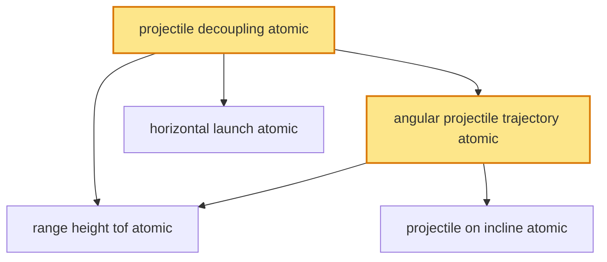

# T8 — Projectile Motion  *(Class 11)*

> Dependency-ordered teaching pathway for physics-teacher review.
> **5 atomic + 12 nano = 17 concept-simulations.**  2 💎 diamond (highest-impact).

**How to use this:** teach top-to-bottom. Everything in a level only depends on earlier levels. Each **atomic** is a full teachable idea (= one simulation); the **↳ nanos** under it are its sub-points (one symbol / term / edge-case each).

**Foundations (teach first, nothing in this chapter comes before them):** projectile_decoupling_atomic

## Concept dependency graph (atomic backbone)

## Teaching pathway (dependency-ordered)

### Level 0 — foundations

- **`projectile_decoupling_atomic`** 💎 — A projectile's motion decomposes into TWO INDEPENDENT motions: **horizontal** (uniform, a_x = 0, x = u_x·t) and **vertical** (free-fall, a_y = −g, y = u_y·t − ½gt²). The only link is the shared time t. **Neither component affects the other.**  _(targets misconception: horizontal & vertical motions affect each other)_
  - ↳ `drop_vs_shoot_simultaneity_nano` — Bullet fired horizontally + bullet dropped from same height at same instant: **both hit the ground at the same time** (vertical motion identical; horizontal motion irrelevant to fall-time). Classic demonstration of decoupling. **CBSE Class-11 conceptual-favourite + Mythbusters viral demo.**
  - ↳ `monkey_hunter_demo_nano` — Hunter aims directly AT a monkey hanging from a branch; monkey drops at the instant of firing. **Dart hits monkey** regardless of dart speed — because both dart and monkey fall by the same ½gt² in the same time. Decoupling masterclass.

### Level 1

- **`angular_projectile_trajectory_atomic`** 💎 — Launch at angle θ to horizontal with speed u: **x = u·cosθ·t**; **y = u·sinθ·t − ½gt²**. Eliminate t → **trajectory: y = x·tanθ − gx²/(2u²cos²θ)** = downward parabola. Symmetric about the peak.
  - ↳ `parabola_symmetry_nano` — Ascending half (launch→peak) is mirror-image of descending half (peak→landing) on level ground. Time-up = time-down = u·sinθ/g. Speed at any height on the way up = speed at the same height on the way down (directions differ).
  - ↳ `two_projectile_relative_nano` — Two projectiles launched simultaneously: in the frame of one, the other moves in a **STRAIGHT LINE at constant velocity** (relative acceleration = (−g) − (−g) = 0). Elegant simplification; collision-condition reduces to straight-line geometry.
  - ↳ `air_resistance_real_projectile_nano` — Ideal projectile (parabola, symmetric) vs real projectile (asymmetric trajectory — steeper descent, shorter range, lower peak) due to air drag ∝ v². Cricket-ball swing + golf-ball dimples + artillery drag-correction. **Deferred to V2 advanced.**
- **`horizontal_launch_atomic`** — Projectile launched HORIZONTALLY from height h with speed u: **time-to-ground t = √(2h/g)** (independent of u — pure free-fall vertically); **horizontal range = u·√(2h/g)**; lands with v_x = u, v_y = √(2gh). Trajectory = half-parabola.
  - ↳ `time_independent_of_launch_speed_nano` — Two balls launched horizontally from the same height at different speeds (10 m/s and 50 m/s): **both land at the same time** (t = √(2h/g)); the faster one lands farther horizontally. Direct consequence of decoupling.
  - ↳ `table_edge_ball_roll_off_nano` — Ball rolling off a table edge at speed u: classic CBSE/ISC physics-practical (measure table-height + landing-distance → compute g or u). **Indian physics-lab-standard experiment.**

### Level 2

- **`range_height_tof_atomic`** — From decoupling on level ground: **Time-of-flight T = 2u·sinθ/g**; **Max-height H = u²sin²θ/(2g)**; **Range R = u²sin(2θ)/g**. Max range at **θ = 45°** (sin2θ = 1). Complementary angles (θ and 90°−θ) give the SAME range.  _(targets misconception: range max at θ=90°)_
  - ↳ `complementary_angles_same_range_nano` — θ = 30° and θ = 60° give the same range (sin60° = sin120°). Trade-off: 30° = flatter, faster, lower; 60° = higher, slower, same horizontal distance. Cricket-fielder-throw vs lob choice.
  - ↳ `max_range_45_derivation_nano` — R = u²sin(2θ)/g is maximised when sin(2θ) = 1 → 2θ = 90° → θ = 45°. R_max = u²/g. **Only true on level ground** (incline changes optimal angle — see projectile_on_incline).
  - ↳ `velocity_at_top_nano` — At max-height: **v_y = 0** but **v_x = u·cosθ ≠ 0**. Total speed at top = u·cosθ (purely horizontal). **cognitive_error_target:** "velocity is zero at the top" → only vertical component; horizontal persists. Classic JEE/NEET trap.
- **`projectile_on_incline_atomic`** — Projectile launched up/down an incline of angle α. **Rotated-axis method**: take axes along + perpendicular to incline; gravity components g·sinα (along, decelerating) + g·cosα (perpendicular). Range up-incline R_up = 2u²·sin(θ−α)·cosθ / (g·cos²α); max-range angle on incline = 45° + α/2 (up) or 45° − α/2 (down).  _(targets misconception: max-range angle always 45°)_
  - ↳ `rotated_axis_method_nano` — On an incline, choose x' along the slope + y' perpendicular. Then g resolves into −g·sinα (x') and −g·cosα (y'). Projectile lands when y' = 0 again. **Reduces incline-projectile to standard decoupling in rotated frame.**
  - ↳ `artillery_range_table_application_nano` — Artillery + DRDO ballistic computations use elevation-angle vs range tables (corrected for air-resistance + terrain-slope). The incline-projectile + max-range-angle physics underpins range-table construction. **Indian-Army + DRDO Pokhran anchor.**
