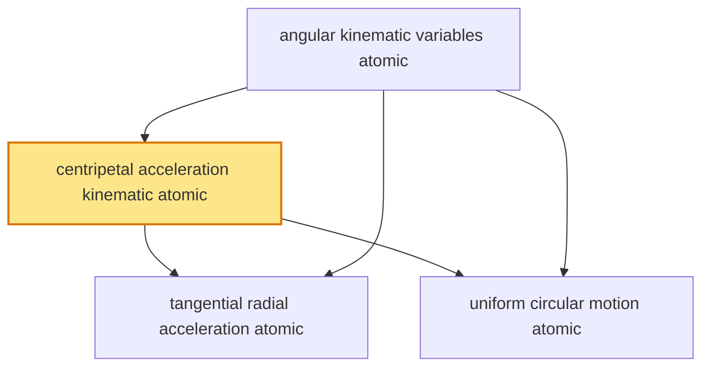

# T9 — Motion In Plane Circular Kinematics  *(Class 11)*

> Dependency-ordered teaching pathway for physics-teacher review.
> **4 atomic + 11 nano = 15 concept-simulations.**  1 💎 diamond (highest-impact).

**How to use this:** teach top-to-bottom. Everything in a level only depends on earlier levels. Each **atomic** is a full teachable idea (= one simulation); the **↳ nanos** under it are its sub-points (one symbol / term / edge-case each).

**Foundations (teach first, nothing in this chapter comes before them):** angular_kinematic_variables_atomic

## Concept dependency graph (atomic backbone)

## Teaching pathway (dependency-ordered)

### Level 0 — foundations

- **`angular_kinematic_variables_atomic`** — **Angular position θ** (radians, measured from reference radius); **angular velocity ω = dθ/dt** (rad/s); **angular acceleration α = dω/dt** (rad/s²). Direct rotational analogs of linear position/velocity/acceleration (T6). For rotation, these describe the motion compactly (one variable θ vs two x,y).  _(targets misconception: ω in degrees/sec)_
  - ↳ `angular_kinematic_equations_nano` — For constant α: **ω = ω₀ + αt**; **θ = ω₀t + ½αt²**; **ω² = ω₀² + 2αθ**. **Identical form to T6 linear equations** (x→θ, v→ω, a→α). Same derivation; same problem-solving decision-tree. Reinforces linear-angular structural analogy.
  - ↳ `linear_angular_relations_nano` — **v = ωr** (tangential speed); **a_tangential = αr**; **arc-length s = rθ**. Convert between angular description (compact) and linear description (intuitive). Foundation for T15 rotational mechanics (every linear quantity has an angular analog).
  - ↳ `radian_measure_why_nano` — Radians (not degrees) make v = ωr and s = rθ clean (no conversion factor). 1 rad = arc-length equal to radius; full circle = 2π rad. **All physics formulae assume radians.** Common student error: plugging degrees into ω formulae.

### Level 1

- **`centripetal_acceleration_kinematic_atomic`** 💎 — Even at CONSTANT SPEED, circular motion is ACCELERATED because the velocity DIRECTION continuously changes. The acceleration points toward the centre: **a_c = v²/r = ω²r = vω**. This is a purely KINEMATIC fact (geometric consequence of direction-change) — it exists BEFORE any discussion of what force causes it (that's T10).  _(targets misconception: constant speed = zero acceleration)_
  - ↳ `delta_v_points_inward_nano` — Geometric proof: draw velocity vectors v⃗₁, v⃗₂ at two nearby points on the circle. Δv⃗ = v⃗₂ − v⃗₁ points toward the centre. As Δt→0, a⃗ = Δv⃗/Δt is exactly centripetal. **Diamond-candidate animation**: rotating velocity-vector + Δv⃗-construction showing inward direction.
  - ↳ `a_c_three_forms_nano` — a_c = v²/r (linear-speed form) = ω²r (angular form) = vω (mixed). All equivalent via v = ωr. **Use whichever the problem gives.** Decision-tree pedagogy (mirrors T6 kinematic-equation choice).
  - ↳ `constant_speed_not_constant_velocity_nano` — Speed |v⃗| = constant; velocity v⃗ = changing (direction rotates). **Acceleration ≠ 0** despite constant speed. The deepest conceptual point of circular kinematics. **cognitive_error_target** countermeasure: explicit speed-vs-velocity distinction animation.

### Level 2

- **`tangential_radial_acceleration_atomic`** — For NON-UNIFORM circular motion (changing speed): total acceleration has TWO perpendicular components: **a_tangential = dv/dt = rα** (along velocity, changes SPEED) + **a_radial = v²/r = ω²r** (toward centre, changes DIRECTION). **a_total = √(a_t² + a_r²)**; direction makes angle arctan(a_t/a_r) with the radius.  _(targets misconception: acceleration in circular motion is always centripetal)_
  - ↳ `speeding_car_on_curve_nano` — Car accelerating while rounding a bend: a_tangential (speeding up along the path) + a_radial (centripetal, turning). Total acceleration tilts forward-of-radius. **Indian-driving anchor**: accelerating out of a curve on Mumbai-Pune Expressway.
  - ↳ `uniform_is_special_case_nano` — Uniform circular motion = the special case where a_tangential = 0 (constant speed). Only a_radial (centripetal) remains. Non-uniform is the general case; uniform is the simplification. Cognitive-hierarchy scaffold.
- **`uniform_circular_motion_atomic`** — UCM = circular motion at CONSTANT speed. Characterised by: constant ω; constant a_c = v²/r (magnitude constant, direction rotating); **period T = 2πr/v = 2π/ω**; **frequency f = 1/T = ω/(2π)**. The canonical kinematic template for all rotational phenomena.  _(targets misconception: uniform = no acceleration)_
  - ↳ `period_frequency_ucm_nano` — T = 2πr/v = 2π/ω; f = 1/T = ω/(2π); ω = 2πf (angular frequency). **Bridge to T17 SHM**: projection of UCM onto a diameter = SHM (same ω). **Bridge to T16**: satellite orbital period from UCM + gravity (T16 owns the dynamics).
  - ↳ `ceiling_fan_turntable_anchor_nano` — Ceiling-fan (~300-350 rpm = ω ≈ 31-37 rad/s); record-player/turntable (33⅓ rpm); washing-machine-spin (~1400 rpm). Everyday Indian-household UCM anchors. Compute ω, v at blade-tip, a_c.
  - ↳ `satellite_circular_orbit_kinematics_nano` — ISRO geostationary satellite (GSAT series): orbital period 24 hr → ω = 2π/(24×3600) rad/s; orbital radius ~42,164 km → v ≈ 3.07 km/s; a_c = v²/r (the KINEMATIC fact; T16 supplies that gravity PROVIDES this a_c). Pure-kinematics version; dynamics in T16.
