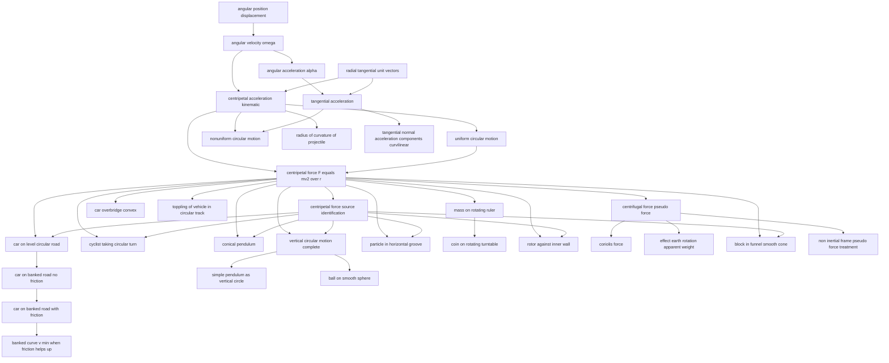

# T10 — Circular Motion  *(Class 11)*

> Dependency-ordered teaching pathway for physics-teacher review.
> **32 atomic + 43 nano = 75 concept-simulations.**

**How to use this:** teach top-to-bottom. Everything in a level only depends on earlier levels. Each **atomic** is a full teachable idea (= one simulation); the **↳ nanos** under it are its sub-points (one symbol / term / edge-case each).

**Foundations (teach first, nothing in this chapter comes before them):** angular_position_displacement, radial_tangential_unit_vectors

## Concept dependency graph (atomic backbone)

## Teaching pathway (dependency-ordered)

### Level 0 — foundations

- **`angular_position_displacement`** — HCV1 §7.1. s = rθ. Radian convention. V1.
  - ↳ `arc_length_equals_r_times_theta` — s = rθ from radian definition.
  - ↳ `radians_to_degrees_conversion` — 2π rad = 360°.
- **`radial_tangential_unit_vectors`** — HCV1 §7.2. Coordinate choice that matters. V1.
  - ↳ `e_r_e_t_change_with_position` — Unit vectors rotate as particle moves.

### Level 1

- **`angular_velocity_omega`** — ω = dθ/dt; v = rω. V1.
  - ↳ `omega_average_vs_instantaneous` — ω_avg = Δθ/Δt vs ω_inst = dθ/dt.
  - ↳ `v_equals_r_omega_substitution` — HCV1 Eq 7.4.

### Level 2

- **`angular_acceleration_alpha`** — α = dω/dt; a_t = rα. V1.
  - ↳ `angular_kinematics_equations` — ω = ω₀+αt; θ = ω₀t+½αt²; ω² = ω₀²+2αθ. HCV1 Eq 7.1-7.3. Direct linear analogy.
  - ↳ `tangential_acceleration_a_t_equals_r_alpha` — a_t = rα from differentiating v = rω.
- **`centripetal_acceleration_kinematic`** — a_r = v²/r = ω²r. Pure kinematics, no force. HCV1 Eq 7.9. V1 ABSOLUTE PRIORITY (highest IN-degree of Topic 10).
  - ↳ `derivation_a_r_equals_v_squared_over_r` — Differentiate r·e_r twice; HCV1 Eq 7.8-7.9. `allow_deep_dive: true`.
  - ↳ `a_r_equals_omega_squared_r` — Using v = rω.
  - ↳ `a_r_direction_always_inward` — Even on opposite sides of circle.

### Level 3

- **`tangential_acceleration`** — a_t = dv/dt. Zero in uniform circular motion. V1.
  - ↳ `tangential_speeding_vs_slowing` — a_t parallel to v ⇒ speed up; antiparallel ⇒ slow down.
- **`uniform_circular_motion`** — The "default" case. dv/dt = 0. V1 ABSOLUTE PRIORITY (hub concept for 3+ other topics).
  - ↳ `uniform_v_dot_a_zero` — a ⊥ v ⇒ tangential component = 0 ⇒ speed constant.
  - ↳ `period_and_frequency` — T = 2π/ω = 2πr/v; f = 1/T.
- **`radius_of_curvature_of_projectile`** — DCM1 Misc Example 5 + HCV1 Q.25-26. R = u²cos²θ/(g·cos³(angle/2)). Cross-topic with Topic 9. V1.
  - ↳ `radius_of_curvature_projectile_peak` — At top, R = (u cosα)²/g.
  - ↳ `radius_at_arbitrary_trajectory_point` — DCM1 Example 5.

### Level 4

- **`nonuniform_circular_motion`** — Both components present; total a = √(a_r²+a_t²). V1.
  - ↳ `net_a_magnitude` — a = √(a_r² + a_t²). DCM1 Final Touch #5.
  - ↳ `angle_of_net_a_with_radius` — tan(angle) = a_t/a_r.
- **`centripetal_force_F_equals_mv2_over_r`** — F_c = mv²/r toward center. "Not a new force — give it a name" framing per HCV1 Points to Ponder #5. V1 ABSOLUTE PRIORITY.
  - ↳ `centripetal_not_a_new_force` — HCV1 Points to Ponder #5 + NCERT #5. EPIC-C STATE_1 candidate.
  - ↳ `newton_2nd_law_radial_direction` — ΣF_radial = mv²/r.
- **`tangential_normal_acceleration_components_curvilinear`** — DCM1 Final Touch #1-2. Underlies "radius of curvature" concept. V1.

### Level 5

- **`centripetal_force_source_identification`** — "Which real force provides centripetal?" Heuristic-rich. EPIC-C STATE_1 candidate (the wrong belief: "centripetal force is a force by itself"). V1.
  - ↳ `gravity_provides_centripetal_planet` — GMm/r² = mv²/r. Bridges to Topic 16.
  - ↳ `tension_provides_centripetal_string` — T = mv²/r for stone on string.
  - ↳ `friction_provides_centripetal_car` — Closes Friction A27 cross-reference.
  - ↳ `normal_provides_centripetal_banked` — N·sinθ = mv²/r component.
- **`mass_on_rotating_ruler`** — ω_max for no-slip = √(μg/L). HCV1 Q.8 + DCM1 L1 Q.11. V1.
  - ↳ `ruler_omega_max_block_no_slip` — μmg = mω²L ⇒ ω_max = √(μg/L).
- **`car_overbridge_convex`** — NCERT Exercise + HCV1 O.I Q.10. Loses contact when v = √(gR). V1.
  - ↳ `overbridge_lose_contact_v_equals_sqrt_gR` — N=0 ⇒ mv²/R = mg.
- **`toppling_of_vehicle_in_circular_track`** — DCM1 Final Touch #6-7. v < √(gra/h) for safe turn. Indian-context anchor (Mumbai-Pune highway curves). V1.
  - ↳ `toppling_inner_wheel_lifts` — N₂=0 ⇒ v²=gra/h. DCM1 Final Touch #6.
- **`centrifugal_force_pseudo_force`** — mω²r outward in rotating frame. HCV1 §7.6. EPIC-C: "I feel pushed outward, so something's pushing me!" V1.
  - ↳ `pseudo_force_only_in_non_inertial_frame` — In ground frame: no centrifugal force. EPIC-C candidate. HCV1 §7.6.
  - ↳ `centrifugal_magnitude_equals_centripetal` — mω²r in both, opposite directions, different frames.
  - ↳ `coriolis_brief_mention` — Brief in HCV1 §7.6. Promoted to V2 A27 if ever authored.

### Level 6

- **`car_on_level_circular_road`** — v_max = √(μsRg); independent of mass. NCERT Eq 5.18. **Cross-references Friction A27.** V1.
  - ↳ `v_max_independent_of_mass` — m cancels both sides. Counterintuitive. EPIC-C candidate.
- **`cyclist_taking_circular_turn`** — Leaning replaces banking. tan(lean) = v²/rg. Indian-context anchor. V1.
  - ↳ `cyclist_lean_angle_no_topple` — tan(lean) = v²/rg from no-toppling.
- **`conical_pendulum`** — tan θ = v²/rg. T = 2π√(L cosθ/g). HCV1 Worked Ex 3. JEE classic. V1.
  - ↳ `conical_pendulum_period` — T = 2π√(L cosθ/g).
- **`vertical_circular_motion_complete`** — u_min at bottom = √(5gR) for string; √(2gR) for rod. DCM1 Type 1 + HCV1 Q.6. **Cross-references Topic 13 work-energy.** V1 — `allow_deep_dive: true`.
  - ↳ `u_min_5gR_string_at_bottom` — Energy + (T≥0 at top) combined. `allow_deep_dive: true`.
  - ↳ `u_min_2gR_rod_at_bottom` — Rod can push (v=0 allowed at top). DCM1 Final Touch #3.
  - ↳ `T_max_at_bottom_min_at_top` — T_bot = m(v²/R + g); T_top = m(v²/R − g).
  - ↳ `velocity_at_arbitrary_angle` — v²(θ) = u² − 2gR(1 − cosθ).
- **`particle_in_horizontal_groove`** — HCV1 Worked Ex 5. Side-wall normal = mv²/r. V2 (rarely tested).
- **`coin_on_rotating_turntable`** — NCERT Class 11 §5.10 lab demo. μg ≥ ω²r for no-slip. V1.
- **`rotor_against_inner_wall`** — HCV1 Worked Ex 10. ω_min = √(g/μr). Indian-context: "Wall of Death" ride at Indian fairs. V1.
  - ↳ `rotor_omega_min_floor_removed` — μN=mg, N=mω²r ⇒ ω_min=√(g/μr). HCV1 Worked Ex 10.
- **`coriolis_force`** — Perpendicular to v in rotating frame. HCV1 §7.6 brief mention. V2 (JEE-Adv only). `allow_deep_dive: true` when ever V1'd.
- **`effect_earth_rotation_apparent_weight`** — HCV1 §7.7. Worked Ex 7. g' = √(g² - ω⁴R²sin²θ(2g - ω²R)). Indian-context: weight at Srinagar vs Chennai (latitude differences). V1.
  - ↳ `g_effective_at_equator` — g' ≈ g − ω²R ≈ 9.78 m/s².
  - ↳ `g_effective_at_poles` — g' = g exactly; latitude effect vanishes.
  - ↳ `plumb_line_tilt_with_latitude` — tan α = ω²R sinθcosθ/(g − ω²R sin²θ). HCV1 Eq 7.15.
- **`block_in_funnel_smooth_cone`** — DCM1 L2 Q.2. Stable/unstable equilibrium along slope. V2.
- **`non_inertial_frame_pseudo_force_treatment`** — HCV1 §7.6 worked discussion. V2 — overlaps with Topic 11 advanced.

### Level 7

- **`car_on_banked_road_no_friction`** — v_o = √(Rg tanθ). The "design speed". NCERT Eq 5.22. V1.
  - ↳ `banked_optimum_speed_friction_unused` — At v_o, no friction needed; tires last.
- **`simple_pendulum_as_vertical_circle`** — DCM1 Type 2. Energy + tension-at-angle. Bridges to SHM small-angle limit. V1.
- **`ball_on_smooth_sphere`** — v_max at top = √(Rg). Leaves at h = R/3 below top. DCM1 Final Touch #8. V1.
  - ↳ `leave_sphere_at_cos_inverse_2_3` — When N=0, mgcosθ = mv²/R ⇒ cosθ=2/3 (from rest at top). DCM1 #8.

### Level 8

- **`car_on_banked_road_with_friction`** — v_max = √(Rg(μ+tanθ)/(1-μtanθ)). NCERT Eq 5.21. V1 — flag `allow_deep_dive: true` (the (1-μtanθ) denominator is a JEE trap).
  - ↳ `banked_with_friction_v_min_case` — When μ < tan θ + low v ⇒ slides DOWN. HCV1 Q.18 case.

### Level 9

- **`banked_curve_v_min_when_friction_helps_up`** — When μ < tan θ. HCV1 Q.18. V2.
