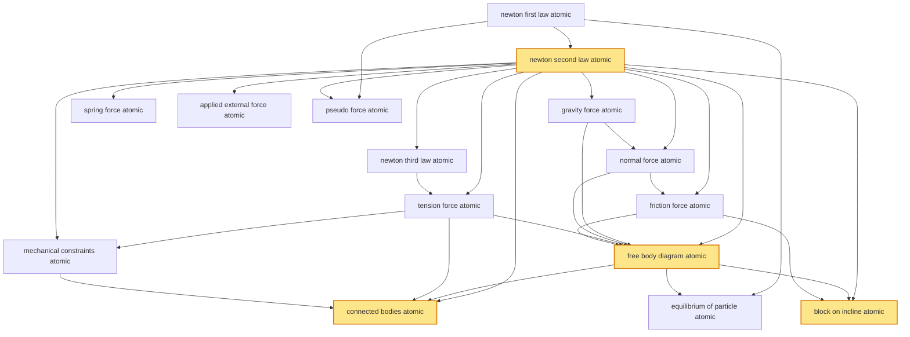

# T11 — Newtons Laws  *(Class 11)*

> Dependency-ordered teaching pathway for physics-teacher review.
> **15 atomic + 18 nano = 33 concept-simulations.**  4 💎 diamond (highest-impact).

**How to use this:** teach top-to-bottom. Everything in a level only depends on earlier levels. Each **atomic** is a full teachable idea (= one simulation); the **↳ nanos** under it are its sub-points (one symbol / term / edge-case each).

**Foundations (teach first, nothing in this chapter comes before them):** newton_first_law_atomic

## Concept dependency graph (atomic backbone)

## Teaching pathway (dependency-ordered)

### Level 0 — foundations

- **`newton_first_law_atomic`** — A body at rest stays at rest, in uniform motion stays in uniform motion, UNLESS net external force acts; operationally defines an inertial frame
  - ↳ `inertial_vs_non_inertial_frames_nano` — Inertial frame: 1st law holds. Non-inertial: 1st law fails → must add pseudo-forces. Earth's surface is approximately inertial for most problems.  _(targets misconception: 1st law fails in moving cars)_
  - ↳ `galilean_invariance_nano` — All inertial frames are equivalent; F = ma in one inertial frame holds in any other with the same form. Foundation of pre-relativistic mechanics

### Level 1

- **`newton_second_law_atomic`** 💎 — F_net = ma; in vector form ΣF = m·a; central quantitative law of mechanics
  - ↳ `f_eq_dp_dt_nano` — Generalised form: F = dp/dt = d(mv)/dt; reduces to F=ma when m constant; needed for rockets, falling chains, conveyor-belt-sand-loading problems  _(targets misconception: F=ma is universal)_
  - ↳ `impulse_change_in_momentum_nano` — J = ∫F dt = Δp; impulse equals change in momentum. Carom-strike, cricket-bat-ball collision time-integrals all use this
  - ↳ `variable_mass_rocket_nano` — ISRO PSLV/GSLV: M dv/dt = u·(dm/dt) − Mg; thrust = u·(rate of fuel ejection); cross-bridge to T14 momentum-conservation and Tsiolkovsky equation

### Level 2

- **`newton_third_law_atomic`** — Every action force has an equal-and-opposite reaction force; the action-reaction PAIR acts on TWO DIFFERENT bodies  _(targets misconception: action and reaction on same body)_
  - ↳ `action_reaction_on_different_bodies_nano` — Side-by-side diagram: hand pushes wall (force ON wall by hand); wall pushes hand (force ON hand by wall). Both forces act, but on different bodies → they DO NOT cancel. **Cognitive-error-prevention nano** (mandatory per NL-G4).  _(targets misconception: nano)_
  - ↳ `walking_rowing_swimming_examples_nano` — Walking: foot pushes earth back; earth pushes foot forward → person accelerates. Rowing: oar pushes water back; water pushes oar forward. Swimming: hand pushes water back; water pushes hand forward. **Three Indian everyday examples**
- **`gravity_force_atomic`** — F_g = mg downward on Earth's surface (g ≈ 9.8 m/s²); more generally F = GMm/r²; mass × gravitational-field-strength
- **`spring_force_atomic`** — F = −kx (Hooke's law); restoring force proportional to displacement from natural length; sign convention "minus" indicates restoring
- **`applied_external_force_atomic`** — Any non-internal force from outside the system (push, pull, applied tension, applied gravity-field). The "F" in F=ma typically refers to applied + reaction-from-environment
- **`pseudo_force_atomic`** — In non-inertial frame with acceleration a_frame: pseudo-force F_pseudo = −m·a_frame acts on every mass m in the frame. Real to observer in that frame; vanishes in inertial frame.  _(targets misconception: pseudo-force isn't real)_
  - ↳ `centrifugal_force_nano` — In rotating frame: F_centrifugal = mω²r outward; explains why water-bucket-on-string works; classic NCERT/HCV example. Equivalent to centripetal-force-balance from inertial frame view.
  - ↳ `train_acceleration_nano` — Passenger in accelerating train (a_train forward): pseudo-force m·a_train backward on passenger; passenger leans back. Indian Railways everyday experience.

### Level 3

- **`normal_force_atomic`** — Contact force perpendicular to the surface, magnitude adjusts to whatever keeps body from penetrating surface (it's NOT always equal to mg)  _(targets misconception: N = mg always)_
  - ↳ `normal_force_in_lift_problem_nano` — In accelerating lift: N = m(g + a) upward acceleration; N = m(g − a) downward acceleration; N = 0 free-fall (passenger feels weightless). **Everyday Indian elevator examples**
- **`tension_force_atomic`** — Force transmitted along a string/rope; tension is uniform along massless inextensible string; tension at any point = force pulling along string at that point  _(targets misconception: tension equals weight always)_
  - ↳ `massless_inextensible_string_constraint_nano` — String mass = 0 → tension uniform along string. String inextensible → tangential velocity along string is same at every point. These are TWO separate idealisations bundled into "ideal string."

### Level 4

- **`friction_force_atomic`** — Force opposing relative motion or tendency of motion between contacting surfaces; static μ_s (no relative motion yet) vs kinetic μ_k (motion occurring); cross-link to T12 for full derivation
- **`mechanical_constraints_atomic`** — Equations relating motion of different connected bodies: string-inextensibility, pulley-massless, rigid-body, surface-rigidity. Each constraint reduces # of independent variables.
  - ↳ `pulley_constraint_v_dot_equal_nano` — Single fixed pulley + inextensible string: |v₁| = |v₂| but in opposite directions; sign convention via constraint equation x₁ + x₂ = L. Differentiate twice to get a₁ = −a₂.

### Level 5

- **`free_body_diagram_atomic`** 💎 — Cognitive tool: isolate ONE body, draw ALL external forces ACTING ON IT, set up F_net = ma equations. THE universal mechanics workflow.  _(targets misconception: drawing forces ON other bodies in same FBD)_
  - ↳ `fbd_step_by_step_nano` — Step 1: identify body. Step 2: list all forces ACTING ON it (gravity, normal, tension, friction, applied, spring). Step 3: choose axes. Step 4: resolve. Step 5: write ΣF_x = ma_x and ΣF_y = ma_y.

### Level 6

- **`equilibrium_of_particle_atomic`** — Particle in equilibrium: ΣF = 0 → ΣF_x = 0 AND ΣF_y = 0; static equilibrium or dynamic-equilibrium (constant velocity); equivalent to 1st law special case
  - ↳ `tension_in_strings_at_a_point_nano` — Two strings joined at a point with weight hanging: ΣF_x = 0 (horizontal tension components cancel); ΣF_y = 0 (vertical components support weight). Classic JEE example.
- **`connected_bodies_atomic`** 💎 — Two or more bodies connected by string/rod/pulley; apply F=ma to each body separately + constraint equation; combine for system solution
  - ↳ `atwood_machine_sim_nano` — Two masses m₁ + m₂ over single fixed pulley: a = g(m₁−m₂)/(m₁+m₂); T = 2gm₁m₂/(m₁+m₂). Asymmetric acceleration is visually compelling.
  - ↳ `block_on_table_connected_to_hanging_mass_nano` — m₁ on table, string over pulley at edge, m₂ hangs: a = m₂g/(m₁+m₂); if friction on table, a = (m₂ − μm₁)g/(m₁+m₂). Classic JEE template.
- **`block_on_incline_atomic`** 💎 — Block of mass m on incline angle θ: gravity component along incline = mg sin θ; perpendicular = mg cos θ; if μ < tan θ slides; if μ ≥ tan θ static
  - ↳ `angle_of_repose_nano` — Angle θ at which block just starts sliding: tan θ = μ_s; defines the static-friction limit on incline
  - ↳ `connected_blocks_on_double_incline_nano` — Two blocks on opposite faces of same wedge connected by string over pulley at apex: classic IIT-Advanced problem
