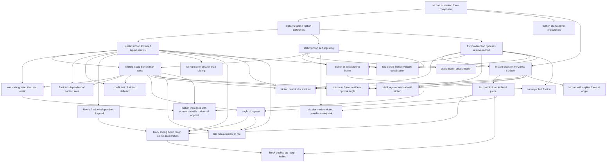

# T12 — Friction  *(Class 11)*

> Dependency-ordered teaching pathway for physics-teacher review.
> **28 atomic + 41 nano = 69 concept-simulations.**

**How to use this:** teach top-to-bottom. Everything in a level only depends on earlier levels. Each **atomic** is a full teachable idea (= one simulation); the **↳ nanos** under it are its sub-points (one symbol / term / edge-case each).

**Foundations (teach first, nothing in this chapter comes before them):** friction_as_contact_force_component

## Concept dependency graph (atomic backbone)

## Teaching pathway (dependency-ordered)

### Level 0 — foundations

- **`friction_as_contact_force_component`** — Friction is the parallel component of contact force (normal = perpendicular component, friction = parallel)
  - ↳ `impending_motion_concept` — "Would-move-if-not-for-friction" scenario; static friction acts on bodies at rest with applied force

### Level 1

- **`static_vs_kinetic_friction_distinction`** — Two regimes: not-sliding (static) and sliding (kinetic)
- **`friction_atomic_level_explanation`** — Molecular bonds at the contact points break/reform → energy goes to heat

### Level 2

- **`kinetic_friction_formula_f_equals_mu_k_N`** — f_k = μ_k × N (magnitude formula)
  - ↳ `linear_proportionality_to_N` — f doubles when N doubles (linearity of f-N relation)
- **`static_friction_self_adjusting`** — Static friction = whatever force is needed up to limit (variable, not a fixed value)
  - ↳ `f_s_equals_applied_force_below_limit` — Applied 2 N → friction 2 N; applied 5 N → friction 5 N (up to limit)
  - ↳ `f_vs_F_applied_graph` — Graph: 45° line until f_max, then drops to μ_k N
- **`friction_direction_opposes_relative_motion`** — Friction direction = opposite to **relative** velocity of object w.r.t. surface (not absolute motion!)
  - ↳ `direction_opposite_to_actual_relative_velocity` — For kinetic friction: direction = −v_rel
  - ↳ `direction_opposite_to_impending_relative_velocity` — For static friction: direction = whatever opposes the would-be slip direction
  - ↳ `direction_determined_by_constraint_when_static` — Static friction direction is set by Newton's 2nd law on the constraint, not assumed

### Level 3

- **`limiting_static_friction_max_value`** — f_s ≤ μ_s N; equality at impending motion
  - ↳ `equality_at_impending_motion` — At the instant motion is about to start, f_s = μ_s N (boundary condition)
  - ↳ `transition_static_to_kinetic_at_breakaway` — Overshoot: at breakaway, friction drops from μ_s N to μ_k N → block accelerates
- **`kinetic_friction_independent_of_speed`** — f_k stays the same whether block moves at 1 m/s or 10 m/s (within ordinary speeds)
- **`rolling_friction_smaller_than_sliding`** — Rolling friction is 2–3 orders of magnitude smaller than sliding friction; ball bearings exploit this
  - ↳ `point_of_contact_zero_velocity_in_rolling` — In pure rolling, contact point has zero instantaneous velocity → no kinetic friction
  - ↳ `ball_bearings_concept` — Convert sliding contact to rolling contact → reduce friction
- **`friction_block_on_horizontal_surface`** — Block on horizontal floor; applied horizontal F; N = mg, f = μN
- **`friction_in_accelerating_frame`** — Box on accelerating train floor: static friction provides the acceleration; or use pseudo-force in train frame
  - ↳ `pseudo_force_in_non_inertial_frame` — In accelerating frame, add −ma fictitious force to body
  - ↳ `static_friction_provides_acceleration` — From ground frame: it's static friction that pushes the box along with the train (no pseudo-force needed)
- **`two_blocks_friction_velocity_equalisation`** — Two stacked blocks given different initial velocities; friction equalizes them over time
- **`static_friction_drives_motion`** — Friction can ACCELERATE objects (not just oppose motion) — cars accelerate due to road friction; walking relies on friction
  - ↳ `static_friction_on_driven_wheel` — Engine torque → wheel pushes back on road → road pushes forward on wheel (Newton's 3rd law)
  - ↳ `walking_relies_on_friction_with_ground` — Foot pushes back on ground → ground pushes forward on foot → human walks

### Level 4

- **`mu_static_greater_than_mu_kinetic`** — Empirical: μ_s > μ_k (e.g., steel-steel: μ_s=0.7, μ_k=0.6)
- **`friction_independent_of_contact_area`** — Counterintuitive: same block on same surface, friction force doesn't depend on which face is down
- **`coefficient_of_friction_definition`** — μ is a dimensionless constant; depends ONLY on the pair of surfaces in contact, NOT on N, A, v
- **`friction_block_on_inclined_plane`** — Block on incline angle θ; N = mg cos θ; gravity along incline = mg sin θ; friction = μN
  - ↳ `normal_force_on_incline_N_equals_mg_cos_theta` — N = mg cos θ derivation
  - ↳ `gravity_parallel_component_mg_sin_theta` — Driving force down the incline = mg sin θ
  - ↳ `static_block_on_incline_equilibrium` — When θ < θ_repose: f_s = mg sin θ (self-adjusts, less than μ_s mg cos θ)
- **`friction_two_blocks_stacked`** — Block A on Block B on floor; two friction interfaces (A-B and B-floor); check no-slip vs slip
  - ↳ `friction_interface_A_to_B` — μ_AB between top and bottom block
  - ↳ `friction_interface_B_to_floor` — μ_Bg between bottom block and floor
  - ↳ `no_slip_constraint_common_acceleration` — If no slipping anywhere, both blocks move with same a
  - ↳ `slip_at_AB_relative_motion_check` — When applied F exceeds f_max(AB), top block slips relative to bottom
  - ↳ `newton_third_law_friction_pair` — Friction A→B and B→A are equal and opposite (Newton's 3rd law)
- **`block_against_vertical_wall_friction`** — Block held against vertical wall by horizontal force F; friction acts vertically upward to support weight; min F = mg/μ_s
  - ↳ `horizontal_F_creates_normal_force_on_wall` — N (wall on block) = F_applied (horizontal eqn)
  - ↳ `vertical_equilibrium_friction_supports_weight` — f = mg (vertical eqn for equilibrium)
  - ↳ `min_F_to_hold_against_wall` — μ_s F ≥ mg → F ≥ mg/μ_s
- **`minimum_force_to_slide_at_optimal_angle`** — Apply F at angle θ to horizontal; θ_opt = tan⁻¹(μ_s); F_min = μmg / √(1+μ²)
  - ↳ `vertical_eqn_with_force_at_angle` — N = mg − F sin θ (vertical component of F reduces normal force)
  - ↳ `horizontal_eqn_at_threshold` — F cos θ = μ_s (mg − F sin θ) at impending motion
  - ↳ `minimize_F_over_theta` — dF/dθ = 0 → tan θ_opt = μ_s → optimal angle = angle of friction
- **`friction_with_applied_force_at_angle`** — F at angle θ changes N → friction is μ(mg − F sin θ), not μ mg
- **`conveyor_belt_friction`** — Block on accelerating/moving belt; relative-motion analysis between block and belt determines static vs kinetic regime

### Level 5

- **`angle_of_repose`** — Tilt incline until block just slides; tan θ_max = μ_s
  - ↳ `θ_max_when_mg_sin_equals_mu_s_mg_cos` — At θ_max: mg sin θ = μ_s mg cos θ → tan θ_max = μ_s
  - ↳ `angle_of_repose_independent_of_mass` — μ_s = tan θ_max — no m anywhere → result holds regardless of block mass
  - ↳ `angle_of_friction_geometric_interpretation` — λ = tan⁻¹(μ_s) — geometric angle the resultant contact force makes with the surface normal at limiting friction. Numerically equal to angle of repose; same fact, different lens.
- **`circular_motion_friction_provides_centripetal`** — On level circular road: static friction = centripetal force; v_max = √(μ_s R g). On banked road: combination of N component + friction
- **`friction_increases_with_normal_not_with_horizontal_applied`** — Subtle: if F₁ is vertical-downward, increasing F₁ increases N → increases f_max. If F₂ is horizontal (applied force), increasing F₂ only increases f up to limit, then f drops to μ_k N (constant).

### Level 6

- **`block_sliding_down_rough_incline_acceleration`** — When θ > θ_repose: a = g(sin θ − μ_k cos θ)
  - ↳ `net_force_down_incline_equals_mg_sin_minus_mu_mg_cos` — F_net = mg sin θ − μ_k mg cos θ (friction opposes downward slide)
  - ↳ `acceleration_formula_g_sin_minus_mu_cos` — a = g(sin θ − μ_k cos θ)
- **`lab_measurement_of_mu`** — Two methods: F-vs-W graph (horizontal) and tilt-table θ_max (inclined)
  - ↳ `horizontal_method_F_vs_W_graph` — F (force to just move) plotted vs W (weight); slope of straight line = μ_s
  - ↳ `inclined_method_tilt_until_slide` — Tilt incline until block just slides; measure θ_max; μ_s = tan θ_max

### Level 7

- **`block_pushed_up_rough_incline`** — Push block UP incline: friction also acts DOWNward (opposes motion) → F_applied > mg sin θ + μ_k mg cos θ

### Other sub-concepts (parent atomic is in another chapter)

  - ↳ `contact_force_perpendicular_component` — Normal component of contact force
  - ↳ `contact_force_parallel_component` — Friction = parallel component (tangential)
  - ↳ `contact_force_resultant_magnitude` — R = √(N² + f²)
  - ↳ `relative_velocity_check_for_kinetic` — Slipping ⇒ kinetic regime; no slipping ⇒ static regime
  - ↳ `air_cushion_no_contact` — Hovercraft / air bearing: no surface contact → no friction
