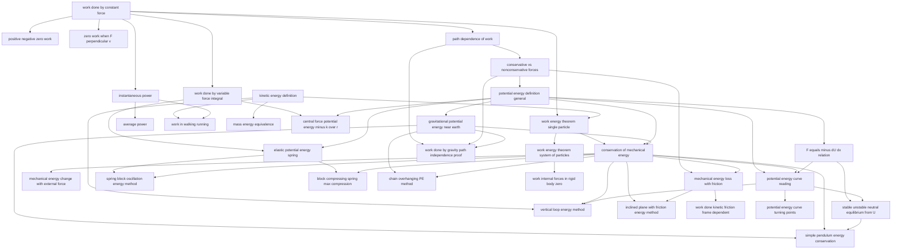

# T13 — Work Energy Power  *(Class 11)*

> Dependency-ordered teaching pathway for physics-teacher review.
> **33 atomic + 42 nano = 75 concept-simulations.**

**How to use this:** teach top-to-bottom. Everything in a level only depends on earlier levels. Each **atomic** is a full teachable idea (= one simulation); the **↳ nanos** under it are its sub-points (one symbol / term / edge-case each).

**Foundations (teach first, nothing in this chapter comes before them):** work_done_by_constant_force, kinetic_energy_definition

## Concept dependency graph (atomic backbone)

## Teaching pathway (dependency-ordered)

### Level 0 — foundations

- **`work_done_by_constant_force`** — W = F·d cos θ. HCV1 §8.3 + NCERT Eq 6.1. V1 ABSOLUTE PRIORITY (hub).
  - ↳ `scalar_nature_of_work` — W is scalar even though F and d are vectors. HCV1 Q.1.
  - ↳ `work_unit_joule_definition` — 1 J = 1 N·m.
  - ↳ `normal_reaction_does_zero_work` — N ⊥ d on horizontal table. HCV1 Q.4.
- **`kinetic_energy_definition`** — K = ½mv². NCERT Eq 6.7 + HCV1 §8.1. V1 ABSOLUTE PRIORITY.
  - ↳ `kinetic_energy_always_positive` — K = ½mv² ≥ 0 always (since v² ≥ 0).
  - ↳ `KE_change_only_by_tangential_force` — Only F_t contributes to dK/dt; F_r doesn't.

### Level 1

- **`work_done_by_variable_force_integral`** — W = ∫F·dr. HCV1 §8.3 + DCM1 implicit. V1.
  - ↳ `work_as_area_under_F_x_graph` — W = ∫F dx is area.
  - ↳ `spring_force_work_derivation` — W = ∫kx dx = ½kx². HCV1 §8.3.
- **`positive_negative_zero_work`** — Sign of W. NCERT Ex 6.1 lists 5 scenarios. EPIC-C STATE_1 candidate: "work is always positive if force is applied". V1.
  - ↳ `work_positive_friction_negative_misconception` — "Friction always reduces KE" — false in moving-frame analysis. EPIC-C candidate.
  - ↳ `static_friction_can_do_nonzero_work` — HCV1 Q.4. When point of application moves, e.g., car wheel.
- **`zero_work_when_F_perpendicular_v`** — Critical insight; tension does no work in pendulum / circular motion. HCV1 §8.3. **Cross-topic with Topic 10 A10.** V1.
  - ↳ `tension_does_zero_work_pendulum` — T ⊥ v throughout pendulum swing.
  - ↳ `tension_does_zero_work_circular` — T ⊥ v in uniform circular motion.
- **`path_dependence_of_work`** — The setup for conservative-vs-nonconservative classification. V1.
- **`work_energy_theorem_single_particle`** — W_net = ΔK = K_f − K_i. HCV1 Eq 8.2 + NCERT Eq 6.6. **Closes Topic 10 CT4 incoming edge.** V1 ABSOLUTE PRIORITY.
  - ↳ `work_energy_theorem_derivation` — From F = ma, ∫F·dr = ∫m(dv/dt)dr = ∫mv·dv = ½mv² − ½mu².
  - ↳ `WET_holds_in_non_inertial_frames_with_pseudo` — HCV1 Points to Ponder #6 + Q.7. Include pseudo-force work.
- **`instantaneous_power`** — P = F·v = Fv cosθ. DCM1 §9.8 + HCV1 §8.2 Eq dW/dt = F·v. V1.
  - ↳ `P_equals_F_v_cos_theta` — P = Fv cosθ.
  - ↳ `power_zero_when_F_perp_v` — Same as A4 but for instantaneous power.
- **`mass_energy_equivalence`** — E = mc². HCV1 §8.11 brief + NCERT mention. V2 brief atomic. WE-G6: kept atomic but with single-state EPIC-L.
  - ↳ `E_equals_mc_squared_brief` — Rest-mass energy. Brief mention.

### Level 2

- **`work_energy_theorem_system_of_particles`** — Internal forces contribute to ΔK even if Newton's 3rd law makes them cancel as forces. HCV1 §8.4 + Points to Ponder #3. V1 — `allow_deep_dive: true`.
  - ↳ `internal_force_pair_can_do_net_work` — HCV1 §8.4 + Points to Ponder #3. Two attracting charges: F_AB + F_BA = 0 but W ≠ 0. EPIC-C candidate.
- **`conservative_vs_nonconservative_forces`** — Round-trip test. HCV1 §8.6 + NCERT §6.6. V1 ABSOLUTE PRIORITY. WE-G3: combined into one atomic.
  - ↳ `round_trip_work_zero_test_for_conservative` — ∮F·dr = 0 ⇔ conservative.
  - ↳ `gravity_is_conservative` — Round-trip W = 0.
  - ↳ `spring_force_is_conservative` — Round-trip W = 0.
  - ↳ `friction_is_nonconservative` — Round-trip W = −2μmgd ≠ 0.
- **`average_power`** — P_av = W_total/t_total. DCM1 §9.8. V1.
  - ↳ `average_power_motor_horsepower` — 1 HP = 746 W. HCV1 Worked Ex 2.
- **`work_in_walking_running`** — NCERT Appendix 6.1: W_s = 2m_l·v₀² per stride; P ≈ 270W. **Direct Indian-context anchor.** V1.
  - ↳ `walking_power_270W_60kg_3ms` — NCERT Appendix Eq 6.34 result. Direct Indian-context anchor.

### Level 3

- **`potential_energy_definition_general`** — ΔU = −W_c. Only defined for conservative forces. HCV1 §8.7 + NCERT Eq 6.10. V1 ABSOLUTE PRIORITY.
  - ↳ `only_change_in_U_is_defined` — Choice of zero is arbitrary. HCV1 §8.7.
  - ↳ `U_only_for_conservative_force` — "We don't (or can't) define U for nonconservative." HCV1 §8.7.
- **`work_internal_forces_in_rigid_body_zero`** — HCV1 §8.8. Internal forces do zero net work because particles maintain rigid distances. V2.

### Level 4

- **`gravitational_potential_energy_near_earth`** — U = mgh. Choice of zero matters. HCV1 §8.9 + NCERT §6.7. V1.
  - ↳ `reference_height_choice_arbitrary` — Ground / table / sea-level — your choice.
- **`elastic_potential_energy_spring`** — U = ½kx². HCV1 §8.10 derivation. V1.
  - ↳ `spring_PE_extension_compression_symmetric` — U(x) = U(−x) = ½kx² either way.
- **`F_equals_minus_dU_dx_relation`** — F = −dU/dx. DCM1 Type 5 Concept + HCV1 §8.7 implicit + NCERT Summary #3. V1 — `allow_deep_dive: true`.
  - ↳ `F_x_from_U_x_slope` — F = −slope of U(x) curve.
- **`central_force_potential_energy_minus_k_over_r`** — U(r) = −k/r for inverse-square attraction. HCV1 Ex 8.3 + Worked Ex 8.4. Bridges to gravitation + electrostatics. V2 (deep-link).
  - ↳ `central_force_U_equals_minus_k_over_r_derivation` — U(r) = −∫(k/r²)dr from ∞ to r. HCV1 Ex 8.3.

### Level 5

- **`conservation_of_mechanical_energy`** — K_i + U_i = K_f + U_f when only W_c acts. HCV1 §8.7 Eq 8.6 + NCERT Eq 6.11. V1 ABSOLUTE PRIORITY.
  - ↳ `conservation_proof_from_WET` — W_c = −ΔU and W_total = ΔK ⇒ ΔK + ΔU = 0. HCV1 Eq 8.6 derivation.
  - ↳ `conservation_breaks_if_friction` — Need W_friction = 0 for conservation to hold strictly.
- **`work_done_by_gravity_path_independence_proof`** — HCV1 §8.3 + Worked Ex shows path independence. V1.
  - ↳ `gravity_work_only_depends_on_height_difference` — W_g = mgh regardless of path.

### Level 6

- **`mechanical_energy_loss_with_friction`** — E_i − E_f = work against friction. DCM1 Type 3 Concept + NCERT Ex 6.27. V1.
  - ↳ `friction_dissipates_KE_as_heat` — Lost mechanical energy = heat. Bridges to A28 mass-energy.
- **`mechanical_energy_change_with_external_force`** — W_ext = ΔE = E_f − E_i. HCV1 Eq 8.8 + general energy balance. V1.
- **`potential_energy_curve_reading`** — Read off K_min, K_max, turning points, classically forbidden regions. NCERT Ex 6.3 + DCM1 Misc Example 16. V1 — `allow_deep_dive: true`.
  - ↳ `classically_forbidden_region` — K = E − U < 0 means region not accessible. NCERT Ex 6.3.
- **`spring_block_oscillation_energy_method`** — NCERT Ex 6.4 + DCM1 Type 1 Ex 1. v_max = √(k/m)·x_max. Bridges to SHM. V1.
  - ↳ `v_max_at_x_zero_spring_block` — At equilibrium, all U → K.
- **`block_compressing_spring_max_compression`** — ½mv² = ½kx_max². NCERT Ex 6.43 + DCM1 Type 1 Ex 1. V1.
  - ↳ `spring_compression_from_initial_KE` — ½mv² = ½kx² ⇒ x_max = v√(m/k).
- **`chain_overhanging_PE_method`** — HCV1 Worked Ex 9 + NCERT Ex 6.38-39. Uses ∫(m/l)gx·dx for hanging part. V1.

### Level 7

- **`stable_unstable_neutral_equilibrium_from_U`** — Classify each extremum by d²U/dx². DCM1 §9.4 Introductory Exercise + JEE classic. V1.
  - ↳ `stable_equilibrium_d2U_positive` — d²U/dx² > 0 (bowl) ⇒ stable.
  - ↳ `unstable_equilibrium_d2U_negative` — d²U/dx² < 0 (dome) ⇒ unstable.
  - ↳ `neutral_equilibrium_d2U_zero` — d²U/dx² = 0 along range ⇒ neutral.
- **`vertical_loop_energy_method`** — h_min = 5R/2 for car at start (or R/2 from top per HCV1 Worked Ex 13). **Cross-topic with Topic 10 A17 — same physical situation, dual perspective.** V1.
  - ↳ `h_min_R_over_2_loop_car` — At top, v² = gR, energy ⇒ h = R/2 from top of loop. HCV1 Worked Ex 13.
- **`inclined_plane_with_friction_energy_method`** — DCM1 Type 3 Ex 6-8. Alternative to F = ma kinematic approach. V1.
  - ↳ `incline_friction_work_along_slope` — W_f = μ·mg·cosθ·d (d along slope).
- **`work_done_kinetic_friction_frame_dependent`** — HCV1 Q.4 Short Answer + Misc Example 18. JEE-Adv level. V2.
- **`potential_energy_curve_turning_points`** — DCM1 Misc Example 16 + NCERT Ex 6.4. V1.

### Level 8

- **`simple_pendulum_energy_conservation`** — v at bottom = √(2gl(1−cosθ)). HCV1 Worked Ex 5 + NCERT Ex 6.17. **Cross-topic with Topic 10 A18.** V1.
  - ↳ `v_at_bottom_pendulum_sqrt_2gh` — From mgh = ½mv².
