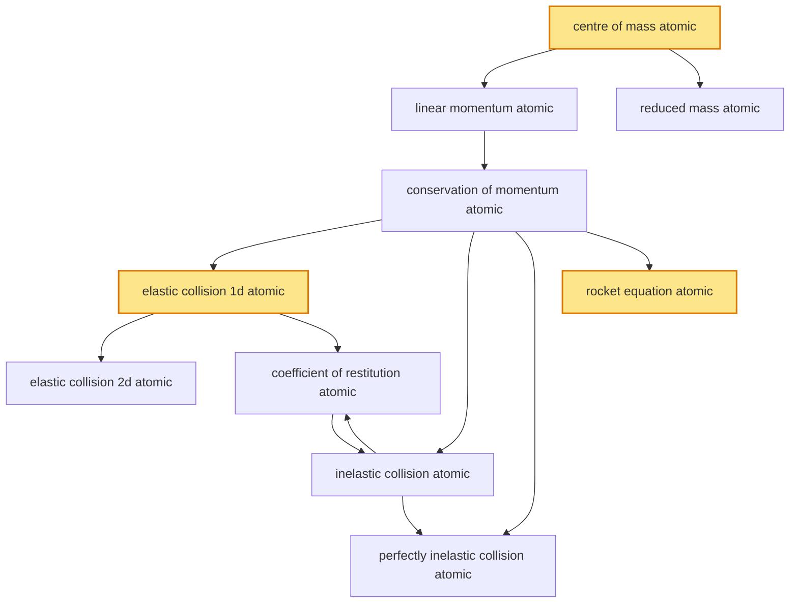

# T14 — Momentum Collisions  *(Class 11)*

> Dependency-ordered teaching pathway for physics-teacher review.
> **10 atomic + 14 nano = 24 concept-simulations.**  3 💎 diamond (highest-impact).

**How to use this:** teach top-to-bottom. Everything in a level only depends on earlier levels. Each **atomic** is a full teachable idea (= one simulation); the **↳ nanos** under it are its sub-points (one symbol / term / edge-case each).

**Foundations (teach first, nothing in this chapter comes before them):** centre_of_mass_atomic

> ⚠ **3 concept(s) have circular prerequisites** in the source catalogue (marked ⟲ below) — i.e. they list each other as prerequisites. The level placement for these is a best-effort break of the loop; worth a human review of the intended order.

## Concept dependency graph (atomic backbone)

## Teaching pathway (dependency-ordered)

### Level 0 — foundations

- **`centre_of_mass_atomic`** 💎 — Mathematical point R = Σmᵢrᵢ/Σmᵢ representing weighted-average position of system; CoM moves as if all mass were concentrated there and all external force acted there
  - ↳ `com_discrete_particles_nano` — R = (m₁r₁ + m₂r₂ + ...)/(m₁+m₂+...); for 2-body case R = (m₁r₁ + m₂r₂)/(m₁+m₂); CoM closer to heavier mass
  - ↳ `com_continuous_body_nano` — R = (∫r dm)/M; integration over body's mass distribution; symmetric body's CoM at geometric centre
  - ↳ `com_motion_v_com_eq_p_total_over_m_nano` — V_CoM = (Σmᵢvᵢ)/M = P_total/M; CoM moves with system's average velocity. **cognitive_error_target:** "CoM is a material point" → CoM is a MATHEMATICAL location, may be outside any actual body

### Level 1

- **`linear_momentum_atomic`** — p = mv (single body); P_system = Σmᵢvᵢ = M·V_CoM (system); SI units kg·m/s. Momentum is the natural quantity behind Newton's 2nd law (F = dp/dt)
  - ↳ `impulse_momentum_theorem_nano` — J = ∫F dt = Δp; impulse equals change in momentum; cross-link to T11 `impulse_change_in_momentum_nano`
- **`reduced_mass_atomic`** — μ = m₁m₂/(m₁+m₂); converts 2-body problem to equivalent 1-body problem of mass μ moving in central potential. Foundation of 2-body collision + Rutherford scattering + Bohr H-atom correction
  - ↳ `rutherford_scattering_application_nano` — Alpha + gold-nucleus: μ ≈ m_α since m_Au >> m_α; cross-link to T47 atomic-models

### Level 2

- **`conservation_of_momentum_atomic`** — When no external force acts on a system (or net external force is zero), total linear momentum is conserved: ΣP_initial = ΣP_final. Follows from Newton's 3rd law applied to internal forces (they cancel pairwise)  _(targets misconception: momentum conserved always)_
  - ↳ `closed_system_requirement_nano` — Conservation holds ONLY when net external force is zero. Gravity acting on bouncing ball + earth: SYSTEM is conserved (ball + earth), but ball-alone is NOT. **cognitive_error_target nano**.
  - ↳ `explosion_as_reverse_collision_nano` — One body → multiple fragments; total p conserved; KE INCREASES (internal energy → KE). Time-reversed perfectly-inelastic-collision. ISRO multi-stage rocket = controlled explosion at staging events.

### Level 3

- **`elastic_collision_1d_atomic`** 💎 — 1D collision conserving BOTH momentum AND kinetic energy. Closed-form solution: v₁' = ((m₁−m₂)v₁ + 2m₂v₂)/(m₁+m₂); v₂' = ((m₂−m₁)v₂ + 2m₁v₁)/(m₁+m₂). Equal-mass case: simple velocity exchange.
  - ↳ `equal_mass_velocity_exchange_nano` — m₁ = m₂: v₁' = v₂; v₂' = v₁. Classic Newton's cradle / billiards visualization.
- **`rocket_equation_atomic`** 💎 — Tsiolkovsky: v − v₀ = u·ln(M₀/M); rocket gains speed by ejecting mass at exhaust-speed u; specific impulse I_sp = u/g₀ measures fuel efficiency
  - ↳ `isro_pslv_multistage_nano` — PSLV: 4 stages (PS1 solid + PS2 liquid + PS3 solid + PS4 liquid); each stage burns + separates (explosion → reverse collision). Total Δv achievable via Tsiolkovsky summed across stages.
  - ↳ `specific_impulse_i_sp_nano` — I_sp = u/g₀ in seconds; chemical rocket: 250-450 s; ion thruster: 1000-5000 s; ISRO LAM (liquid apogee motor) ~300 s

### Level 4

- **`elastic_collision_2d_atomic`** — 2D oblique elastic collision: conservation of momentum applied PER COMPONENT (x and y), plus conservation of KE; results in coupled equations. Geometric significance: post-collision velocity directions form right angle for equal masses
  - ↳ `right_angle_for_equal_masses_nano` — When equal masses collide elastically with one at rest: post-collision velocity vectors are perpendicular. Classic billiards-shot geometry.

### Level 5

- **`inelastic_collision_atomic`** ⟲ — Momentum conserved; KE NOT conserved (some converted to heat, sound, deformation). Coefficient of restitution e ∈ [0,1] characterises energy retention  _(targets misconception: real collisions are elastic)_
- **`perfectly_inelastic_collision_atomic`** ⟲ — Bodies stick together after collision; common post-collision velocity v_f = (m₁v₁ + m₂v₂)/(m₁+m₂); maximum KE-loss case; e = 0
  - ↳ `railway_buffer_collision_nano` — Two Indian Railways wagons couple on track: bodies stick (Janney coupler engagement) → perfectly inelastic; coupling-and-uncoupling at Mughalsarai/Bandra/Itarsi yards.
- **`coefficient_of_restitution_atomic`** ⟲ — e = |v_separation|/|v_approach|; e = 1 elastic, e = 0 perfectly inelastic, 0 < e < 1 general inelastic. Property of the COLLISION PAIR (not single object)  _(targets misconception: e is property of one ball)_
  - ↳ `bouncing_ball_height_nano` — Ball dropped from height h₀ bounces to h₁ = e²h₀; nth bounce → h_n = e^(2n)h₀; series of decreasing heights
  - ↳ `cricket_bat_ball_nano` — Cricket ball-bat collision: e ≈ 0.45 for hardened-leather + willow; affects six-vs-four trajectory; depends on bat-thickness, ball-condition, swing-speed. Indian cricket-equipment-industry context.
