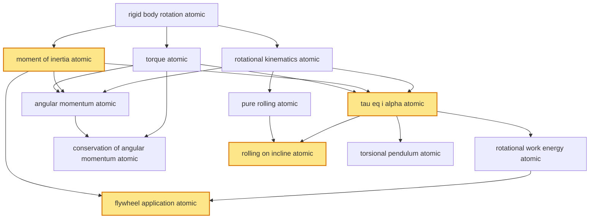

# T15 — Rotational Mechanics  *(Class 11)*

> Dependency-ordered teaching pathway for physics-teacher review.
> **12 atomic + 15 nano = 27 concept-simulations.**  4 💎 diamond (highest-impact).

**How to use this:** teach top-to-bottom. Everything in a level only depends on earlier levels. Each **atomic** is a full teachable idea (= one simulation); the **↳ nanos** under it are its sub-points (one symbol / term / edge-case each).

**Foundations (teach first, nothing in this chapter comes before them):** rigid_body_rotation_atomic

## Concept dependency graph (atomic backbone)

## Teaching pathway (dependency-ordered)

### Level 0 — foundations

- **`rigid_body_rotation_atomic`** — Rigid body = all internal distances constant; rotation about fixed axis = every point traces a circle of fixed radius around axis
  - ↳ `rotation_axis_vs_translation_nano` — Pure rotation = points trace circles around fixed axis (axis is stationary). Pure translation = all points have same velocity. General motion = translation + rotation about CoM

### Level 1

- **`rotational_kinematics_atomic`** — ω = dθ/dt; α = dω/dt; ω = ω₀ + αt; θ = ω₀t + ½αt²; ω² = ω₀² + 2αθ. **Rotational analog of T6 linear kinematics.**  _(targets misconception: angular and linear kinematics are different physics)_
  - ↳ `omega_v_eq_omega_r_relation_nano` — Linear velocity of point at radius r: v = ωr. Linear acceleration tangential: a_t = αr. Linear acceleration centripetal: a_c = ω²r. **Three relations bridging linear ↔ angular.**
- **`moment_of_inertia_atomic`** 💎 — I = Σmᵢrᵢ² (discrete); I = ∫r² dm (continuous). I is "rotational mass" — resists change in rotational motion. **DEPENDS ON CHOSEN AXIS.**  _(targets misconception: I is a property of body alone)_
  - ↳ `i_for_canonical_bodies_nano` — Solid sphere: I = (2/5)MR². Hollow sphere: (2/3)MR². Disc/cylinder about axis: ½MR². Ring: MR². Rod about end: ML²/3. Rod about centre: ML²/12. **Table for V1 reference.**
  - ↳ `parallel_axis_theorem_nano` — I_parallel = I_CoM + Md²; moment of inertia about any axis parallel to CoM-axis equals I_CoM + (mass × distance²). Allows computing I about arbitrary axis.
  - ↳ `perpendicular_axis_theorem_nano` — For PLANAR body in xy-plane: I_z = I_x + I_y. Only valid for thin laminar (planar) bodies; not for 3D solids. **cognitive_error_target:** "perpendicular-axis applies to all bodies" → planar only.
- **`torque_atomic`** — τ = r × F (vector form); τ = rF sin θ (magnitude); τ is to angular motion what F is to linear motion. SI unit: N·m
  - ↳ `moment_arm_lever_arm_nano` — τ = F × d_perpendicular = F × (r sin θ). Moment arm = perpendicular distance from axis to line-of-action of force. **cognitive_error_target:** "torque = r·F always" → r sin θ matters; force ALONG r contributes ZERO torque
  - ↳ `couples_two_equal_opposite_forces_nano` — Pair of equal-opposite forces with separation d: net force = 0; net torque = F·d (independent of axis choice). Door-handle, wrench-on-bolt examples

### Level 2

- **`tau_eq_i_alpha_atomic`** 💎 — τ_net = Iα; central quantitative law of rotational dynamics. Rotational analog of F_net = ma
  - ↳ `rotational_vs_linear_table_nano` — Side-by-side table: m↔I, F↔τ, v↔ω, a↔α, F=ma↔τ=Iα, p=mv↔L=Iω, KE=½mv²↔KE=½Iω². **Cognitive scaffold nano.**
- **`angular_momentum_atomic`** — L = Iω (rotational) = r × p (general); SI unit: kg·m²/s; vector quantity; direction by right-hand rule along ω  _(targets misconception: L is a scalar)_
  - ↳ `l_eq_r_cross_p_nano` — For a single particle: L = r × p; for system: L_total = Σ(rᵢ × pᵢ); axis-independent definition
- **`pure_rolling_atomic`** — Rolling without slipping: v_CoM = Rω (constraint); contact-point velocity = 0 instantaneously; STATIC friction (not kinetic) provides the rotational coupling  _(targets misconception: rolling friction is kinetic)_
  - ↳ `contact_point_instantaneous_rest_nano` — Rolling-without-slipping condition: v_CoM − Rω = 0 → contact point has zero velocity at any instant. **Diamond visualisation candidate**: trace path of contact point = cycloid
  - ↳ `total_ke_rolling_nano` — KE_total = KE_translation + KE_rotation = ½mv_CoM² + ½Iω² = ½mv² + ½I(v/R)² = ½v²(m + I/R²). Larger I/R² → more KE in rotation

### Level 3

- **`rotational_work_energy_atomic`** — W_torque = ∫τ dθ; rotational KE = ½Iω²; total KE for rolling = ½mv² + ½Iω². Bridges T13 Work-Energy linear treatment
- **`conservation_of_angular_momentum_atomic`** — When no external torque acts (τ_ext = 0): L_total = constant. Derivation: τ_ext = dL/dt = 0 → L = const. **Pirouette, planetary Kepler-2, gyroscope-stability all apply**
  - ↳ `pirouette_application_nano` — Ice-skater / Bharatnatyam dancer pirouette: arms pulled in → I decreases → ω increases (L = Iω constant). Indian classical-dance everyday observation
  - ↳ `isro_satellite_attitude_control_nano` — Geostationary satellites use reaction-wheel-based attitude control: spinning wheel inside satellite changes satellite's angular momentum; ISRO INSAT/GSAT/Cartosat all use this
  - ↳ `keplers_2nd_law_planetary_nano` — Law of equal areas: planets sweep equal areas in equal times → dA/dt = L/2m = constant (when L conserved under central force). Cross-link to T16 Gravitation
- **`rolling_on_incline_atomic`** 💎 — Body rolling without slipping down incline angle θ: a_CoM = g sin θ / (1 + I/(mR²)); time-to-bottom depends on I/(mR²) ratio. **Solid sphere < disc < hollow sphere < ring**
  - ↳ `rolling_race_demonstration_nano` — Race down same incline: solid sphere wins (smallest I/mR² = 2/5); disc 2nd (1/2); hollow sphere 3rd (2/3); ring last (1.0). Iconic Class 11 demo
- **`torsional_pendulum_atomic`** — Disc suspended by wire with torsional rigidity κ: τ = −κθ → I·d²θ/dt² = −κθ → angular SHM with ω² = κ/I; T = 2π√(I/κ)

### Level 4

- **`flywheel_application_atomic`** 💎 — Wheel with large I stores rotational KE = ½Iω² and smooths angular-velocity fluctuations. Automotive engine flywheel, power-plant turbine inertia, KERS (Kinetic Energy Recovery System) all use this
