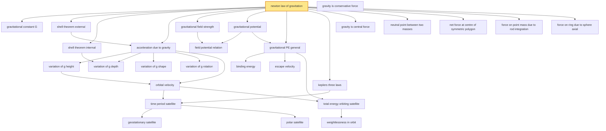

# T16 — Gravitation  *(Class 11)*

> Dependency-ordered teaching pathway for physics-teacher review.
> **28 atomic + 28 nano = 56 concept-simulations.**  1 💎 diamond (highest-impact).

**How to use this:** teach top-to-bottom. Everything in a level only depends on earlier levels. Each **atomic** is a full teachable idea (= one simulation); the **↳ nanos** under it are its sub-points (one symbol / term / edge-case each).

**Foundations (teach first, nothing in this chapter comes before them):** newton_law_of_gravitation, gravity_is_conservative_force

## Concept dependency graph (atomic backbone)

## Teaching pathway (dependency-ordered)

### Level 0 — foundations

- **`newton_law_of_gravitation`** 💎 — `F = Gm₁m₂/r²`, central + conservative + medium-independent. The diamond seed.
  - ↳ `force_between_two_point_masses` — DCM2 Fig 13.1
  - ↳ `force_between_two_spherical_bodies` — DCM2 Fig 13.2; shell theorem makes this identical to point-mass
  - ↳ `force_between_sphere_and_rod_integration` — DCM2 Fig 13.4 + Example 13.5; ∫dF over rod length
  - ↳ `superposition_polygon_vertex_masses` — DCM2 Examples 13.2/13.3/13.4 hexagon/pentagon/square
- **`gravity_is_conservative_force`** — Path-independence enables potential / PE definition; cited explicitly in NCERT §8.7, HCV1 §11.3

### Level 1

- **`gravitational_constant_G`** — G = 6.67×10⁻¹¹ N·m²/kg²; measured by Cavendish torsion balance
  - ↳ `cavendish_torsion_balance_method` — HCV1 §11.2 derivation: `G = kθr²/(Mml)`; "Cavendish weighed the Earth"
- **`shell_theorem_external`** — "External point sees shell as point-mass at centre" — Newton's Principia result
- **`shell_theorem_internal`** — "Interior of shell has zero gravity"; depth-variation of g derives from this
- **`gravitational_field_strength`** — `E = F/m` (vector); units N/kg ≡ m/s²; identical to g for Earth's field
  - ↳ `gravitational_field_solid_sphere_external` — `E = GM/r²` for r ≥ R
  - ↳ `gravitational_field_solid_sphere_internal` — `E = GMr/R³` (linear in r); peak at surface
  - ↳ `gravitational_field_shell_external` — `E = GM/r²` for r ≥ R
  - ↳ `gravitational_field_shell_internal` — E = 0 inside shell
  - ↳ `gravitational_field_ring_axial` — `E = GMr/(R²+r²)^(3/2)`; max at r = R/√2
- **`gravitational_potential`** — `V = W_∞→P/m` (scalar); units J/kg. Reference: V(∞) = 0.
  - ↳ `gravitational_potential_point_mass` — `V = -GM/r`; negative because gravity is attractive
  - ↳ `gravitational_potential_solid_sphere_external` — `V = -GM/r` for r ≥ R
  - ↳ `gravitational_potential_solid_sphere_internal` — `V = -GM(1.5R² - 0.5r²)/R³`; at centre = -1.5GM/R
  - ↳ `gravitational_potential_shell_external` — `V = -GM/r` for r ≥ R
  - ↳ `gravitational_potential_shell_internal` — V = -GM/R constant inside; HCV1 §11.5 ring-integration derivation
  - ↳ `gravitational_potential_ring_axial` — `V = -GM/√(R²+r²)`; at centre = -GM/R
- **`keplers_three_laws`** — Historical Tycho-Brahe-Kepler observational basis; predates Newton
  - ↳ `law_of_orbits_ellipse` — Planets in ellipses with Sun at one focus
  - ↳ `law_of_areas_constant_areal_velocity` — `dA/dt = L/2m` constant → follows from central-force angular momentum conservation
  - ↳ `law_of_periods_T_squared_R_cubed` — `T² ∝ a³`; NCERT Table 1 has 9-planet data (Mercury to Pluto) confirming
  - ↳ `central_force_implies_planar_orbit` — NCERT §8.2 "Central Forces" inset box; angular momentum conservation → motion confined to plane
- **`gravity_is_central_force`** — Force along line of centres → angular momentum conserved → Kepler law of areas
- **`neutral_point_between_two_masses`** — DCM2 problem class; NCERT Example 8.4 (two spheres M and 4M at 6R separation → neutral point at 2R from M)
- **`net_force_at_centre_of_symmetric_polygon`** — Net force = 0 by symmetry when all vertex masses equal; ≠ 0 if symmetry broken (DCM2 Examples 13.3/13.4)
- **`force_on_point_mass_due_to_rod_integration`** — `F = GMm/(a(l+a))`; cannot assume rod as point at centre
- **`force_on_ring_due_to_sphere_axial`** — DCM2 Example 13.6: `F = √3·GMm/(8a²)` for ring at √3·a from sphere centre

### Level 2

- **`acceleration_due_to_gravity`** — `g = GM/R²` ≈ 9.8 m/s² at Earth surface
- **`field_potential_relation`** — `E = -dV/dr` (1D) or `E = -∇V` (3D); the "shortest descent of V" geometric reading
- **`gravitational_PE_general`** — `U(r) = -Gm₁m₂/r` between two point masses; reference U(∞) = 0
  - ↳ `gravitational_PE_constant_g_limit` — `ΔU = mgh` recovered as h<<R limit of full form
  - ↳ `gravitational_PE_n_particle_system` — Sum over `N(N-1)/2` pairs; HCV1 Example 11.2

### Level 3

- **`variation_of_g_height`** — `g(h) = g·(1 - 2h/R)` for h<<R; full form `g·R²/(R+h)²`
  - ↳ `binomial_expansion_step` — The `(1+h/R)⁻² ≈ 1 - 2h/R` step explicit
- **`variation_of_g_depth`** — `g(d) = g·(1 - d/R)`; from shell-theorem-internal applied to outer shell
  - ↳ `mass_of_inner_sphere_proportionality` — `M_inner/M_earth = (R-d)³/R³`
- **`variation_of_g_shape`** — Equator R 21 km larger than poles → g larger at poles. Geometric, not dynamical.
- **`variation_of_g_rotation`** — `g' = g - Rω²cos²λ`; effective at latitude λ
  - ↳ `apparent_g_equator_zero_condition` — DCM2 Example 13.8: "rotate Earth fast enough for weight at equator = 0 → T = 1.4 hr"
- **`binding_energy`** — `BE = |U| - KE`; energy needed to take object to infinity at rest
- **`escape_velocity`** — `v_e = √(2GM/R) = √(2gR) ≈ 11.2 km/s` from Earth's surface; 2.3 km/s from Moon
  - ↳ `why_moon_has_no_atmosphere` — Moon's low v_e (2.3 km/s) < typical gas-molecule thermal speed → atmosphere escapes

### Level 4

- **`orbital_velocity`** — `v = √(GM/(R+h))`; at low altitude v = √(gR) ≈ 7.9 km/s

### Level 5

- **`time_period_satellite`** — `T = 2π(R+h)^(3/2)/√(GM)`; Kepler's 3rd law for satellites
- **`total_energy_orbiting_satellite`** — `E = -GMm/(2(R+h))`; KE = -E (positive), PE = 2E (negative); total negative → bound orbit
  - ↳ `bound_vs_unbound_orbit_sign` — E<0 elliptical/circular bound; E=0 parabolic escape; E>0 hyperbolic escape

### Level 6

- **`geostationary_satellite`** — T = 24 hr → h ≈ 35,800 km; equatorial orbit only; INSAT series.
- **`polar_satellite`** — h ≈ 500-800 km; T ≈ 100 min; north-south orbit; IRS series for remote sensing
- **`weightlessness_in_orbit`** — Astronaut + satellite both accelerate at g_local → spring balance reads 0; not absence of gravity, absence of *normal force*
  - ↳ `spring_balance_in_free_fall_thought_experiment` — NCERT §8.12 elevator-cable-cut thought experiment
