# T17 — Simple Harmonic Motion  *(Class 11)*

> Dependency-ordered teaching pathway for physics-teacher review.
> **29 atomic + 37 nano = 66 concept-simulations.**

**How to use this:** teach top-to-bottom. Everything in a level only depends on earlier levels. Each **atomic** is a full teachable idea (= one simulation); the **↳ nanos** under it are its sub-points (one symbol / term / edge-case each).

**Foundations (teach first, nothing in this chapter comes before them):** shm_definition_force_minus_kx

> ⚠ **5 concept(s) have circular prerequisites** in the source catalogue (marked ⟲ below) — i.e. they list each other as prerequisites. The level placement for these is a best-effort break of the loop; worth a human review of the intended order.

## Concept dependency graph (atomic backbone)

```mermaid
graph TD
  c0["shm definition force minus kx"]
  c1["shm acceleration equals minus omega squared x"]
  c2["shm velocity equals omega root A2 minus x2"]
  c3["shm displacement xt sinusoidal"]
  c4["shm as projection of uniform circular motion"]
  c5["total mechanical energy in shm constant"]
  c6["energy displacement graph parabola pair"]
  c7["energy at x equals A over 2 problem pattern"]
  c8["shm initial conditions xt form"]
  c9["time to reach fraction of amplitude"]
  c10["find amplitude from two displacement velocity pairs"]
  c11["phase difference between x v a graphs"]
  c12["block attached to single spring period formula"]
  c13["spring combinations in shm"]
  c14["vertical spring block gravity shifts equilibrium"]
  c15["block between two walls with springs period"]
  c16["block collides with spring amplitude from kinetic energy"]
  c17["simple pendulum period formula"]
  c18["g determination via pendulum in lab"]
  c19["physical pendulum period formula"]
  c20["angular shm equation gamma minus k theta"]
  c21["torsional pendulum disc on wire period"]
  c22["damping force proportional to velocity"]
  c23["damped oscillation solution exp decay envelope"]
  c24["forced oscillation steady state at driver frequency"]
  c25["resonance amplitude peaks at natural frequency"]
  c26["linear combination of sin and cos is shm"]
  c27["superposition two shm same direction"]
  c28["perpendicular two shm lissajous figures"]
  c0 --> c1
  c1 --> c2
  c0 --> c3
  c1 --> c3
  c1 --> c4
  c2 --> c4
  c0 --> c5
  c2 --> c5
  c5 --> c6
  c5 --> c7
  c3 --> c8
  c8 --> c9
  c2 --> c10
  c1 --> c11
  c2 --> c11
  c3 --> c11
  c0 --> c12
  c1 --> c12
  c12 --> c13
  c12 --> c14
  c13 --> c15
  c5 --> c16
  c0 --> c16
  c0 --> c17
  c20 --> c17
  c17 --> c18
  c17 --> c19
  c0 --> c20
  c19 --> c20
  c20 --> c21
  c0 --> c22
  c22 --> c23
  c22 --> c24
  c23 --> c24
  c24 --> c25
  c3 --> c26
  c3 --> c27
  c26 --> c27
  c3 --> c28
  c4 --> c28
```

## Teaching pathway (dependency-ordered)

### Level 0 — foundations

- **`shm_definition_force_minus_kx`** — The defining condition F = −kx, with examples (spring-block, projection of UCM). Core of the topic.
  - ↳ `omega_definition_angular_frequency` — ω = √(k/m), units rad/s, ω = 2π/T = 2πf. Distinct from linear ω of UCM but same units (per HCV1 12.4 (c)).

### Level 1

- **`shm_acceleration_equals_minus_omega_squared_x`** — a = −ω²x. From a = F/m + F = −kx, ω² = k/m. Maximum at extremes, zero at mean.
  - ↳ `a_x_graph_straight_line_negative_slope` — a−x is a line through origin, slope −ω². DCM2 14.2 (Fig 14.5) canonical figure.
- **`damping_force_proportional_to_velocity`** — F_d = −bv. Total force on block: m d²x/dt² + b dx/dt + kx = 0. NCERT §14.9.
  - ↳ `b_dimensionless_ratio_b_over_sqrt_km` — b/√(km) determines damping regime. NCERT Eq 14.34 onward.
  - ↳ `critical_damping_concept` — When b²/4m² = k/m, motion just barely returns without oscillating. HCV1 §12.12.

### Level 2

- **`shm_velocity_equals_omega_root_A2_minus_x2`** — v(x) = ±ω√(A²−x²). At extremes v=0, at mean v=±ωA. The v−x ellipse.
  - ↳ `vmax_at_mean_position` — v_max = ωA, occurs at x=0. Critical for energy bookkeeping.
  - ↳ `vx_ellipse_geometry` — (v/ωA)² + (x/A)² = 1, an ellipse in v−x plane. DCM2 Fig 14.7.
- **`shm_displacement_xt_sinusoidal`** — x(t) = A sin(ωt + φ) or A cos(ωt + φ). Solution of d²x/dt² = −ω²x. T = 2π/ω.
  - ↳ `solution_of_differential_equation_general_form` — We don't solve d²x/dt² = −ω²x explicitly; we recognize sin/cos as general solution. NCERT 14.3 eq 14.4.
  - ↳ `phase_angle_meaning` — Argument (ωt+φ) is phase; φ is phase constant set by initial conditions. HCV1 §12.4(d).
  - ↳ `sin_vs_cos_form_equivalence` — A sin(ωt + π/2) = A cos(ωt). Choice depends on convenience. HCV1 §12.4(e).
- **`block_attached_to_single_spring_period_formula`** — T = 2π√(m/k). The canonical entry pattern. NCERT §14.8.1, HCV1 §12.2.
- **`damped_oscillation_solution_exp_decay_envelope`** — x(t) = A e^(−bt/2m) cos(ω′t + φ), ω′ = √(k/m − b²/4m²). Amplitude decays exponentially. NCERT Fig 14.20.
  - ↳ `t_half_amplitude_decay` — T_{1/2,amp} = (ln 2)·2m/b. From e^(−bt/2m) = 1/2. NCERT Ex 14.10.
  - ↳ `t_half_energy_is_half_of_amplitude_half` — E ∝ A² → T_{1/2,energy} = T_{1/2,amp}/2. Common JEE distinction. NCERT Ex 14.10(c).

### Level 3

- **`shm_as_projection_of_uniform_circular_motion`** — Foot of perpendicular from P on x-axis executes SHM. x = A cos ωt, y = A sin ωt. NCERT §14.4, HCV1 §12.5. Cross-topic bridge T10→T17.
  - ↳ `reference_circle_and_reference_particle` — The auxiliary circle (radius A) and uniformly rotating particle P′. Visualization-only construct.
  - ↳ `two_perpendicular_projections_are_two_shms` — x-projection = A cos ωt, y-projection = A sin ωt. Same A and ω, phase differ by π/2. Setup for Lissajous (A29).
- **`total_mechanical_energy_in_shm_constant`** — E = ½kA² = ½mω²A². Independent of t. Cross-topic bridge T13→T17.
  - ↳ `kinetic_energy_in_shm_kx_minus_kA_proportional` — KE = ½m·ω²(A²−x²) = ½k(A²−x²). Max at mean, zero at extremes.
  - ↳ `potential_energy_in_shm_half_k_x_squared` — U = ½kx². Parabola in U−x plot. Period of U is T/2 (per NCERT 14.7).
  - ↳ `ke_pe_period_is_half_displacement_period` — KE oscillates 2× per cycle of x — common JEE trick. NCERT §14.7.
- **`shm_initial_conditions_xt_form`** — Per S-G2. Four canonical (x₀, v₀) combinations → four canonical x(t) forms. DCM2 Table 14.1.
  - ↳ `case_start_mean_positive_velocity` — t=0: x=0, v=+ωA → x = A sin ωt.
  - ↳ `case_start_mean_negative_velocity` — t=0: x=0, v=−ωA → x = −A sin ωt.
  - ↳ `case_start_positive_extreme_zero_velocity` — t=0: x=+A, v=0 → x = A cos ωt.
  - ↳ `case_start_negative_extreme_zero_velocity` — t=0: x=−A, v=0 → x = −A cos ωt.
- **`find_amplitude_from_two_displacement_velocity_pairs`** — Given (x₁,v₁) and (x₂,v₂): use v² = ω²(A²−x²) to solve A and ω. Common JEE typed problem.
- **`phase_difference_between_x_v_a_graphs`** — x leads v by π/2, leads a by π (out of phase). NCERT Fig 14.13. Important for graph-matching MCQ.
- **`spring_combinations_in_shm`** — Per S-G3. The umbrella for parallel + series combined-spring systems.
  - ↳ `springs_in_parallel_keff_equals_sum` — Two springs both attached to block side-by-side: k_eff = k₁ + k₂. NCERT Ex 14.6 (two springs k each on either side, T = 2π√(m/2k)).
  - ↳ `springs_in_series_keff_reciprocal_sum` — End-to-end springs: 1/k_eff = 1/k₁ + 1/k₂.
- **`vertical_spring_block_gravity_shifts_equilibrium`** — Hanging spring: mean position shifts by mg/k but T is unchanged. HCV1 W.Ex 5. Common misconception trap.
- **`forced_oscillation_steady_state_at_driver_frequency`** — External F₀ cos(ω_d t) drives system. Eventually x(t) = A_d cos(ω_d t + φ), at driver frequency ω_d, not natural ω. NCERT §14.10.
- **`linear_combination_of_sin_and_cos_is_shm`** — A sin ωt + B cos ωt = D sin(ωt + φ) where D = √(A²+B²), tan φ = B/A. The trig-identity bedrock. NCERT Eq 14.3c, HCV1 §12.11.

### Level 4

- **`energy_displacement_graph_parabola_pair`** — E flat line, U parabola opening up, KE parabola opening down. They sum to E. Canonical figure NCERT Fig 14.16(b), DCM2 Fig 14.9.
- **`energy_at_x_equals_A_over_2_problem_pattern`** — At x = A/2: KE = 3E/4, PE = E/4 (or = 3:1 ratio). Frequently typed JEE pattern. DCM2 Ex 14.5.
- **`time_to_reach_fraction_of_amplitude`** — Time from mean → A/2 is T/12; mean → A/√2 is T/8; mean → A√3/2 is T/6. Canonical timing-trick pattern. HCV1 W.Ex 4, DCM2 Ex 14.9.
  - ↳ `t_equals_T_over_12_to_half_amplitude` — sin ωt = 1/2 ⇒ ωt = π/6 ⇒ t = T/12.
- **`block_between_two_walls_with_springs_period`** — Block compressed by spring on one side and stretched on other → both forces toward mean → F = −2kx → T = 2π√(m/2k). NCERT Ex 14.6.
- **`block_collides_with_spring_amplitude_from_kinetic_energy`** — Block of mass m with speed v hits spring → ½mv² = ½kA² → A = v√(m/k). HCV1 W.Ex 9. Connects T13 (KE) → T17 (amplitude).
- **`resonance_amplitude_peaks_at_natural_frequency`** — Amplitude A_d maximum when ω_d ≈ ω. Peak sharpness ↑ when damping ↓. NCERT Fig 14.21. **Indian-context anchor:** "Soldiers go out of step while crossing a bridge — same reason an earthquake will not cause uniform damage to all buildings, even of same strength" (direct NCERT 14.10 closing paragraph).
  - ↳ `coupled_pendulum_demonstration_natural_freq_match` — 5 pendulums on common rope: only the one with matching length picks up large amplitude. NCERT Fig 14.22.
- **`superposition_two_shm_same_direction`** — Per S-G6 split (A). Two SHMs along same axis with phase difference δ: x = A sin(ωt + ε) where A = √(A₁²+A₂²+2A₁A₂ cos δ). HCV1 §12.11(A).
  - ↳ `delta_equals_zero_amplitudes_add_constructive` — δ=0: A = A₁ + A₂. Constructive.
  - ↳ `delta_equals_pi_amplitudes_subtract_destructive` — δ=π: A = \|A₁ − A₂\|. Destructive. Zero amplitude if A₁=A₂.
  - ↳ `vector_method_phasor_addition` — Represent each SHM as a vector of magnitude A_i at angle δ_i. Resultant by parallelogram. HCV1 §12.11 Vector Method, Fig 12.16.
- **`perpendicular_two_shm_lissajous_figures`** — Per S-G6 split (B). Two SHMs along perpendicular axes (x and y). General path is ellipse: x²/A₁² + y²/A₂² − 2xy cos δ/(A₁A₂) = sin²δ. HCV1 §12.11(B).
  - ↳ `delta_zero_line_through_origin_positive_slope` — δ=0: y = (A₂/A₁) x. Line through origin, slope +A₂/A₁. Fig 12.19.
  - ↳ `delta_pi_line_through_origin_negative_slope` — δ=π: y = −(A₂/A₁) x. Line, negative slope. Fig 12.20.
  - ↳ `delta_pi_over_2_ellipse_along_axes` — δ=π/2: x²/A₁² + y²/A₂² = 1. Standard ellipse along the coordinate axes. Fig 12.21.
  - ↳ `equal_amplitudes_delta_pi_over_2_circle` — A₁=A₂ AND δ=π/2: x²+y² = A². Pure circle. (Foreshadow of UCM→SHM bridge.)

### Level 5

- **`simple_pendulum_period_formula`** ⟲ — T = 2π√(L/g). Per S-G4 — distinct atomic from physical pendulum. NCERT §14.8.2, HCV1 §12.8. **Indian-context anchor:** "What length of pendulum ticks seconds?" — NCERT Ex 14.9, answer L = 1 m.
  - ↳ `small_angle_sin_theta_approx_theta` — sin θ ≈ θ for θ < 0.349 rad (20°). Justifies linearization. NCERT Table 14.1 + safety bound at 50° for ≤5% error.
  - ↳ `pendulum_independent_of_mass_and_amplitude` — T does not depend on bob mass or (small) amplitude — the Galileo observation. Per NCERT 14.8.2 introductory paragraph.
- **`g_determination_via_pendulum_in_lab`** ⟲ — g = 4π²L/T². Lab procedure: measure 20 oscillations to reduce stopwatch error. HCV1 §12.8 (Determination of g).
- **`physical_pendulum_period_formula`** ⟲ — Per S-G4. Rigid body suspended through point O: T = 2π√(I/mgL). HCV1 §12.9. Rod-as-pendulum, meter-stick-pendulum patterns.
- **`angular_shm_equation_gamma_minus_k_theta`** ⟲ — Per S-G5. Angular equivalent of F=−kx: Γ = −kθ. T = 2π√(I/k). HCV1 §12.7. **Indian-context anchor:** hanging umbrella oscillations.
  - ↳ `angular_omega_squared_equals_k_over_I` — ω² = k/I. Analogous to k/m in linear SHM.
- **`torsional_pendulum_disc_on_wire_period`** ⟲ — Disc twisted on wire: torsional constant k, T = 2π√(I/k). HCV1 §12.10 (Fig 12.14). Used for measuring torsional rigidity.

### Other sub-concepts (parent atomic is in another chapter)

  - ↳ `periodic_motion_umbrella` — Definition: motion repeating at fixed T. Non-SHM examples (rolling ball, parabolic bounce). Per S-G1 — not its own atomic.
  - ↳ `restoring_force_sign_convention` — The minus sign means F is always toward mean position. Visual: arrow flips when block crosses x=0.
  - ↳ `spring_constant_k_physical_meaning` — k = F/x = stiffness. Units N/m. k=mω².
