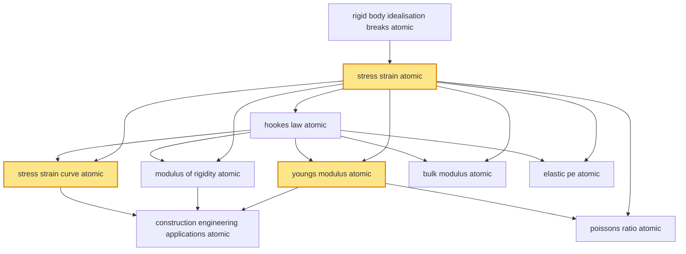

# T18 — Elasticity  *(Class 11)*

> Dependency-ordered teaching pathway for physics-teacher review.
> **10 atomic + 14 nano = 24 concept-simulations.**  3 💎 diamond (highest-impact).

**How to use this:** teach top-to-bottom. Everything in a level only depends on earlier levels. Each **atomic** is a full teachable idea (= one simulation); the **↳ nanos** under it are its sub-points (one symbol / term / edge-case each).

**Foundations (teach first, nothing in this chapter comes before them):** rigid_body_idealisation_breaks_atomic

## Concept dependency graph (atomic backbone)

## Teaching pathway (dependency-ordered)

### Level 0 — foundations

- **`rigid_body_idealisation_breaks_atomic`** — Rigid-body assumption (T11-T17) is an idealisation; real bodies deform under applied forces; elasticity is the theory of small-deformation regime

### Level 1

- **`stress_strain_atomic`** 💎 — Stress = F/A (force per unit area; SI: Pa = N/m²). Strain = ΔL/L (dimensionless ratio of deformation to original dimension). **Three stress types: tensile (axial), shear (tangential), hydraulic (uniform pressure)**.
  - ↳ `tensile_compressive_stress_nano` — Force F along axis: F/A acts along normal. Tensile = pulling apart; compressive = pushing together. Same magnitude/formula, opposite directions.
  - ↳ `shear_stress_nano` — Force F tangential to surface area A: F/A acts in plane. Pure shear deforms a rectangle into a parallelogram. Cross-link to T15 torque (rotational analog).
  - ↳ `hydraulic_volumetric_stress_nano` — Uniform pressure P acts on all surfaces of body: volumetric stress = P (SI: Pa). Strain = ΔV/V. Applies in deep oceans, hydraulic presses, atmospheric compression.

### Level 2

- **`hookes_law_atomic`** — Within elastic limit: stress ∝ strain → stress = E × strain (where E is the relevant modulus). Linear regime only.  _(targets misconception: Hooke's law applies always)_

### Level 3

- **`stress_strain_curve_atomic`** 💎 — Graphical representation showing: proportional limit (Hooke's law) → elastic limit → yield point → plastic regime → ultimate stress → fracture. Different materials show distinct curves (steel: brittle; rubber: ultra-elastic; glass: brittle no-yield)
  - ↳ `proportional_vs_elastic_vs_plastic_regimes_nano` — (1) Proportional limit: Hooke holds. (2) Elastic limit: deformation reverses on unloading; non-linear in this band. (3) Yield point: plastic deformation begins. (4) Plastic regime: permanent deformation. (5) Ultimate stress: peak before fracture. **Cognitive scaffold nano.**
  - ↳ `ductile_vs_brittle_materials_nano` — Ductile (large plastic regime): copper, aluminum, gold — drawn into wire. Brittle (negligible plastic regime): glass, cast iron — shatter without warning. Indian materials industry context.
- **`youngs_modulus_atomic`** 💎 — Y = (F/A) / (ΔL/L) = stress / longitudinal strain; characterises tensile/compressive deformation. **Industrial values:** steel ~200 GPa, aluminum ~70 GPa, brass ~91 GPa, rubber ~0.01-0.1 GPa  _(targets misconception: Y depends on size of body)_
  - ↳ `steel_vs_aluminum_vs_rubber_y_nano` — Steel Y ≈ 200 GPa (high stiffness; structural). Aluminum Y ≈ 70 GPa (lighter; aerospace). Rubber Y ≈ 0.01-0.1 GPa (extremely flexible; tires + seals). **Materials-selection table.**
  - ↳ `tata_steel_rail_track_y_application_nano` — Indian Railways rail tracks: high-carbon-steel Y ≈ 210 GPa; spec'd to specific elongation under thermal expansion + dynamic load. Tata Steel + SAIL manufacture per IR specs.
- **`modulus_of_rigidity_atomic`** — η = (F/A) / (Δx/L) = shear stress / shear strain; characterises shear deformation. Typically 0.3-0.5 × Y for metals
  - ↳ `torsion_of_wire_application_nano` — Torsion of cylindrical wire by torque τ: angle of twist φ = τL / (η · I_polar); used in torsional pendulum + torsion balance (Cavendish experiment for G measurement)
- **`bulk_modulus_atomic`** — K = −V(dP/dV) = −(volumetric stress) / (volumetric strain). Negative sign because volume DECREASES as pressure INCREASES. Compressibility = 1/K
  - ↳ `k_for_solids_liquids_gases_nano` — Solids: K ~10^11 Pa (steel ~160 GPa). Liquids: K ~10^9 Pa (water ~2.2 GPa). Gases: K varies with process; ideal gas isothermal K = P; adiabatic K = γP. **Cross-cluster bridge to T27 (ideal gas K = P)**
  - ↳ `deep_ocean_pressure_application_nano` — Indian Navy submarines (INS Arihant + INS Kalvari) operate at depths ~200-400 m with hydrostatic pressure ~20-40 bar; hull design uses bulk modulus to predict deformation
- **`elastic_pe_atomic`** — Energy stored in deformed body within elastic limit: U = ½ × stress × strain × volume = ½ × (F/A) × (ΔL/L) × A·L = ½·F·ΔL. Bridges to T17 SHM spring elastic-PE (½kx²) and T13 Work-Energy general
  - ↳ `spring_energy_half_kx_squared_bridge_nano` — For spring (Hooke's-law system): U = ½kx². Identical form to ½·stress·strain·V because spring IS a Hooke's-law system with effective E·A/L = k

### Level 4

- **`poissons_ratio_atomic`** — σ = −(transverse strain) / (longitudinal strain). When body stretched longitudinally, transverse dimensions shrink slightly. Dimensionless; typical values 0.2-0.5  _(targets misconception: Poisson's ratio = 0.5 always)_
  - ↳ `poisson_ratio_table_nano` — Cork ≈ 0 (no transverse change). Steel ≈ 0.30. Brass ≈ 0.34. Aluminum ≈ 0.33. Rubber ≈ 0.50 (incompressible volume). Glass ≈ 0.21.
- **`construction_engineering_applications_atomic`** — Beam loading, cantilever bending, bridge engineering all use elasticity: deflection ∝ load/Y; safety factor = ultimate stress / working stress. **Indian civil engineering context**
  - ↳ `l_t_construction_bridge_y_application_nano` — L&T Construction (Mumbai Sea Link, Bandra-Worli, Bogibeel Bridge): structural-steel Y critical for deflection prediction; safety factor 2-3× ultimate stress
  - ↳ `drdo_armor_composite_y_application_nano` — DRDO + Indian armed forces armor: composites with high Y per unit weight; ceramic-metal-polymer combinations; Arjun tank + Tejas LCA airframe applications
