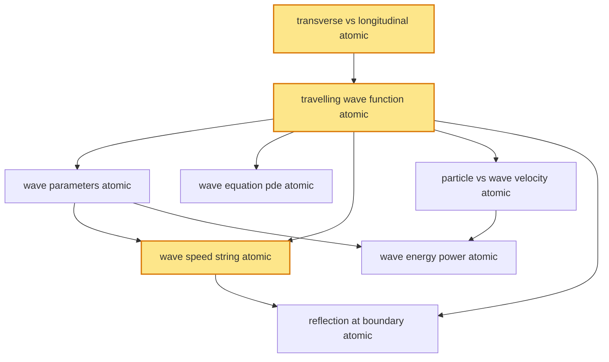

# T19 — Wave Equation  *(Class 11)*

> Dependency-ordered teaching pathway for physics-teacher review.
> **8 atomic + 15 nano = 23 concept-simulations.**  3 💎 diamond (highest-impact).

**How to use this:** teach top-to-bottom. Everything in a level only depends on earlier levels. Each **atomic** is a full teachable idea (= one simulation); the **↳ nanos** under it are its sub-points (one symbol / term / edge-case each).

**Foundations (teach first, nothing in this chapter comes before them):** transverse_vs_longitudinal_atomic

## Concept dependency graph (atomic backbone)

## Teaching pathway (dependency-ordered)

### Level 0 — foundations

- **`transverse_vs_longitudinal_atomic`** 💎 — Wave = propagating disturbance. **Transverse:** particle displacement ⊥ to propagation (string, light, water surface). **Longitudinal:** particle displacement ∥ to propagation (sound, pressure). All waves transport energy + momentum WITHOUT net mass transfer.
  - ↳ `string_wave_demo_nano` — Transverse: shake one end of long string → pulse travels along string while each particle moves up-down only. Classroom demo + lab.
  - ↳ `slinky_longitudinal_demo_nano` — Slinky compression-rarefaction = longitudinal wave demo; Indian classroom physics-lab standard.
  - ↳ `water_surface_mixed_wave_nano` — Surface water waves: particles trace small circles → mixed transverse + longitudinal. Indian coastal observation (Marina Beach, Goa).

### Level 1

- **`travelling_wave_function_atomic`** 💎 — Sinusoidal travelling wave: y(x, t) = A sin(kx − ωt + φ). Right-moving: argument (kx − ωt). Left-moving: (kx + ωt). Phase velocity v = ω/k.  _(targets misconception: particles travel with wave)_
  - ↳ `pulse_vs_continuous_wave_nano` — Pulse = single disturbance (e.g., one shake of string). Continuous wave = repeated sinusoidal source. Both obey wave equation; pulse = sum-of-sinusoids via Fourier (bridge to T22).

### Level 2

- **`wave_parameters_atomic`** — Wave parameters: amplitude A, wavelength λ, period T, frequency f = 1/T, angular frequency ω = 2πf, wave-number k = 2π/λ. Universal relation v = fλ = ω/k.
  - ↳ `amplitude_nano` — Maximum displacement from equilibrium. Units: m (transverse) or m (longitudinal displacement) or Pa (sound pressure amplitude).
  - ↳ `wavelength_nano` — Spatial period: distance between consecutive crests (or any 2π phase-matched points). λ = v/f.
  - ↳ `period_frequency_nano` — Temporal period T = time for one full cycle; f = 1/T = cycles/sec. Hz = s⁻¹.
  - ↳ `wavenumber_angular_frequency_nano` — k = 2π/λ (rad/m); ω = 2π/T (rad/s). Both phase-rate quantities; central to wave-equation.
- **`wave_equation_pde_atomic`** — Second-order PDE: ∂²y/∂t² = v²·∂²y/∂x². Travelling wave y(x±vt) is general solution (d'Alembert). **Linear PDE → superposition holds (foundation for T22).**
  - ↳ `verification_sub_into_pde_nano` — Substitute y = A sin(kx − ωt) into PDE → ω² = v²k² → v = ω/k. Cognitive scaffold for derivation.
- **`particle_vs_wave_velocity_atomic`** — v_particle = ∂y/∂t = −Aω cos(kx − ωt) — oscillates ±Aω. v_wave = ω/k — constant phase-velocity. **Two fundamentally different quantities; common JEE confusion.**  _(targets misconception: v_particle = v_wave)_
  - ↳ `phase_velocity_vs_group_velocity_nano` — For non-dispersive medium: v_phase = v_group. For dispersive (e.g., deep water, glass-prism light): v_group can differ → wave packet envelope moves at v_group. **V2 extension; flagged.**

### Level 3

- **`wave_speed_string_atomic`** 💎 — Speed of transverse wave on stretched string: v = √(T/μ); T = tension (N), μ = linear mass density (kg/m). Derived from Newton's 2nd law on small arc. **Industry-anchored: sitar/tabla/guitar string tuning, Indian Railways rail-vibration diagnostics.**
  - ↳ `musical_string_tuning_application_nano` — Sitar, tabla, sarod, guitar tuning: increase tension T → higher v → higher f (for fixed L). Indian classical music + Western. **Healthcare bridge:** ultrasound transducers also use string-resonance principles.
  - ↳ `rail_vibration_application_nano` — Indian Railways uses ultrasonic rail-flaw detection: travelling-wave reflections reveal internal cracks. Tata Steel + IR Research Designs & Standards Organisation (RDSO Lucknow) maintain testing standards.
- **`wave_energy_power_atomic`** — Power transmitted: P = ½μvω²A². Energy density ∝ A²f². Bridges T13 Work-Energy (energy transported through fluid/string) + T17 SHM elastic-PE.
  - ↳ `intensity_a_squared_dependence_nano` — Wave intensity I = P/A ∝ A²ω² → doubling amplitude quadruples intensity. Critical to T23 sound (dB scale) + T44 wave optics (Malus law variation).

### Level 4

- **`reflection_at_boundary_atomic`** — Wave at boundary: **fixed end** → π phase change (crest reflects as trough). **Free end** → 0 phase change. Boundary impedance determines partial reflection + transmission. **Sets up T22 standing waves.**  _(targets misconception: phase change always at reflection)_
  - ↳ `light_vs_heavy_string_partial_reflection_nano` — Wave on light string hitting junction with heavy string: partial reflection (phase-inverted) + partial transmission (in-phase). Classroom demo.
  - ↳ `optical_fibre_total_internal_reflection_bridge_nano` — T19 reflection mechanism extends to T42 TIR + T50 optical-fibre communication (BSNL + ISRO satellite-to-ground).
