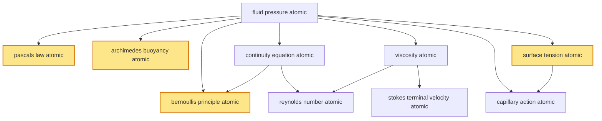

# T20 — Fluid Mechanics  *(Class 11)*

> Dependency-ordered teaching pathway for physics-teacher review.
> **10 atomic + 21 nano = 31 concept-simulations.**  4 💎 diamond (highest-impact).

**How to use this:** teach top-to-bottom. Everything in a level only depends on earlier levels. Each **atomic** is a full teachable idea (= one simulation); the **↳ nanos** under it are its sub-points (one symbol / term / edge-case each).

**Foundations (teach first, nothing in this chapter comes before them):** fluid_pressure_atomic

## Concept dependency graph (atomic backbone)

## Teaching pathway (dependency-ordered)

### Level 0 — foundations

- **`fluid_pressure_atomic`** — Pressure in fluid: P = F/A; depth-dependence P = P₀ + ρgh (hydrostatic). Acts equally in all directions at a point. SI: Pa = N/m². Atmospheric pressure ≈ 10⁵ Pa.
  - ↳ `depth_pressure_rho_g_h_nano` — Pressure increases linearly with depth: P(h) = P₀ + ρgh. Indian-Navy submarine context: 10 m water = 1 atm; INS Arihant at 300 m ≈ 31 atm.
  - ↳ `atmospheric_pressure_torricelli_nano` — Torricelli mercury barometer: 760 mm Hg = 1 atm = 1.013 × 10⁵ Pa. Indian meteorology stations (IMD network) measure surface pressure for weather prediction.

### Level 1

- **`pascals_law_atomic`** 💎 — Pressure applied at any point in enclosed incompressible fluid transmits undiminished to every other point. F_out/A_out = F_in/A_in → mechanical advantage = A_out/A_in.  _(targets misconception: pressure increases force proportionally to area)_
  - ↳ `hydraulic_lift_application_nano` — Tata Motors + Ashok Leyland workshop hydraulic-lift systems use Pascal's law. Maruti/Hyundai service stations India-wide: 100 kg force on 10 cm² piston → 10,000 kg lift on 1 m² piston.
  - ↳ `hydraulic_brakes_jcb_nano` — JCB India earthmovers + Tata trucks + Indian Railways braking systems use hydraulic-pressure transmission. JCB Pune manufactures excavators with Pascal-law hydraulics.
- **`archimedes_buoyancy_atomic`** 💎 — Object immersed in fluid experiences upward buoyant force equal to weight of fluid displaced: F_b = ρ_fluid × V_displaced × g. Floats if ρ_object < ρ_fluid (effective density via shape).  _(targets misconception: heavier objects sink)_
  - ↳ `iron_ship_floats_hull_shape_nano` — Steel hull of cargo ship: total density (steel + air interior) << water density. INS Vikrant aircraft carrier displacement 45,000 tonnes — floats per Archimedes. **Cognitive scaffold nano.**
  - ↳ `submarine_buoyancy_ballast_nano` — Indian Navy submarines (INS Arihant, Kalvari class) adjust buoyancy by flooding/blowing ballast tanks — controls effective ρ.
  - ↳ `hot_air_balloon_density_nano` — Hot air at 100°C has ρ ≈ 0.95 kg/m³ vs cold air at 25°C ρ ≈ 1.18 kg/m³ → buoyancy lift. Indian Hot Air Balloon Festival (Pushkar Rajasthan).
- **`continuity_equation_atomic`** — Mass conservation in incompressible flow: A₁v₁ = A₂v₂. Volume-flow-rate Q = Av is constant along tube.
  - ↳ `river_narrowing_application_nano` — Ganges narrows at Rishikesh + Haridwar gorges → flow speeds up; widens at delta → slows. Same flow rate.
- **`viscosity_atomic`** — F = ηA(dv/dy); shear stress = η × velocity-gradient. SI: Pa·s. η_water(20°C) ≈ 10⁻³ Pa·s; η_honey ≈ 10 Pa·s; η_air ≈ 1.8 × 10⁻⁵ Pa·s. Temperature-dependent (liquids: η ↓ as T ↑; gases: η ↑ as T ↑).  _(targets misconception: viscosity = thickness)_
  - ↳ `engine_oil_grading_application_nano` — Indian Oil (IOCL) + HP + BP engine-oil SAE grades: 10W-30, 5W-40 — multi-grade oils with η-T behaviour spec'd for Indian climate (40-45°C summer).
- **`surface_tension_atomic`** 💎 — T = F/L (force per unit length along surface); equivalently energy per unit area (J/m²). Origin: net inward cohesive force on surface molecules. T_water ≈ 73 × 10⁻³ N/m at 20°C.  _(targets misconception: surface tension floats things)_
  - ↳ `droplet_spherical_shape_nano` — Surface tension minimises surface area → sphere for fixed volume. Rain droplets, mercury beads, soap bubbles all approach spherical.
  - ↳ `water_strider_insect_nano` — Water strider (पानी का कीड़ा — observable in Indian ponds) walks on water: weight = surface-tension support across legs. Demonstrates scale-dependence.
  - ↳ `soap_bubble_excess_pressure_nano` — Inside soap bubble: ΔP = 4T/R (two surfaces). Inside water droplet: ΔP = 2T/R (one surface). Smaller bubble → higher inside pressure.

### Level 2

- **`bernoullis_principle_atomic`** 💎 — P + ½ρv² + ρgh = constant along streamline (incompressible + non-viscous + steady flow). Pressure DROPS where velocity rises.  _(targets misconception: Bernoulli applies to any flow)_
  - ↳ `aviation_lift_application_nano` — HAL Tejas + Boeing 787 Air India + IndiGo A320 wing: curved upper surface → faster airflow → lower pressure → net upward lift. **Approximation only** (Bernoulli partially explains; angle-of-attack also critical).
  - ↳ `venturi_flowmeter_nano` — Pipe narrowing → higher v → lower P → manometer reading gives flow rate. Used in Indian petroleum (IOCL refineries) + water-supply (Hindustan Tin Works) + medical IV drips.
  - ↳ `atomiser_spray_paint_nano` — Asian Paints + Berger Paints spray-gun atomisers; horizontal high-v airflow creates low pressure that sucks paint up nozzle. Also IPL stadium watering sprinklers.
- **`stokes_terminal_velocity_atomic`** — Drag on small sphere in viscous fluid: F_drag = 6πηrv (low-Re limit). Terminal v: v_t = (2/9)·(ρ_sphere − ρ_fluid)gr²/η when drag = net weight.
  - ↳ `raindrop_terminal_velocity_nano` — Monsoon raindrop (r ≈ 2 mm) reaches v_t ≈ 6-10 m/s in seconds; without air resistance would fall at >100 m/s from 1 km cloud. **Indian monsoon context.**
  - ↳ `parachute_drdo_application_nano` — DRDO + Indian Army parachute design (ADRDE Agra) uses Stokes/quadratic-drag scaling for terminal v ≈ 5 m/s landing speed.
- **`reynolds_number_atomic`** — Re = ρvD/η; dimensionless ratio of inertial to viscous forces. Re < 2000: laminar; Re > 4000: turbulent; 2000-4000: transition. Predicts onset of turbulence.  _(targets misconception: Re predicts flow type uniquely)_
  - ↳ `pipe_flow_water_supply_nano` — Indian municipal water supply (Bangalore BWSSB, Delhi DJB, Mumbai BMC): pipe design uses Re to prevent turbulent losses + pump-power-spec.
- **`capillary_action_atomic`** — Capillary rise in narrow tube: h = 2T cosθ / (ρgr). Angle of contact θ determines rise (θ<90°: rise) or depression (θ>90°: e.g., mercury in glass).
  - ↳ `soil_water_uptake_agricultural_nano` — ICAR (Indian Council of Agricultural Research) studies capillary rise in soil — controls irrigation efficiency. Drip irrigation (Jain Irrigation Jalgaon) leverages capillary distribution.
  - ↳ `plant_xylem_capillary_nano` — Plant xylem tubes lift water from roots to leaves via capillary + transpiration. Critical for Indian farming + horticulture.
  - ↳ `blotting_paper_chromatography_nano` — Paper chromatography (Class 11-12 lab + DRDO forensics) uses capillary rise in paper fibres to separate dye components.
