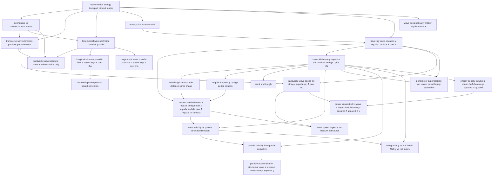

# T21 — Wave Motion  *(Class 11)*

> Dependency-ordered teaching pathway for physics-teacher review.
> **25 atomic + 42 nano = 67 concept-simulations.**

**How to use this:** teach top-to-bottom. Everything in a level only depends on earlier levels. Each **atomic** is a full teachable idea (= one simulation); the **↳ nanos** under it are its sub-points (one symbol / term / edge-case each).

**Foundations (teach first, nothing in this chapter comes before them):** wave_motion_energy_transport_without_matter

## Concept dependency graph (atomic backbone)

## Teaching pathway (dependency-ordered)

### Level 0 — foundations

- **`wave_motion_energy_transport_without_matter`** — A wave transports energy/disturbance from one region of space to another **without bulk motion of matter**
  - ↳ `queue_jerk_propagation_analogy` — Person in queue leans → pushes neighbor → jerk propagates without anyone walking forward
  - ↳ `cork_pieces_on_water_demo` — Drop pebble in pond; cork pieces bob up-down but don't move outward
  - ↳ `circular_ripple_on_water` — Raindrop on calm water → expanding circle. Each water particle locally up-down only.

### Level 1

- **`mechanical_vs_nonmechanical_waves`** — Mechanical waves require a medium (sound, string, water); non-mechanical do not (EM, matter waves)
  - ↳ `sound_requires_medium_no_sound_in_vacuum` — Bell-jar experiment: bell rings inaudibly when air pumped out. Sound is a mechanical wave.
  - ↳ `EM_waves_propagate_in_vacuum_speed_c` — Light from stars reaches earth across vacuum at c = 3×10⁸ m/s
  - ↳ `matter_waves_de_broglie_brief_mention` — Quantum-mechanical waves associated with electrons, used in electron microscopes
- **`wave_pulse_vs_wave_train`** — Single jerk = wave pulse; continuous oscillation of source = wave train (or wave packet)
- **`wave_does_not_carry_matter_only_disturbance`** — Restating A1 as a misconception-confronting atomic: when a sound wave goes from a speaker to your ear, NO air physically travels — only the disturbance pattern does

### Level 2

- **`transverse_wave_definition_particles_perpendicular`** — Wave where medium particles oscillate **perpendicular** to propagation direction (string, water surface, EM)
  - ↳ `string_pulse_y_perpendicular_x_propagation` — Hand snap up-down sends pulse along x; each string element moves in y only
- **`longitudinal_wave_definition_particles_parallel`** — Wave where medium particles oscillate **along** propagation direction (sound in air, compression in slinky)
  - ↳ `compressions_and_rarefactions` — Longitudinal wave = alternating high-density and low-density regions traveling
  - ↳ `piston_in_pipe_generates_sound` — Push-pull piston creates sinusoidal compressions in air → sound wave
- **`traveling_wave_equation_y_equals_f_t_minus_x_over_v`** — The general form of a wave traveling in +x direction at speed v: y(x,t) = f(t − x/v). The argument MUST be in the combination (t − x/v).
  - ↳ `argument_must_be_t_minus_or_plus_x_over_v` — y = f(x−vt) or y = f(t−x/v) for +x propagation; y = f(t+x/v) for −x propagation
  - ↳ `wave_PDE_d2y_dt2_equals_v2_d2y_dx2` — Wave equation in PDE form (∂²y/∂t² = v² ∂²y/∂x²). Any solution f(x±vt) satisfies it.
  - ↳ `arbitrary_function_f_works_as_long_as_argument_correct` — y = (t − x/v)², or y = A exp[-(t−x/v)/T], or y = sin... — all are wave equations. Shape is arbitrary; ARGUMENT is constrained.

### Level 3

- **`sinusoidal_wave_y_equals_a_sin_kx_minus_omega_t_plus_phi`** — The canonical sinusoidal traveling wave: y(x,t) = A sin(kx − ωt + φ). A=amplitude, k=wave number, ω=angular freq, φ=phase constant.
  - ↳ `amplitude_A_max_displacement` — A = max value of y; particles oscillate between +A and −A
  - ↳ `phase_kx_minus_omega_t_plus_phi` — The entire argument is "the phase"; determines y at any (x,t)
  - ↳ `alternate_sine_wave_forms` — y = A sin(kx−ωt) ≡ A sin 2π(x/λ − t/T) ≡ A sin k(x−vt). All same wave.
  - ↳ `phase_constant_phi_initial_phase` — φ in y = A sin(kx − ωt + φ) is the **initial phase angle** — sets the wave's lateral shift / starting position at (x=0, t=0). Determined by initial conditions. φ = π/2 makes the wave start at max; φ = π reverses the sine; etc.
- **`transverse_waves_require_shear_modulus_solids_only`** — Transverse waves can propagate only in media that can sustain shearing strain — solids only. Longitudinal waves propagate in solids, liquids, gases.
  - ↳ `S_waves_dont_pass_through_earth_liquid_core` — Seismology: P-waves (longitudinal) arrive first everywhere; S-waves (transverse) don't reach the antipode → proof Earth's outer core is liquid
- **`transverse_wave_speed_on_string_v_equals_sqrt_T_over_mu`** — Speed of transverse wave on a stretched string: v = √(T/μ). T = tension, μ = linear mass density (mass/length).
  - ↳ `dimensional_analysis_T_per_mu_gives_velocity_squared` — [T] = MLT⁻², [μ] = ML⁻¹ → [T/μ] = L²T⁻². So v = C·√(T/μ); exact derivation shows C=1.
  - ↳ `circular_arc_derivation_string_segment` — Small string element forms arc of radius R, moves with speed v in moving frame; centripetal force T·Δl/R balances tension components; algebra gives v = √(T/μ)
  - ↳ `mu_definition_mass_per_unit_length` — μ = m/L. For a uniform string of total mass m and total length L. Units kg/m.
  - ↳ `tension_higher_wave_faster` — Pluck a tighter string → wave travels faster → higher pitch (sitar tuning)
  - ↳ `heavier_string_slower_wave` — Thicker (heavier per length) string → slower wave → lower pitch
- **`longitudinal_wave_speed_in_fluid_v_equals_sqrt_B_over_rho`** — Speed of longitudinal wave in a fluid: v = √(B/ρ). B = bulk modulus, ρ = density.
- **`longitudinal_wave_speed_in_solid_rod_v_equals_sqrt_Y_over_rho`** — Speed of longitudinal wave in a long solid rod: v = √(Y/ρ). Y = Young's modulus.

### Level 4

- **`wavelength_lambda_min_distance_same_phase`** — Wavelength = minimum spatial distance between two points oscillating in phase
  - ↳ `wavelength_distance_between_crests_or_troughs` — Easiest measurement: λ = distance between consecutive crests (or troughs)
  - ↳ `k_equals_2pi_over_lambda_wave_number` — Angular wave number k = 2π/λ; unit rad/m. "Number of waves in 2π length."
- **`angular_frequency_omega_period_relation`** — ω = 2π/T = 2πν. T = period (seconds per cycle), ν = frequency (cycles per second, Hz)
  - ↳ `period_T_time_for_one_full_oscillation` — T = time for any particle to complete one cycle
  - ↳ `frequency_nu_units_hertz` — ν = 1/T, unit Hz = oscillations per second
- **`crest_and_trough`** — Crest = point of max positive displacement (+A); trough = max negative (−A)
- **`newton_laplace_speed_of_sound_correction`** — Newton's formula v = √(P/ρ) ≈ 280 m/s underestimates by ~15%. Laplace correction: process is adiabatic, not isothermal → B_adiabatic = γP → v = √(γP/ρ) = 331 m/s (matches measurement).
- **`principle_of_superposition_two_waves_pass_through_each_other`** — When two or more waves traverse the same medium simultaneously, the displacement of any element is the algebraic sum of displacements due to each wave. The waves pass through unmodified after overlap.
  - ↳ `displacements_add_algebraically_pointwise` — At each (x,t), y_total = y_1 + y_2 + ... + y_n
  - ↳ `linear_waves_only_obey_superposition` — Superposition holds for small-amplitude (linear) waves. Non-linear waves (huge amplitude) don't simply add.
  - ↳ `two_pulses_pass_through_each_other_then_continue` — Two opposite-shape pulses momentarily cancel at overlap (y_total = 0 across string), then continue unchanged
- **`energy_density_in_wave_u_equals_half_rho_omega_squared_A_squared`** — Energy per unit volume in a sinusoidal wave: u = ½ρω²A². Comes from SHM energy ½kx² applied to each particle.

### Level 5

- **`wave_speed_relations_v_equals_omega_over_k_equals_lambda_over_T_equals_nu_lambda`** — Three equivalent expressions for wave speed: v = ω/k = λ/T = νλ
  - ↳ `lambda_equals_v_T_distance_per_period` — Wavelength = distance the wave travels in one period
- **`power_transmitted_in_wave_P_equals_half_rho_omega_squared_A_squared_S_v`** — Average power = ½ρω²A²·S·v (S = cross-sectional area). Alternative form on string: P_av = 2π²μvA²ν².

### Level 6

- **`wave_velocity_vs_particle_velocity_distinction`** — **Two different velocities exist at the same point.** Wave velocity v = ω/k (constant, depends on medium). Particle velocity v_P = ∂y/∂t = Aω cos(kx−ωt+φ) (varies sinusoidally with time, depends on position+time).
  - ↳ `wave_velocity_constant_in_medium` — v = ω/k is set by medium properties (string tension, mass density). Same value for all particles.
  - ↳ `particle_velocity_changes_sinusoidally` — v_P = Aω cos(...) — changes sign every half-cycle, depends on time and position
  - ↳ `particle_velocity_zero_at_extreme_positions` — At y = ±A, cos(phase) = 0 (since sin = ±1), so v_P = 0
  - ↳ `particle_velocity_max_at_mean_position` — At y = 0, cos = ±1, so v_P = ±Aω = maximum particle speed
  - ↳ `v_P_equals_minus_v_wave_times_slope` — Elegant relation: v_P = −v × (∂y/∂x). Particle velocity = −(wave velocity) × (slope of y-x graph at that point)
- **`wave_speed_depends_on_medium_not_source`** — The medium determines wave speed. Frequency is set by the source; wavelength adapts via λ = v/ν.
  - ↳ `frequency_set_by_source_wavelength_adapts` — Tune fork at higher ν → string vibrates faster → λ becomes shorter, but v = ν·λ stays constant
  - ↳ `wave_at_string_junction_changes_v_and_lambda` — When wave crosses from light string to heavy string, v decreases, ν unchanged, λ decreases

### Level 7

- **`particle_velocity_from_partial_derivative`** — v_P(x,t) = ∂y/∂t = Aω cos(kx − ωt + φ)
  - ↳ `partial_derivative_t_treats_x_constant` — ∂/∂t means hold x fixed (look at one particle); d/dt would mean follow a moving point
- **`two_graphs_y_vs_x_at_fixed_t_AND_y_vs_t_at_fixed_x`** — Two visualizations of the same wave: (i) y-vs-x at fixed time (snapshot — shows wavelength λ); (ii) y-vs-t at fixed position (single particle's SHM — shows period T). Same equation, different "slice".
  - ↳ `y_x_graph_slope_is_partial_dy_dx` — On the y-x snapshot, slope = ∂y/∂x at that point (not dy/dx since y is a 2-variable function)
  - ↳ `y_t_graph_slope_is_particle_velocity` — On the y-t graph at fixed x, slope = ∂y/∂t = particle velocity
  - ↳ `phase_difference_from_path_difference_phi_equals_2pi_over_lambda_times_delta_x` — Two particles at distance Δx on the same y-x graph have phase difference φ = (2π/λ)·Δx
  - ↳ `phase_difference_from_time_interval_phi_equals_2pi_over_T_times_delta_t` — Same particle at two times Δt has phase difference φ = (2π/T)·Δt

### Level 8

- **`particle_acceleration_in_sinusoidal_wave_a_p_equals_minus_omega_squared_y`** — a_P = ∂²y/∂t² = −ω² · y(x,t). Same form as SHM — each particle executes SHM.
