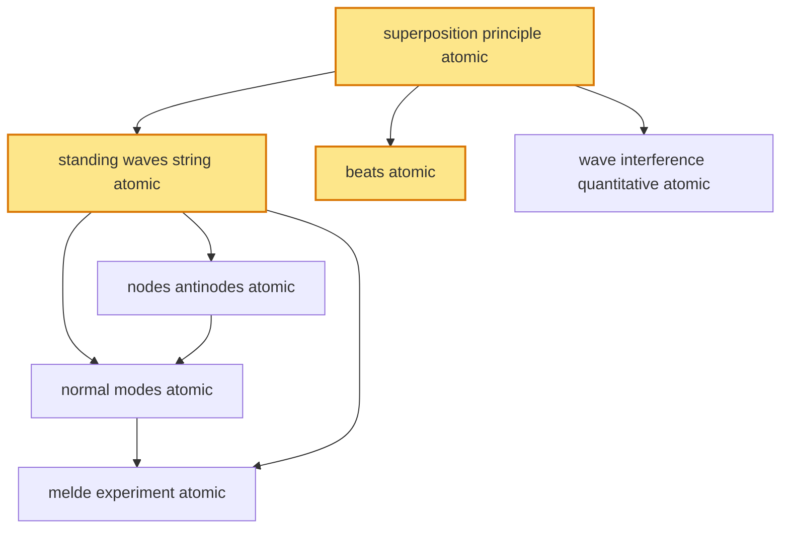

# T22 — Superposition Standing Waves  *(Class 11)*

> Dependency-ordered teaching pathway for physics-teacher review.
> **7 atomic + 12 nano = 19 concept-simulations.**  3 💎 diamond (highest-impact).

**How to use this:** teach top-to-bottom. Everything in a level only depends on earlier levels. Each **atomic** is a full teachable idea (= one simulation); the **↳ nanos** under it are its sub-points (one symbol / term / edge-case each).

**Foundations (teach first, nothing in this chapter comes before them):** superposition_principle_atomic

## Concept dependency graph (atomic backbone)

## Teaching pathway (dependency-ordered)

### Level 0 — foundations

- **`superposition_principle_atomic`** 💎 — When two or more waves traverse the same medium, the resultant displacement at any point at any time = vector sum of individual displacements. y(x,t) = y₁(x,t) + y₂(x,t) + ... Follows from linearity of wave equation (T19).
  - ↳ `two_pulse_crossing_nano` — Two pulses approach + cross: at the moment of overlap, displacements add (constructive if same sign; destructive if opposite). After crossing, each pulse continues unchanged — **waves pass through each other**.
  - ↳ `boundary_reflection_transmission_coefficients_nano` — At light↔heavy string junction: reflection coefficient r = (v₂−v₁)/(v₂+v₁); transmission coefficient t = 2v₂/(v₂+v₁). Energy conservation: r²+t²·(v₁/v₂)·(μ₂/μ₁)·...

### Level 1

- **`standing_waves_string_atomic`** 💎 — Two oppositely-travelling waves of equal amplitude/frequency superpose to give: y(x,t) = 2A sin(kx) cos(ωt). **Spatial envelope sin(kx) determines amplitude pattern; time-factor cos(ωt) makes whole pattern oscillate in place. No energy translation.**  _(targets misconception: standing wave doesn't transport energy)_
  - ↳ `counter_propagating_pair_construction_nano` — Standing wave construction: y₁(x,t) = A sin(kx − ωt) [right-moving] + y₂(x,t) = A sin(kx + ωt) [left-moving from reflection] → 2A sin(kx) cos(ωt). Trig identity: sin(A−B) + sin(A+B) = 2 sin(A) cos(B).
  - ↳ `energy_localised_not_translated_nano` — At any node, both kinetic + potential energy of string-particle are zero. At antinode, particle KE oscillates max ↔ 0; PE oscillates 0 ↔ max — total energy of segment constant; localised. No power flow across nodes.
- **`beats_atomic`** 💎 — Superposition of two waves of nearly-equal frequency f₁, f₂ at the same point: amplitude envelope oscillates at f_envelope = (f₁−f₂)/2, but intensity oscillates at f_beat = |f₁−f₂|. Audible as "wah-wah" pulsation.  _(targets misconception: beats happen in space)_
  - ↳ `tabla_tuning_application_nano` — Tabla, sitar, violin tuning by ear: master tuner adjusts string until beats with reference frequency slow to zero — at zero beats, frequencies match. **Indian-classical-music universal practice; ITC Sangeet + Doordarshan music broadcasts.**
  - ↳ `piano_tuner_beat_detection_nano` — Piano tuners (rare in India but exists) use beats between adjacent strings to set "equal temperament" — slight frequency offsets give consonant intervals. Same physics as tabla tuning.
- **`wave_interference_quantitative_atomic`** — Two-source superposition at point P: y_P = y₁ + y₂. Path difference Δ → phase difference φ = 2πΔ/λ. **Constructive interference:** Δ = nλ → amplitude = 2A (intensity 4× single-source). **Destructive:** Δ = (n+½)λ → amplitude = 0. **Foundation for T44 wave optics YDSE.**
  - ↳ `intensity_pattern_cos_squared_nano` — I(φ) = 4I₀ cos²(φ/2) for two coherent equal-amplitude sources. Pattern oscillates between 0 (destructive) and 4I₀ (constructive). **Already validated in T44 wave optics YDSE.**

### Level 2

- **`nodes_antinodes_atomic`** — **Nodes:** positions where sin(kx) = 0 → x = 0, λ/2, λ, ... (spacing λ/2). **Antinodes:** sin(kx) = ±1 → x = λ/4, 3λ/4, 5λ/4, ... (also λ/2 spacing). Antinodes between adjacent nodes.  _(targets misconception: nodes at boundaries always)_
  - ↳ `fixed_vs_free_boundary_pattern_nano` — **Fixed-fixed string** (sitar): node at both ends; allowed wavelengths λ_n = 2L/n. **Open-open pipe** (flute, hollow tube): antinode at both ends; same λ_n = 2L/n but pressure pattern flipped. **Open-closed pipe** (clarinet, single-end closed): node at closed end, antinode at open end; only odd harmonics λ_n = 4L/(2n−1).

### Level 3

- **`normal_modes_atomic`** — Standing-wave allowed frequencies on fixed-fixed string of length L: f_n = n·v/(2L), n = 1, 2, 3, ... **Harmonics:** f_1 = fundamental; f_2 = 2nd harmonic = 1st overtone; etc. For open-closed pipe: f_n = (2n−1)·v/(4L), only odd harmonics.
  - ↳ `harmonics_overtones_terminology_nano` — f_n = n·f_1: n=1 is fundamental (1st harmonic); n=2 is 1st overtone = 2nd harmonic; etc. **Terminology trap:** "nth harmonic" = nth multiple of f_1; "nth overtone" = (n+1)th harmonic. Cognitive scaffold for student.
  - ↳ `musical_instrument_harmonics_application_nano` — Sitar/veena/violin: many harmonics simultaneously (tone "timbre"); fundamental gives pitch; relative amplitudes of harmonics determine tonal character (sitar vs violin sound DIFFERENT at same pitch). **ITC Sangeet Research Academy + IIT-Bombay music-cognition** research.

### Level 4

- **`melde_experiment_atomic`** — Standing waves on a string driven by electrical tuning fork at one end; other end attached to weight via pulley. Standing-wave pattern forms when f_driver matches one of f_n = n·v/(2L). Classic Indian Class-11/12 physics-lab apparatus.
  - ↳ `resonance_amplitude_buildup_nano` — At f_driver = f_n: forced oscillator (string) responds with very large amplitude (theoretically infinite without damping; practically limited by air drag + internal losses). Bridges to T17 SHM driven-damped-oscillator.
  - ↳ `acoustic_resonator_cavity_application_nano` — Microwave cavity resonators (used in Indian Space Programme + DRDO radar): same standing-wave physics in 3D box. Cavity length tunes resonant frequency.
