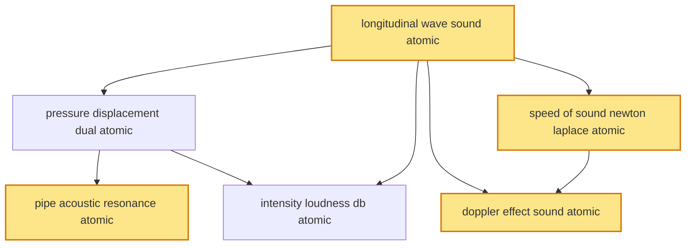

# T23 — Sound Waves  *(Class 11)*

> Dependency-ordered teaching pathway for physics-teacher review.
> **6 atomic + 19 nano = 25 concept-simulations.**  4 💎 diamond (highest-impact).

**How to use this:** teach top-to-bottom. Everything in a level only depends on earlier levels. Each **atomic** is a full teachable idea (= one simulation); the **↳ nanos** under it are its sub-points (one symbol / term / edge-case each).

**Foundations (teach first, nothing in this chapter comes before them):** longitudinal_wave_sound_atomic

## Concept dependency graph (atomic backbone)

## Teaching pathway (dependency-ordered)

### Level 0 — foundations

- **`longitudinal_wave_sound_atomic`** 💎 — Sound is a longitudinal mechanical wave: particles of medium oscillate parallel to direction of energy propagation, creating alternating compressions (high pressure) + rarefactions (low pressure). Requires elastic medium (gas, liquid, solid) — cannot travel through vacuum.  _(targets misconception: longitudinal-vs-transverse)_
  - ↳ `compression_rarefaction_pattern_nano` — Compression = particles momentarily bunched → local pressure increase ΔP > 0. Rarefaction = particles momentarily spread → ΔP < 0. Pattern travels at v_sound; individual particles oscillate in-place ±s₀. **Mass NOT transported; only the disturbance.**
  - ↳ `vacuum_no_sound_demonstration_nano` — Bell jar with vacuum pump: ringing bell becomes silent as air is evacuated — proves sound needs medium. Contrast with light (EM wave) which propagates through vacuum. **Indian CBSE Class-11 lab demo.**
  - ↳ `ultrasound_infrasound_audible_bands_nano` — Audible band: ~20 Hz–20 kHz (declines with age). **Ultrasound > 20 kHz** (AIIMS medical imaging, industrial NDT, dog whistles, bat echolocation). **Infrasound < 20 Hz** (elephant communication, IMD earthquake-precursor monitoring, volcano monitoring). Same physics; different perception.

### Level 1

- **`pressure_displacement_dual_atomic`** — Sound wave can be described two equivalent ways: **Displacement wave** s(x,t) = s₀ sin(kx−ωt); **Pressure wave** p(x,t) = p₀ cos(kx−ωt) = BAks₀ cos(kx−ωt) (where B = bulk modulus). **Key:** pressure leads displacement by π/2 → pressure-antinode coincides with displacement-node.  _(targets misconception: pressure peaks where displacement peaks)_
  - ↳ `phase_shift_pi_over_2_visualisation_nano` — Stationary snapshot: where particles are maximally displaced (compression edge), they are momentarily at rest — local pressure neither max nor min. Where particles cross equilibrium (max velocity), they bunch densely → max pressure. **Visualisation requires double-track animation (displacement + pressure synchronised).**
  - ↳ `pressure_amplitude_p0_formula_nano` — p₀ = BAks₀ where B = bulk modulus, k = wavenumber, s₀ = displacement amplitude. For air at STP: B ≈ 1.42×10⁵ Pa; typical conversational speech p₀ ≈ 0.01 Pa with s₀ ≈ 10⁻⁸ m — extraordinarily small displacement, measurable pressure.
- **`speed_of_sound_newton_laplace_atomic`** 💎 — Speed of sound in gas: **Newton (1687) — isothermal assumption:** v = √(P/ρ) → predicts 280 m/s at STP (wrong; measured 332 m/s, off by ~16%). **Laplace (1816) — adiabatic correction:** v = √(γP/ρ) where γ = Cp/Cv ≈ 1.40 for air → predicts 332 m/s (matches experiment). Physical reason: sound oscillations are too rapid for heat exchange → adiabatic, not isothermal.
  - ↳ `temperature_dependence_v_sqrt_T_nano` — From v = √(γRT/M): v ∝ √T (at fixed γ, M). **Indian-classroom-grade rule:** v at temperature T (in K) = v₀·√(T/T₀). At T = 0°C: v = 332 m/s; at T = 30°C (Indian summer): v ≈ 350 m/s. Audible to musicians during humid Indian summers.
  - ↳ `humidity_density_dependence_nano` — Humid air has slightly LOWER mean molar mass (water vapour M=18 < dry-air M=29) → v slightly HIGHER in humid air. ~0.4% increase per 50% RH change. Negligible in classroom, measurable in precision acoustic engineering (CSIR-NPL standards).
  - ↳ `speed_in_liquids_solids_nano` — Liquids: v = √(B/ρ); water ≈ 1480 m/s. Solids: v = √(Y/ρ); steel ≈ 5960 m/s. **Solids fastest** because Young's modulus >> bulk modulus of gas. Anchor: DRDO submarine SONAR uses water sound-speed; Indian Railways rail-track sound transmission detectable miles away (rail-ear-press folklore).

### Level 2

- **`pipe_acoustic_resonance_atomic`** 💎 — Air columns inside pipes support standing waves of sound: pressure node ↔ displacement antinode (and vice versa) at boundaries. **Open-open pipe (flute, bansuri):** displacement antinodes at both ends → f_n = nv/(2L), all harmonics. **Open-closed pipe (clarinet, bottle):** displacement node at closed end + antinode at open end → f_n = (2n−1)v/(4L), only odd harmonics. **End-correction:** effective length = L + 0.6r at each open end.
  - ↳ `bansuri_shehnai_harmonics_nano` — Indian bamboo bansuri (Hariprasad Chaurasia tradition) is open-open pipe — full harmonic series accessible (the flute "sweetness"). Shehnai is open-closed-conical-bore — only odd harmonics dominate giving distinctive "nasal" timbre. **ITC Sangeet Research Academy formal pedagogy.**
  - ↳ `end_correction_explanation_nano` — At the open end, the air column extends slightly beyond the physical mouth (because pressure-equalisation extends into open air). End-correction ≈ 0.6r where r = pipe radius. **Indian Class-11/12 physics lab resonance-column experiment with water column directly measures this.**
  - ↳ `resonance_column_apparatus_nano` — Standard CBSE/ISC + IIT physics-lab apparatus: vertical glass tube + adjustable water reservoir; tuning fork held over open top; resonance heard when air-column length = λ/4, 3λ/4, ... Measures v_sound from known fork frequency. Tests Laplace formula directly.
- **`intensity_loudness_db_atomic`** — **Intensity** I = power/area = ½ρωv·s₀² = p₀²/(2ρv) [W/m²]. **Decibel scale (logarithmic):** β = 10 log₁₀(I/I₀) with reference I₀ = 10⁻¹² W/m² (threshold of human hearing). **Loudness perception is approximately logarithmic** (Weber-Fechner law). Conversational speech ≈ 60 dB; rock concert ≈ 110 dB; pain threshold ≈ 120 dB.  _(targets misconception: double intensity = double dB)_
  - ↳ `log_scale_intuition_db_nano` — Each 10 dB = 10× intensity. 60 dB → 70 dB is 10× more intense, perceived as ~2× louder. Common Indian-context: autorickshaw horn at 1 m ≈ 100 dB; Mumbai traffic ambient ≈ 75 dB; library ≈ 30 dB. Cognitive scaffold: log scale matches human sensory perception.
  - ↳ `inverse_square_intensity_falloff_nano` — Point source in 3D: I ∝ 1/r² → β decreases by 6 dB per doubling of distance. Why: same energy spreads over surface 4πr². Important for noise-pollution regulation + concert-hall design. **CPCB India noise standards reference this.**
  - ↳ `noise_pollution_indian_standards_nano` — **CPCB (Central Pollution Control Board) India** mandates: residential zones ≤ 55 dB daytime / 45 dB night; commercial 65/55; industrial 75/70; silence-zone (hospitals, schools) 50/40. Enforcement via state pollution-control boards.
- **`doppler_effect_sound_atomic`** 💎 — Apparent frequency f' heard by observer differs from source frequency f when source-observer-medium relative motion exists. **General formula:** f' = f·(v ± v_obs)/(v ∓ v_src) where signs depend on directions and v = sound speed in medium. **Asymmetry:** medium is at rest in lab frame — source-moving vs observer-moving give different formulae (not Galilean-equivalent).  _(targets misconception: source-vs-observer asymmetry due to medium frame)_
  - ↳ `ambulance_siren_passing_by_nano` — Classic anchor: ambulance approaches → f' > f (pitch rises); passes → f' < f (pitch drops). **Indian context:** police siren, ambulance horn, Indian Railways horn-doppler at level crossings — high-pitched-approaching → low-pitched-receding step-change at observer pass-by.
  - ↳ `source_observer_asymmetry_explanation_nano` — Why two formulae? Sound wave is carried by medium (air at rest). If source moves toward observer, wavelength in front compresses (λ' < λ); v_sound unchanged → f' = v/λ' > f. If observer moves toward stationary source, λ unchanged but observer sweeps through wavefronts faster → f' = (v+v_obs)/λ > f. **Different physical mechanisms.**
  - ↳ `sonic_boom_mach_cone_nano` — When v_src > v_sound (supersonic): wavefronts pile up into a Mach cone of half-angle sin θ = v/v_src. Sonic boom = shockwave reaching observer. **Indian anchor: HAL Tejas LCA + IAF Sukhoi/Rafale supersonic test flights over Pokhran + Bay of Bengal corridor.**
  - ↳ `doppler_radar_application_nano` — Police speed-guns + Indian traffic-radar (Delhi/Mumbai/Bengaluru): emit microwave, measure reflected-wave Doppler shift → vehicle speed. ISRO weather-radar (Doppler weather imaging): wind-velocity from rain-droplet reflection shift. **Same Doppler principle — observer + reflector + source roles inverted.**
  - ↳ `beats_doppler_application_nano` — Apply T22 beats to Doppler: two slightly-detuned tuning forks (e.g., 256 Hz vs 258 Hz) produce 2 Hz beats. If one fork moves, Doppler shifts its f, changing beat rate — classic Indian-physics-lab tuning-fork experiment. **Cross-reference T22 beats_atomic.**
