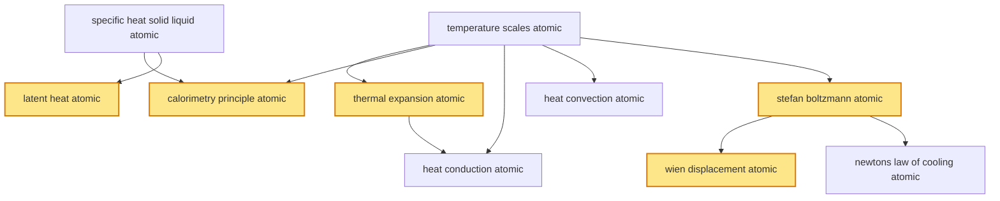

# T25 — Thermal Properties  *(Class 11)*

> Dependency-ordered teaching pathway for physics-teacher review.
> **10 atomic + 19 nano = 29 concept-simulations.**  5 💎 diamond (highest-impact).

**How to use this:** teach top-to-bottom. Everything in a level only depends on earlier levels. Each **atomic** is a full teachable idea (= one simulation); the **↳ nanos** under it are its sub-points (one symbol / term / edge-case each).

**Foundations (teach first, nothing in this chapter comes before them):** temperature_scales_atomic, specific_heat_solid_liquid_atomic

## Concept dependency graph (atomic backbone)

## Teaching pathway (dependency-ordered)

### Level 0 — foundations

- **`temperature_scales_atomic`** — Temperature: measure of thermal energy; thermometric property. Three scales: Celsius (water-ice 0°C, boiling 100°C), Kelvin (absolute, 0 K = −273.15°C), Fahrenheit (legacy). T(K) = T(°C) + 273.15. ΔT(K) = ΔT(°C).
  - ↳ `kelvin_vs_celsius_for_delta_T_nano` — ΔT in Kelvin = ΔT in Celsius (since both scales have 1-unit = 1-K size). All thermal-physics equations use ΔT directly — Kelvin-vs-Celsius doesn't matter for differences. Critical for student.
  - ↳ `clinical_thermometer_application_nano` — AIIMS + apollo + Class-12 lab clinical thermometer: 35-42°C range, mercury or digital. Indian-context: fever monitoring during dengue/COVID waves.
- **`specific_heat_solid_liquid_atomic`** — Q = mCΔT; energy to raise unit mass by unit temperature. Water C ≈ 4186 J/kg·K (exceptionally high); ice ≈ 2100; steam ≈ 2010; iron ≈ 460; copper ≈ 385. **Bridges T26 Cv/Cp gas-specific-heats to operational form.**
  - ↳ `water_high_c_climate_application_nano` — Water's high C anchors Indian monsoon thermal regulation: oceans heat slowly + cool slowly → moderate coastal climates. Cooking: 1 L water at 25°C → 100°C needs 314 kJ.

### Level 1

- **`thermal_expansion_atomic`** 💎 — Solid bodies expand on heating: ΔL = αL₀ΔT (linear); ΔA = βA₀ΔT (area, β ≈ 2α); ΔV = γV₀ΔT (volume, γ ≈ 3α). Coefficient α depends on material. Steel α ≈ 12 × 10⁻⁶ /K; copper ≈ 17 × 10⁻⁶; aluminum ≈ 23 × 10⁻⁶.  _(targets misconception: α/β/γ independent)_
  - ↳ `linear_area_volumetric_relation_nano` — β = 2α; γ = 3α (to leading order). Derivation: differentiate (L+ΔL)² = L² + 2LΔL + (ΔL)² and (L+ΔL)³ similarly. Cognitive scaffold.
  - ↳ `rail_track_expansion_application_nano` — Indian Railways 1 km steel rail expands ~1.2 cm per 10°C ΔT. Expansion gaps (4-6 mm) every 13 m rail section. Welded long-rail uses pre-stressing. **Tata Steel + SAIL spec'd to standard α.**
  - ↳ `anomalous_water_expansion_4c_nano` — Water has MAXIMUM density at 4°C; expands on cooling 4→0°C. Causes ice to float + Indian lake-fish to survive winter beneath ice cap. Critical to monsoon climate.
  - ↳ `thermal_expansion_liquid_gas_nano` — Liquid γ_water ≈ 207 × 10⁻⁶ /K. Gas: PV = nRT means γ_gas dominated by P-T behaviour (V proportional to T at constant P). **Cross-cluster link to T20 fluid density-T dependence.**
- **`calorimetry_principle_atomic`** 💎 — Heat-lost = Heat-gained in mixing without phase-change: m₁C₁(T₁−T_f) = m₂C₂(T_f−T₂). Conservation of energy applied to thermal interactions.
  - ↳ `water_equivalent_application_nano` — Water equivalent W of calorimeter: heat absorbed by calorimeter = W·C_water·ΔT. Standard Indian physics-lab equipment + IIT-Bombay+IIT-Madras Class-11/12 lab kits.
- **`latent_heat_atomic`** 💎 — Q = mL; energy absorbed/released at phase transition WITHOUT temperature change. L_f (fusion) ice→water = 334 kJ/kg. L_v (vaporisation) water→steam = 2260 kJ/kg.  _(targets misconception: ice at 0°C = water at 0°C energetically)_
  - ↳ `pressure_cooker_application_nano` — Standard Indian pressure cooker (Hawkins, Prestige): raises boiling-point to ~120°C at 1.5-2 atm; uses L_v released on condensation to cook food faster + with less fuel.
  - ↳ `sweat_cooling_evaporation_nano` — Human sweating in Indian-summer (40-45°C): L_v ≈ 2400 kJ/kg at 35°C → evaporative cooling. 1 g sweat removes 2.4 kJ from skin. **Healthcare/physiology Indian context.**
- **`heat_convection_atomic`** — Bulk-fluid motion driven by buoyancy + thermal gradient transfers heat. Hot fluid rises (lower ρ); cold fluid sinks; circulation moves heat. **Convection IS buoyancy-driven flow.**
  - ↳ `sea_breeze_land_breeze_monsoon_nano` — Land heats faster than ocean (lower C) → hot air rises over land → cool air flows in from sea = day-time sea breeze. Reverse at night = land breeze. **Indian monsoon is large-scale extension of this.**
  - ↳ `room_heater_radiator_application_nano` — Bajaj + Usha room-heaters: hot-air convection circulates room air. North-Indian winter context.
- **`stefan_boltzmann_atomic`** 💎 — Total power radiated by black/grey body: P = σεAT⁴. σ = 5.67 × 10⁻⁸ W/m²·K⁴. ε = emissivity (1 for blackbody, <1 for grey body). **Bridges to T38 EM Waves** (radiation IS EM).
  - ↳ `ntpc_boiler_thermal_application_nano` — NTPC Korba + Tata Power Mundra + BHEL boilers operate at 600°C surface temps; radiative loss σ(T⁴ − T_amb⁴) is major heat-loss source; insulation + reflective coatings critical.
  - ↳ `sun_solar_radiation_isro_nano` — Sun ≈ blackbody at 5778 K → P/A ≈ σT⁴ ≈ 6 × 10⁷ W/m². Solar constant at Earth ≈ 1361 W/m². ISRO satellites + Indian solar-PV plants use this.

### Level 2

- **`heat_conduction_atomic`** — Fourier's law: Q/t = kA(ΔT/L). k = thermal conductivity. Cu k ≈ 400 W/m·K; Fe ≈ 80; glass ≈ 1; air ≈ 0.025; wool ≈ 0.04 (insulator).
  - ↳ `thermal_conductor_vs_insulator_nano` — Indian housing materials: brick (k ≈ 0.8) vs concrete (k ≈ 1.4) vs wood (k ≈ 0.13). BIS National Building Code thermal-insulation requirements.
  - ↳ `winter_clothing_woollen_insulation_nano` — Wool sweater + double-layer clothing in North-Indian winter: trapped air (k ≈ 0.025) is the actual insulator, wool just traps. Same principle in thermos flask.
- **`wien_displacement_atomic`** 💎 — λ_max · T = b (b = 2.898 × 10⁻³ m·K). Peak wavelength of blackbody spectrum shifts inversely with T. Sun (5778 K): λ_max ≈ 500 nm (yellow-green). Earth (300 K): λ_max ≈ 10 μm (infrared).
  - ↳ `thermal_imaging_drdo_application_nano` — DRDO + Indian armed forces thermal-imaging night-vision goggles: detect 300-310 K body heat → IR at λ ≈ 9.7 μm. AIIMS COVID screening thermometers use same principle.
  - ↳ `imd_satellite_radiometer_nano` — IMD INSAT satellites carry IR radiometers measuring cloud-top temperatures via Wien's-law peak shift → weather prediction.
- **`newtons_law_of_cooling_atomic`** — dT/dt = −k(T − T_env); small-ΔT-from-environment limit of Stefan-Boltzmann. T(t) = T_env + (T₀ − T_env)·e^(−kt).
  - ↳ `tea_cooling_application_nano` — Hot tea (60°C → 25°C ambient) cools per Newton's law; characteristic time τ ≈ 1/k ≈ 10-15 min for standard Indian tea-cup.
