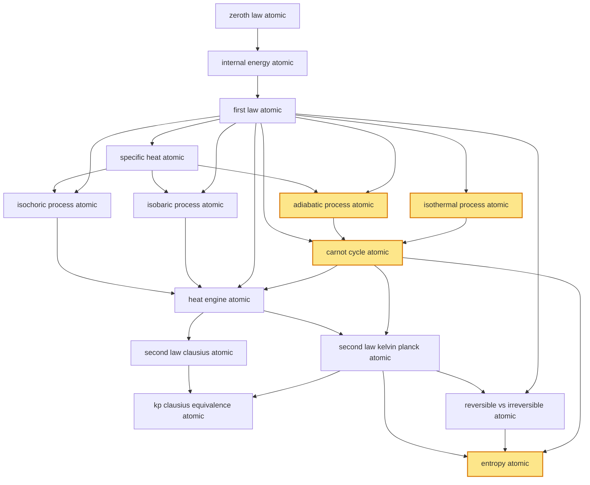

# T26 — Thermodynamics  *(Class 11)*

> Dependency-ordered teaching pathway for physics-teacher review.
> **15 atomic + 18 nano = 33 concept-simulations.**  4 💎 diamond (highest-impact).

**How to use this:** teach top-to-bottom. Everything in a level only depends on earlier levels. Each **atomic** is a full teachable idea (= one simulation); the **↳ nanos** under it are its sub-points (one symbol / term / edge-case each).

**Foundations (teach first, nothing in this chapter comes before them):** zeroth_law_atomic

## Concept dependency graph (atomic backbone)

## Teaching pathway (dependency-ordered)

### Level 0 — foundations

- **`zeroth_law_atomic`** — Two systems in thermal equilibrium with a third are in equilibrium with each other; temperature is the operational state-variable defining "thermally equilibrated"
  - ↳ `temperature_scales_nano` — T(K) = T(°C) + 273.15; T(°F) = (9/5)T(°C) + 32; absolute zero = 0 K = −273.15 °C; Kelvin = SI primary
  - ↳ `primary_thermometer_nano` — CSIR-NPL Delhi maintains India's primary temperature standard (ITS-90 platinum-resistance thermometer); gas thermometer = primary definition basis

### Level 1

- **`internal_energy_atomic`** — U = sum of kinetic + potential energies of all molecules; STATE function (path-independent); depends only on (T, V, n) for an ideal gas → depends only on T
  - ↳ `state_vs_path_function_nano` — State function: U, T, P, V, S (depend only on the state, ΔU = U_f − U_i). Path function: Q, W (depend on the path between states). **Cognitive-error-prevention nano**.

### Level 2

- **`first_law_atomic`** — ΔU = Q − W; energy conservation generalised to heat; Q heat ADDED to system, W work DONE BY system
  - ↳ `first_law_sign_convention_nano` — Physics convention (NCERT/HCV/DCP): Q in = +, W by system = +; ΔU = Q − W. Chemistry convention: Q in = +, W on system = +; ΔU = Q + W. Same physics, opposite sign for W. **Cognitive-error-prevention nano — explicit contrast required.**
  - ↳ `work_done_in_pv_diagram_nano` — W = ∫P dV (area under P-V curve); positive when V increases (expansion), negative when V decreases (compression)

### Level 3

- **`isothermal_process_atomic`** 💎 — T = constant; for ideal gas ΔU = 0 → Q = W; W = nRT ln(V_f/V_i); PV = constant (Boyle's law)
  - ↳ `isothermal_indian_radiator_nano` — Slow cooling of a car/scooter radiator at idle ≈ isothermal heat rejection at constant T_engine; Maruti Suzuki / Tata Motors / Bajaj engines designed around isothermal idle
  - ↳ `isothermal_vs_adiabatic_contrast_nano` — Side-by-side PV-overlay: both start at same (P,V), isothermal stays on PV=const, adiabatic on PV^γ=const (steeper, since γ>1). T drops in adiabatic expansion (Q=0 → all work comes from U → U drops → T drops). **Cognitive-error-prevention nano**.
- **`specific_heat_atomic`** — C = Q/(nΔT); Cv (constant volume) and Cp (constant pressure); Cp − Cv = R (Mayer's relation, ideal gas); γ = Cp/Cv (adiabatic index)
  - ↳ `mayers_relation_nano` — Cp − Cv = R (per mole, ideal gas); derived from first law applied to isobaric vs isochoric heating
  - ↳ `gamma_for_mono_di_polyatomic_nano` — Monatomic γ = 5/3 (He, Ne, Ar); diatomic γ = 7/5 (N₂, O₂, H₂); polyatomic γ ≈ 4/3 (CO₂, NH₃, CH₄). Bridges to T27 equipartition theorem (f degrees of freedom → Cv = fR/2)

### Level 4

- **`adiabatic_process_atomic`** 💎 — Q = 0 (no heat exchange); ΔU = −W; PV^γ = constant; T₁V₁^(γ−1) = T₂V₂^(γ−1); steeper PV-curve than isothermal
  - ↳ `diesel_engine_compression_nano` — Diesel engine compression-stroke is approximately adiabatic; T rises ~5× to auto-ignition temperature ~500 °C — fuel ignites without spark. Indian Railways WDM/WDG diesel locomotives + Tata/Mahindra/Ashok-Leyland diesel trucks operate on this.
- **`isobaric_process_atomic`** — P = constant; W = P·ΔV; ΔU = nCv·ΔT; Q = nCp·ΔT
  - ↳ `indian_pressure_cooker_nano` — Pressure-cooker pre-vent: isobaric heating at ~2 atm; raises water boiling point to ~120 °C → faster cooking. Hawkins/Prestige household appliance everywhere in India
- **`isochoric_process_atomic`** — V = constant; W = 0; ΔU = Q = nCv·ΔT; pressure scales linearly with T
  - ↳ `otto_cycle_combustion_nano` — Petrol engine combustion-stroke is approximately isochoric (volume constant during the brief ignition); used in Maruti/Honda/Bajaj petrol engines + Indian 2-wheeler market (~20M units/yr)

### Level 5

- **`carnot_cycle_atomic`** 💎 — 4-stroke reversible cycle: isothermal-expansion (T_hot) → adiabatic-expansion → isothermal-compression (T_cold) → adiabatic-compression. η_Carnot = 1 − T_cold/T_hot
  - ↳ `carnot_inequality_nano` — η_real ≤ η_Carnot for any heat engine operating between T_hot and T_cold; equality only for reversible engine. Foundation of second-law optimality.
  - ↳ `ntpc_thermal_efficiency_nano` — NTPC supercritical coal plants (Sipat, Vindhyachal, Mundra) operate T_hot ~600 °C steam, T_cold ~40 °C cooling water → η_Carnot ~64%, real η ~42-45%. India's ~75% electricity from such cycles.

### Level 6

- **`heat_engine_atomic`** — Cyclic device that converts Q_hot → W + Q_cold; efficiency η = W/Q_hot = 1 − Q_cold/Q_hot. Refrigerator + heat pump = reverse of heat engine (W input pumps heat cold→hot)
  - ↳ `refrigerator_cop_nano` — COP_refrigerator = Q_cold/W; COP_heat_pump = Q_hot/W; COP_HP = COP_R + 1. Voltas/Godrej/LG India refrigerators rated 1-5 BEE stars based on this
  - ↳ `bharat_stage_emission_norms_nano` — BS-VI norms (since 2020) constrain heat-engine efficiency curves on Indian Diesel/petrol vehicles — η improvements + emission caps. Indian Railways shifting from WDM diesel to electric (75% route-km AC-electrified) reduces aggregate Carnot losses.

### Level 7

- **`second_law_kelvin_planck_atomic`** — No process exists whose ONLY result is the complete conversion of heat from a single reservoir into work; equivalently, no heat engine has η = 100%
- **`second_law_clausius_atomic`** — No process exists whose ONLY result is the transfer of heat from a colder body to a hotter body; equivalently, no refrigerator works without external W input

### Level 8

- **`kp_clausius_equivalence_atomic`** — Proof that Kelvin-Planck violation ⟺ Clausius violation — assume one, construct a composite engine that violates the other. Establishes the two statements are operationally identical.
- **`reversible_vs_irreversible_atomic`** — Reversible: infinitely slow, no dissipation, system always in equilibrium; can be reversed by infinitesimal change. Irreversible: real processes (friction, heat conduction across finite ΔT, free expansion, mixing) — direction of time emerges

### Level 9

- **`entropy_atomic`** 💎 — S = ∫dQ_rev/T (operational definition); ΔS_universe ≥ 0 for any real process; entropy is a STATE function (despite Q being path function — Q_rev/T is path-independent for reversible paths)
  - ↳ `entropy_of_universe_increases_nano` — Σ ΔS_system + ΔS_surroundings ≥ 0 for any real process; equality only for reversible. Statistical interpretation: entropy = k ln(W) (Boltzmann; T27 territory but cross-link here).
  - ↳ `entropy_ncert_2023_note_nano` — NCERT 2023 condensed entropy treatment (removed standalone §12.13); HCV2 Ch.26 + DCWT Ch.21 retain full treatment; state boards (Maharashtra HSC, Tamil Nadu, Karnataka PUC, UP, WB) retain — author at full depth for state-board + JEE-Adv
