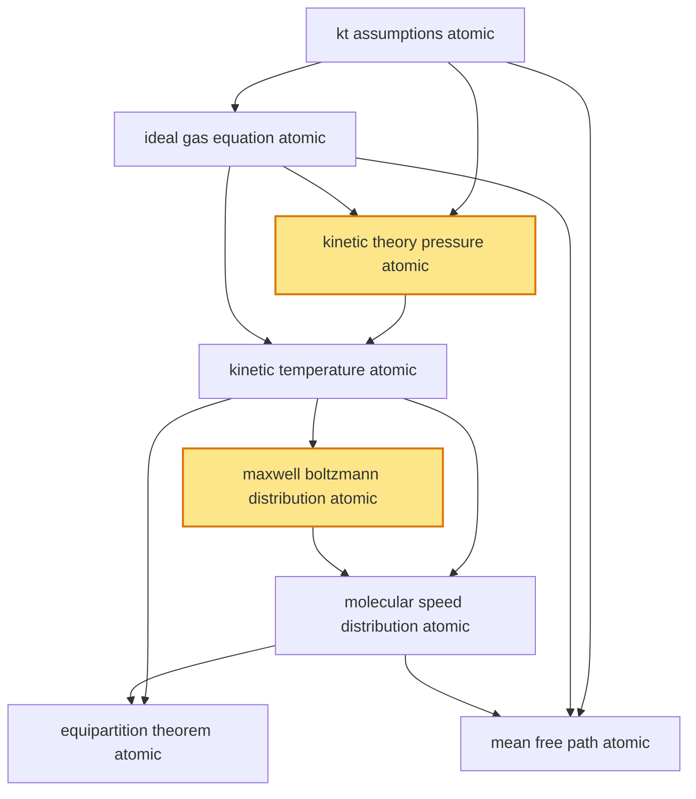

# T27 — Kinetic Theory  *(Class 11)*

> Dependency-ordered teaching pathway for physics-teacher review.
> **8 atomic + 16 nano = 24 concept-simulations.**  2 💎 diamond (highest-impact).

**How to use this:** teach top-to-bottom. Everything in a level only depends on earlier levels. Each **atomic** is a full teachable idea (= one simulation); the **↳ nanos** under it are its sub-points (one symbol / term / edge-case each).

**Foundations (teach first, nothing in this chapter comes before them):** kt_assumptions_atomic

## Concept dependency graph (atomic backbone)

## Teaching pathway (dependency-ordered)

### Level 0 — foundations

- **`kt_assumptions_atomic`** — Molecules are point particles + identical mass + random motion + elastic collisions + negligible inter-molecular volume vs container volume + Newtonian mechanics applies
  - ↳ `point_particle_vs_real_molecule_nano` — Real molecules have finite size + intermolecular forces (van der Waals); ideal-gas treatment is the high-T low-P limit

### Level 1

- **`ideal_gas_equation_atomic`** — PV = nRT (macroscopic); equivalent forms PV = NkT (per-molecule) and P = ρRT/M (density form). Bundles Boyle, Charles, Avogadro.
  - ↳ `boyle_charles_avogadro_unification_nano` — Boyle: PV=const at fixed T; Charles: V/T=const at fixed P; Avogadro: V ∝ n at fixed P,T. All three reconciled in PV=nRT.
  - ↳ `universal_gas_constant_R_nano` — R = 8.314 J/(mol·K); k = R/N_A = 1.38 × 10⁻²³ J/K (Boltzmann constant); SI-unit reconciliation

### Level 2

- **`kinetic_theory_pressure_atomic`** 💎 — PV = (1/3)Nm⟨v²⟩; pressure as time-averaged momentum-flux from molecular collisions on container walls; central derivation of chapter
  - ↳ `momentum_flux_per_collision_nano` — Single molecule with v_x hits wall: Δp = 2mv_x; collision rate per molecule = v_x/(2L); pressure contribution per molecule = mv_x²/V
  - ↳ `isotropy_factor_one_third_nano` — ⟨v_x²⟩ = ⟨v_y²⟩ = ⟨v_z²⟩ = ⟨v²⟩/3 by isotropy → factor 1/3 in PV = (1/3)Nm⟨v²⟩

### Level 3

- **`kinetic_temperature_atomic`** — (1/2)m⟨v²⟩ = (3/2)kT — temperature is proportional to per-molecule average translational kinetic energy
  - ↳ `temperature_is_translational_ke_not_total_ke_nano` — T relates only to translational KE per (3/2)kT per molecule; rotational + vibrational KE contribute to Cv but not directly to T. **Cognitive-error-prevention nano** — subtle but central misconception.

### Level 4

- **`maxwell_boltzmann_distribution_atomic`** 💎 — f(v) = 4π(m/2πkT)^(3/2) v² exp(−mv²/2kT); probability-density of molecular speeds; peaks at v_mp; broadens with T
  - ↳ `distribution_widens_with_temperature_nano` — At higher T: peak shifts right (higher v_mp), peak height decreases, total area stays = 1; the high-speed tail lengthens
  - ↳ `high_speed_tail_for_reaction_rates_nano` — Reaction rates depend on fraction of molecules with KE > activation energy → exponential tail dominates; basis for Arrhenius equation (chemistry)
  - ↳ `statistical_entropy_boltzmann_nano` — S = k ln W where W = number of microstates compatible with macrostate. Boltzmann's gravestone equation. Bridges to T26 entropy_atomic.

### Level 5

- **`molecular_speed_distribution_atomic`** — v_rms = √(3kT/m), v_avg = √(8kT/πm), v_mp = √(2kT/m); inequality v_mp < v_avg < v_rms
  - ↳ `three_speed_comparison_table_nano` — Side-by-side table: name, formula, numerical-ratio at fixed T (v_mp : v_avg : v_rms ≈ 1.000 : 1.128 : 1.225)
  - ↳ `rms_speed_n2_o2_at_300k_nano` — N₂ at 300 K: v_rms ≈ 517 m/s; O₂ at 300 K: v_rms ≈ 484 m/s; H₂ at 300 K: v_rms ≈ 1928 m/s (~Earth-escape relevant)

### Level 6

- **`equipartition_theorem_atomic`** — Each quadratic degree of freedom (KE or PE) contributes (1/2)kT to average per-molecule energy; total U = (f/2)NkT for f dof per molecule
  - ↳ `degrees_of_freedom_table_nano` — Side-by-side table: Monatomic (3 trans, f=3, γ=5/3, Cv=3R/2). Diatomic rigid (3 trans + 2 rot, f=5, γ=7/5, Cv=5R/2). Diatomic with vib at high T (f=7, γ=9/7, Cv=7R/2). Polyatomic linear (f=5-7), nonlinear (f=6+). **Cognitive-error-prevention nano** — students conflate the three.
  - ↳ `vibrational_modes_kick_in_at_high_t_nano` — Diatomic at room T: f=5 (3 trans + 2 rot). Above ~1000 K: vibrational modes activated → f=7. Explains why Cv is not strictly constant.
- **`mean_free_path_atomic`** — λ = 1/(√2·n·π·d²); average distance a molecule travels between collisions; bridges molecular-scale to bulk-transport phenomena (viscosity, diffusion, conduction)
  - ↳ `mfp_air_at_stp_nano` — Air at STP: λ ≈ 70 nm; n ≈ 2.7 × 10²⁵ /m³; d ≈ 0.37 nm. Validates point-particle assumption (λ ≫ d)
  - ↳ `atmospheric_diffusion_imd_ncmrwf_nano` — MFP increases at high altitude (low n) → diffusion becomes dominant transport mechanism; IMD/NCMRWF weather models use kinetic-theory-derived diffusion coefficients for pollutant transport (CPCB Mumbai/Delhi PM2.5 dispersion)
  - ↳ `vacuum_quality_via_mfp_nano` — Lab vacuum: P=10⁻⁶ torr → λ ~ 50 m ≫ chamber size → molecular-flow regime (vs viscous flow). ISRO satellite-thermal labs + BARC noble-gas separation operate in this regime.
