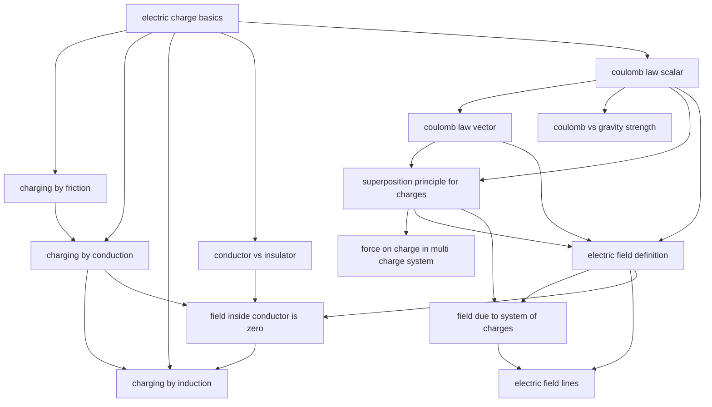

# T29 — Electric Charges  *(Class 12)*

> Dependency-ordered teaching pathway for physics-teacher review.
> **14 atomic + 17 nano = 31 concept-simulations.**

**How to use this:** teach top-to-bottom. Everything in a level only depends on earlier levels. Each **atomic** is a full teachable idea (= one simulation); the **↳ nanos** under it are its sub-points (one symbol / term / edge-case each).

**Foundations (teach first, nothing in this chapter comes before them):** electric_charge_basics

## Concept dependency graph (atomic backbone)

## Teaching pathway (dependency-ordered)

### Level 0 — foundations

- **`electric_charge_basics`** — Umbrella per CH-G1: additive (scalar nano) + conserved (β-decay nano) + quantised (q=ne nano). NCERT §1.5 carries all three in one section — keep them unified

### Level 1

- **`charging_by_friction`** — Class-room canonical: comb in dry hair, balloon on wall. Indian-context: monsoon vs winter dryness — winter sparks abundant
- **`conductor_vs_insulator`** — Free-electron model. Indian-context: dry wood = insulator (safe), wet wood = partial conductor (NOT safe — earthing-shock context per NCERT §1.3)
- **`coulomb_law_scalar`** — F = k q₁q₂/r². Sign convention via signed q₁, q₂. EPIC-C STATE_1 wrong belief: "force depends on net charge sum, not product" — common confusion

### Level 2

- **`charging_by_conduction`** — Touch a charged body to a neutral one → charge redistributes. Charge sharing q→q/2 when identical spheres touched
- **`coulomb_law_vector`** — Eq.1.3: F⃗₂₁ = (1/4πε₀)(q₁q₂/r²₂₁) r̂₂₁. The split per CH-G3 surfaces the scalar→vector pedagogical gap
- **`coulomb_vs_gravity_strength`** — NCERT Example 1.4: F_e/F_G ≈ 2.4e39 for e-p. Establishes "atomic-scale dominated by electric force; cosmic-scale dominated by gravity." Cross-cluster bridge to T16

### Level 3

- **`superposition_principle_for_charges`** — Per CH-G4: standalone atomic. Force on q due to system = vector sum of pairwise Coulomb forces. EPIC-C STATE_1 wrong belief: "the presence of q₃ modifies the q₁-q₂ pair force" — NO, pairs are independent

### Level 4

- **`force_on_charge_in_multi_charge_system`** — NCERT §1.7 application examples (equilateral triangle of 3 charges + 4-charge square problems). Direct superposition usage
- **`electric_field_definition`** — E⃗ = F⃗/q for test charge q→0. The "field exists without test charge" conceptual shift. EPIC-C STATE_1 wrong belief: "no force = no field" (field can exist; force shows up only when test charge present)

### Level 5

- **`field_due_to_system_of_charges`** — E⃗ = Σ E⃗_i. Direct from superposition. NCERT Eq.1.10. Visual: 3-charge field-vector composition at a point
- **`field_inside_conductor_is_zero`** — Per CH-G6: standalone atomic. The redistribution argument (HCV §29.13 + NCERT §1.15). High `Required-by` — foundation for capacitor theory, electrostatic shielding, and circuit-potential equality

### Level 6

- **`charging_by_induction`** — The canonical 5-step NCERT §1.4 process is the visual anchor. EPIC-C STATE_1 wrong belief: "the rod must touch" — induction does NOT require contact
- **`electric_field_lines`** — The 6 properties (start +, end −, never cross, density ∝ |E|, perpendicular to conductor surface, tangent gives direction). EPIC-C STATE_1 wrong belief: "field lines are physical objects" — they're geometric construction

### Other sub-concepts (parent atomic is in another chapter)

  - ↳ `additivity_of_charges` — Algebraic sum like mass; sign matters. 1-state insight
  - ↳ `charge_conservation` — β-decay creates e+p with net 0; pair production conserves
  - ↳ `quantisation_q_equals_ne` — Step-size e = 1.6e-19 C; macroscopic μC ≈ 10¹³ steps, so quantisation invisible at lab scale
  - ↳ `tribo_series_simple` — Glass+silk → glass +ve; ebonite+wool → ebonite −ve. Mnemonic table (5 entries) sufficient at Class 12
  - ↳ `grounding_completes_induction` — The wire-to-earth step is what separates "induction" from "polarisation". Without grounding, induction reverses when rod is removed
  - ↳ `semiconductor_intro` — Per CH-G5: nano here, atomic in T48. Just the existence + intermediate-ρ fact + "thermal carriers" hint
  - ↳ `earthing_safety_three_pin_plug` — NCERT §1.3 footnote on Indian home wiring (live + neutral + earth). Anchor primitive
  - ↳ `coulomb_constant_k_value` — k = 9e9 N·m²/C² in vacuum; permittivity ε₀ = 8.854e-12. Just the constants
  - ↳ `r_squared_dependence_intuition` — The "double distance, force becomes 1/4" pattern. Cross-cluster bridge to gravitation (already noted in T16 catalog)
  - ↳ `direction_attractive_vs_repulsive` — Same sign ⇒ along r̂₂₁; opposite sign ⇒ along −r̂₂₁. The sign-of-product = sign-of-direction insight
  - ↳ `newtons_third_law_check` — F⃗₁₂ = −F⃗₂₁. Coulomb's law respects Newton-III — a sanity check pedagogically valuable for confidence
  - ↳ `test_charge_limit` — Why q→0: large test charge would disturb the source distribution. HCV §29.3 explicit on this
  - ↳ `field_direction_radial_for_point_charge` — E⃗ points outward for +Q, inward for −Q. Sphere-of-symmetry insight
  - ↳ `field_lines_never_cross` — Because the field has a unique direction at every point. Pedagogically critical because students draw crossings in homework
  - ↳ `field_lines_perpendicular_to_conductor` — Bridge to A14: if not ⊥, surface charges redistribute until equilibrium
  - ↳ `redistribution_in_microseconds` — The free-electron drift to surface takes <1 ms (HCV §29.13). Pedagogically interesting — "instantaneous" is approximately true at lab scale
  - ↳ `charge_resides_on_surface` — Excess charge on a conductor sits on the outer surface. Bridge to Gauss's law (will be derived rigorously in T30)
