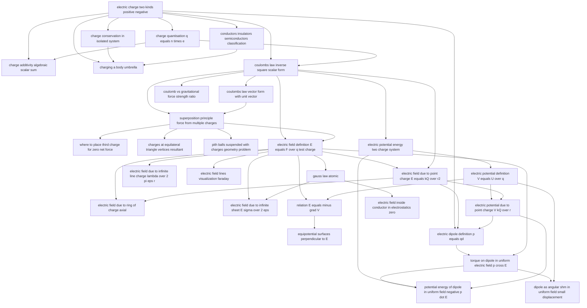

# T30 — Electrostatics  *(Class 12)*

> Dependency-ordered teaching pathway for physics-teacher review.
> **30 atomic + 36 nano = 66 concept-simulations.**

**How to use this:** teach top-to-bottom. Everything in a level only depends on earlier levels. Each **atomic** is a full teachable idea (= one simulation); the **↳ nanos** under it are its sub-points (one symbol / term / edge-case each).

**Foundations (teach first, nothing in this chapter comes before them):** electric_charge_two_kinds_positive_negative

## Concept dependency graph (atomic backbone)

## Teaching pathway (dependency-ordered)

### Level 0 — foundations

- **`electric_charge_two_kinds_positive_negative`** — Two types: positive (proton, glass rod after silk-rub) + negative (electron, plastic rod after fur-rub). Like repels, unlike attracts. **Indian-context anchor:** polyester saree spark in dry weather (NCERT §1.1 first paragraph).
  - ↳ `like_charges_repel_unlike_charges_attract` — Visual: two pith-balls hanging from threads; both repel or both attract depending on charge sign. NCERT Fig 1.1.
  - ↳ `polarity_franklin_convention` — Glass-rod-after-silk = +, plastic-rod-after-fur = −. Sign convention by Benjamin Franklin. Historical/conventional, no deep physics. NCERT §1.2.

### Level 1

- **`charge_quantisation_q_equals_n_times_e`** — Charge always integer multiple of e = 1.6×10⁻¹⁹ C. Macroscopic charges are huge n. **Per E-G2: separate from conservation.** NCERT §1.5.3; HCV2 §29.1 ("charge is quantized"); DCEM §24.2 #3.
  - ↳ `one_coulomb_equals_6_25e18_electrons` — 1 C / 1.6×10⁻¹⁹ ≈ 6.25×10¹⁸ electrons. NCERT Ex 1.2 (200 years to accumulate 1 C at 10⁹ e/s). HCV2 W.Ex 4.
  - ↳ `microscopic_continuity_approximation` — At macroscopic scales the discreteness of e is invisible — we treat charge as continuous. Justifies integration over continuous charge distributions. NCERT §1.5.3 closing paragraph.
- **`charge_conservation_in_isolated_system`** — Total charge of isolated system is constant. Per E-G2: separate from quantisation. NCERT §1.5.2 + DCEM §24.2 #4. **Pair-production / pair-annihilation example** as edge case (HCV2 §29.1: "in a beta decay process, a neutron converts into a proton and a fresh electron — total charge remains zero").
  - ↳ `charge_redistribution_not_creation` — Rubbing doesn't create charge — it transfers electrons. NCERT §1.2 final paragraph, HCV2 §29.1.
- **`conductors_insulators_semiconductors_classification`** — Conductors (metals, human body, earth) have free electrons; insulators (glass, plastic, wood) do not; semiconductors (Si, Ge) in between. All three sources agree (NCERT §1.3, DCEM §24.3, HCV2 §29.12).
  - ↳ `free_electrons_in_metals_conduction_electrons` — The cloud of weakly-bound outer-shell electrons. Critical for conductor physics. HCV2 §29.12.

### Level 2

- **`charge_additivity_algebraic_scalar_sum`** — Charges add algebraically with signs: (+1)+(+2)+(−3)+(+4)+(−5) = −1. Distinct from mass (always positive). Per E-G2: own atomic. NCERT §1.5.1.
- **`charging_a_body_umbrella`** — Per E-G3: one atomic with 4 method-nanos. Conceptual frame: electrons are transferred or redistributed; no charge is created. Covers all three classical charging methods + earthing for safety.
  - ↳ `charging_by_friction_rubbing_electron_transfer` — Two materials rubbed → electrons flow from donor to acceptor. Glass+silk → glass becomes +, silk becomes −. NCERT 1.2, DCEM 24.4 Charging by Rubbing.
  - ↳ `charging_by_contact_direct_transfer` — Charged object touches neutral object → both end with same-sign charge. DCEM 24.4 + Fig 24.1.
  - ↳ `charging_by_induction_no_direct_contact` — Bring charged rod near conductor + ground → conductor ends with opposite charge. Rod is not consumed. NCERT 1.4 Fig 1.4, DCEM 24.4 Fig 24.2, HCV2 §29.1 last paragraph.
  - ↳ `earthing_grounding_for_safety` — **Indian-context anchor:** Third pin in domestic socket. When fault occurs, charge dumps to earth through the third pin → user does not get shocked. DCEM Ex 24.6 + NCERT §1.3 ("we have to stick to certain pairs").
- **`coulombs_law_inverse_square_scalar_form`** — F = k\|q₁q₂\|/r² where k = 1/4πε₀ ≈ 9×10⁹ N·m²/C². Force along line joining charges. NCERT 1.6 eq 1.1–1.2, DCEM 24.5, HCV2 29.2 eq 29.1. **Per E-G4: separate scalar atomic from vector form.**
  - ↳ `coulombs_law_in_dielectric_medium_K_factor` — When a dielectric medium fills the space, F_medium = F_vacuum / K. K is dielectric constant of medium (K=1 vacuum, K≈80 water). DCEM 24.5 #4.
  - ↳ `coulomb_constant_k_equals_9e9_value` — k = 8.988×10⁹ N·m²/C² ≈ 9×10⁹ for problems. Derived from c² × 10⁻⁷. NCERT 1.6, DCEM 24.5.

### Level 3

- **`coulombs_law_vector_form_with_unit_vector`** — F₂₁ = (1/4πε₀)(q₁q₂/r²₂₁)r̂₂₁ . Sign of charges + direction of r̂ together encode attract vs repel. Per E-G4: separate atomic. NCERT 1.6 eq 1.3 + Fig 1.6, HCV2 §29.2 eq after 29.1.
  - ↳ `newton_third_law_for_coulomb_force` — F₂₁ = −F₁₂. Action-reaction pair. DCEM 24.5 #2. **Cross-topic ref T11 ← T30.**
  - ↳ `position_vector_form_for_3d_problems` — F on q₁ due to q₂ at positions r₁, r₂: F₁ = (1/4πε₀)(q₁q₂/\|r₁−r₂\|³)(r₁−r₂). 3D vector form for non-collinear charges. DCEM §24.5 Extra Points + Fig 24.5.
- **`coulomb_vs_gravitational_force_strength_ratio`** — F_e/F_g for two electrons = 4.17×10⁴² (HCV2 §29.1). For e-p = 2.4×10³⁹ (NCERT Ex 1.4). The take-away: electric force is ~10⁴⁰× stronger than gravity. **HCV2 owns this conceptual atomic.**
- **`electric_potential_energy_two_charge_system`** — U(r) = (1/4πε₀)(q₁q₂/r) with U(∞) = 0. Work done by external agent against Coulomb force. HCV2 §29.5 eq 29.5–29.6. **Cross-topic ref T13 ← T30.**
  - ↳ `pe_three_charge_system_pairwise_sum` — U_total = Σ pairs (1/4πε₀)(qᵢqⱼ/rᵢⱼ). HCV2 Ex 29.3 (three 10μC charges at triangle, U = 27 J).

### Level 4

- **`superposition_principle_force_from_multiple_charges`** — F₁ = Σᵢ F₁ᵢ = vector sum of pairwise Coulomb forces. NCERT 1.7 eq 1.4–1.5, DCEM 24.5 #1, HCV2 §29.2 (implicit).
- **`electric_potential_definition_V_equals_U_over_q`** — V_A = U_A/q (PE per unit test charge). Scalar (unlike E which is vector). Unit volt = joule/coulomb. HCV2 §29.6 eq 29.7–29.8, NCERT (later in Stage 3).
  - ↳ `potential_difference_V_B_minus_V_A_independent_of_path` — V_B − V_A = (U_B − U_A)/q depends only on endpoints. Conservative-field consequence. HCV2 §29.6.

### Level 5

- **`where_to_place_third_charge_for_zero_net_force`** — Two charges on a line; find position of third where net force = 0. Solution exists between like charges (closer to smaller) or outside unlike charges (beyond smaller). HCV2 W.Ex 2, DCEM-style typed problem.
- **`charges_at_equilateral_triangle_vertices_resultant`** — Three charges at corners; find force on each. By symmetry resultant on any vertex is along bisector. NCERT Ex 1.6, HCV2 §29 W.Ex 1, DCEM Ex 24.8.
  - ↳ `force_at_centroid_from_three_equal_charges_zero` — Charge Q at centroid of equilateral triangle with q,q,q at vertices: net F on Q = 0 by symmetry. NCERT Ex 1.6.
- **`pith_balls_suspended_with_charges_geometry_problem`** — Two identical pith balls (mass m, charge q) on threads from common point. Find angle θ where tension + gravity + Coulomb balance. HCV2 W.Ex 22-23, DCEM Ex 24.9 (with dielectric variant). **Indian classroom favorite.**
- **`electric_field_definition_E_equals_F_over_q_test_charge`** — E = lim(q→0) F/q. Vector. SI unit N/C (= V/m). Distinguishes "source" charge Q from "test" charge q. NCERT 1.8 + Eq 1.6–1.9, DCEM 24.6, HCV2 29.3.
  - ↳ `field_independent_of_test_charge_magnitude` — E depends only on source Q and position r, not on test q. NCERT §1.8 point (ii).
  - ↳ `field_direction_outward_for_positive_inward_for_negative` — E radially outward from +Q, radially inward to −Q. NCERT §1.8 point (iii).

### Level 6

- **`electric_field_due_to_point_charge_E_equals_kQ_over_r2`** — E = (1/4πε₀)(Q/r²) r̂. Spherical symmetry. NCERT §1.8 eq 1.6, DCEM 24.6, HCV2 29.3. **Per E-G5: own atomic.**
- **`electric_field_due_to_infinite_line_charge_lambda_over_2_pi_eps_r`** — E = λ/(2πε₀r) at perpendicular distance r from infinite line with linear charge density λ. E ∝ 1/r (not 1/r²). DCEM §24.6 "Electric Field of a Line Charge" derivation, HCV2 W.Ex 12. **Per E-G5: own atomic.**
  - ↳ `finite_rod_E_field_perpendicular_bisector` — For rod length 2a at perpendicular distance x: E = q/(4πε₀ x√(x²+a²)). Reduces to ∞-line for x ≪ a. DCEM §24.6, HCV2 W.Ex 12.
- **`electric_field_lines_visualization_faraday`** — Lines tangent to E, density proportional to magnitude. Originate from +, terminate at −, never cross. NCERT §1.11, DCEM (later section, Stage 3), HCV2 §29.4.
  - ↳ `lines_dont_cross_uniqueness_of_E` — At any point E has unique direction → field lines can't cross. HCV2 §29.4.
- **`relation_E_equals_minus_grad_V`** — E = −dV/dr along direction of maximum decrease. Components: E_x = −∂V/∂x, etc. The differential link between field and potential. HCV2 §29.8 eq 29.10–29.13. Per E-G7: own atomic.
  - ↳ `E_along_direction_of_steepest_V_decrease` — E points in direction of fastest V drop. dV/dr is rate of change with position. HCV2 §29.8 "the electric field is along the direction in which the potential decreases at the maximum rate."
- **`gauss_law_atomic`** — Per E-G1: Gauss's law lives in Topic 30 as one atomic with 3 application-nanos. ∮ E·dA = Q_enc/ε₀. Theoretical formulation from NCERT §1.12 (Stage-3 follow-up), DCEM §24.12 (Stage 3), HCV2 Ch.30 (Stage 3). **Placeholder — full content requires Stage-3 read.**
  - ↳ `gauss_application_infinite_line_charge` — Cylindrical Gaussian surface around infinite line → E = λ/(2πε₀r). The Gauss-derived version of A17.
  - ↳ `gauss_application_infinite_charged_sheet` — Pill-box Gaussian surface across sheet → E = σ/2ε₀. The Gauss-derived version of A18.
  - ↳ `gauss_application_uniformly_charged_spherical_shell` — Inside thin shell: E = 0. Outside: E = kQ/r² (as if all charge at center). The "shell theorem" parallel to gravitation T15.

### Level 7

- **`electric_field_due_to_ring_of_charge_axial`** — E on axis at distance x from ring of radius R, total charge q: E_x = (1/4πε₀)(qx/(x²+R²)^(3/2)). Max at x = R/√2. Zero at center (x=0). Far-field reduces to point charge. **Per E-G5: own atomic.** DCEM §24.6 "Electric Field of a Ring of Charge" Figs 24.12–24.13, HCV2 W.Ex 2.
  - ↳ `ring_field_maximum_at_x_equals_R_over_sqrt_2` — dE_x/dx = 0 → x = R/√2. E_max = (2/3√3)(1/4πε₀)(q/R²). DCEM §24.6 Fig 24.13.
  - ↳ `ring_field_zero_at_center` — At x = 0 by symmetry forces from opposite ring segments cancel. DCEM §24.6 point (i).
- **`electric_field_due_to_infinite_sheet_E_sigma_over_2_eps`** — E = σ/(2ε₀) perpendicular to infinite uniformly charged sheet. Independent of distance. NCERT §1.15 (in Stage-3 follow-up read). **Per E-G5: own atomic.** Listed here as forward-reference; full derivation belongs to Gauss-law application atomic A29.n2.
- **`electric_potential_due_to_point_charge_V_kQ_over_r`** — V(r) = (1/4πε₀)(Q/r) with V(∞) = 0. Scalar — adds algebraically for multiple charges (no vector decomposition needed). HCV2 §29.7 eq 29.9.
  - ↳ `superposition_of_potential_is_algebraic_sum` — V_total = Σᵢ Vᵢ. Scalar sum, unlike E which is vector sum. HCV2 §29.7 eq + Ex 29.4 (two charges 10μC + 20μC give V = 27 MV).
- **`equipotential_surfaces_perpendicular_to_E`** — Surfaces where V = constant. E always perpendicular to them. No work done moving charge along an equipotential. Per E-G7: own atomic. For point charge → concentric spheres. HCV2 §29.8 Fig 29.11.
  - ↳ `for_point_charge_equipotentials_are_concentric_spheres` — V = kQ/r → V = const ⇔ r = const. HCV2 §29.8 Fig 29.11.
  - ↳ `two_equipotential_surfaces_never_intersect` — If they did, the point of intersection would have two different V values. HCV2 §29 Short Answer Q8.
- **`electric_field_inside_conductor_in_electrostatics_zero`** — E_inside = 0 under static conditions. Mobile electrons redistribute on surface until internal field exactly cancels external. **Crucial property.** HCV2 §29.13 + Fig 29.15.
  - ↳ `induced_charges_redistribute_to_surface` — All net charge on conductor lives on its surface (volume charge density = 0 inside). HCV2 §29.13.
  - ↳ `time_to_equilibrium_less_than_millisecond` — The redistribution is essentially instantaneous (< 1 ms) in good conductors. HCV2 §29.13 closing.

### Level 8

- **`electric_dipole_definition_p_equals_qd`** — Per E-G6: this atomic absorbs definition + axial field + equatorial field + potential into one cohesive lesson. p = q·d vector from −q to +q. SI unit C·m. Dipole-axis-of-orientation concept. HCV2 §29.9.
  - ↳ `axial_field_at_distance_r_equals_2kp_over_r3` — On dipole axis (end-on, θ=0): E = (1/4πε₀)(2p/r³) parallel to p. Falls as 1/r³ (faster than point charge). HCV2 §29.9 "Special Cases (a)" + eq 29.17.
  - ↳ `equatorial_field_at_distance_r_equals_kp_over_r3_antiparallel` — On perpendicular bisector (broadside, θ=π/2): E = (1/4πε₀)(p/r³) antiparallel to p. Half of axial magnitude. HCV2 §29.9 "Special Cases (b)" + eq 29.17.
  - ↳ `dipole_potential_V_equals_kp_cos_theta_over_r2` — V at angle θ from axis: V = (1/4πε₀)(p cos θ/r²). Zero on equator (θ=π/2). Falls as 1/r² (faster than point charge). HCV2 §29.9 eq 29.16.
  - ↳ `dipole_field_general_angle_theta_formula` — E_r = (1/4πε₀)(2p cos θ/r³), E_θ = (1/4πε₀)(p sin θ/r³). Total magnitude E = (1/4πε₀)(p/r³)√(3cos²θ+1). HCV2 §29.9 eq 29.17.

### Level 9

- **`torque_on_dipole_in_uniform_electric_field_p_cross_E`** — τ = p × E. Magnitude τ = pE sin θ. Restoring direction. HCV2 §29.10 eq 29.19, NCERT §1.10 (Stage 3).

### Level 10

- **`potential_energy_of_dipole_in_uniform_field_negative_p_dot_E`** — U(θ) = −p·E = −pE cos θ. Minimum (most stable) at θ=0 (aligned with E); maximum (unstable) at θ=π (antiparallel). HCV2 §29.11 eq 29.20.
- **`dipole_as_angular_shm_in_uniform_field_small_displacement`** — For small angular displacement from equilibrium, dipole executes angular SHM with T = 2π√(I/pE) where I is dipole's moment of inertia about center. HCV2 W.Ex 19 (Fig 29-W12): rod with ±q at ends, I = ml²/2, T = 2π√(ml/2qE). **THIS IS THE DIRECT T17 → T30 CROSS-TOPIC BRIDGE.** Uses A21 angular SHM equation from Topic 17.
