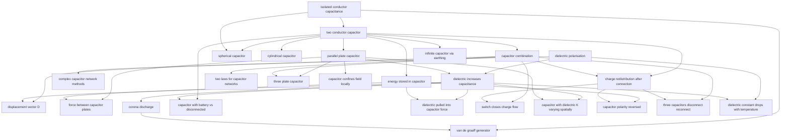

# T31 — Capacitors  *(Class 12)*

> Dependency-ordered teaching pathway for physics-teacher review.
> **26 atomic + 23 nano = 49 concept-simulations.**

**How to use this:** teach top-to-bottom. Everything in a level only depends on earlier levels. Each **atomic** is a full teachable idea (= one simulation); the **↳ nanos** under it are its sub-points (one symbol / term / edge-case each).

**Foundations (teach first, nothing in this chapter comes before them):** isolated_conductor_capacitance, dielectric_polarisation

## Concept dependency graph (atomic backbone)

## Teaching pathway (dependency-ordered)

### Level 0 — foundations

- **`isolated_conductor_capacitance`** — `C = Q/V` for single conductor with V referenced to infinity; depends only on geometry
  - ↳ `spherical_conductor_capacitance` — `C = 4πε₀R`; Earth ≈ 711 μF (NCERT-equivalent example in DCEM §25.1)
  - ↳ `farad_is_large_unit_intuition` — "1 F requires 30 km × 30 km plates at 1 mm separation" (NCERT eq. 2.45) — primary anchor for unit-magnitude intuition
- **`dielectric_polarisation`** — Non-polar molecules get induced dipole moment; polar molecules align with field. P = χₑE for linear isotropic dielectric.
  - ↳ `non_polar_vs_polar_molecule` — NCERT §2.10 Fig 2.22
  - ↳ `induced_surface_charge_density` — σ_p = P (NCERT eq.); bound charges, not free charges

### Level 1

- **`two_conductor_capacitor`** — C = Q/V where Q is charge on positive plate and V is potential difference; net total charge = 0
  - ↳ `why_not_total_charge_definition` — NCERT §2.11 explicit: "the term 'charge on a capacitor' does NOT mean the total charge given... total charge is +Q - Q = 0"

### Level 2

- **`parallel_plate_capacitor`** — `C = ε₀A/d`; derived by Gauss-law on cylinder spanning plate; valid when d << √A (no edge effects)
  - ↳ `fringing_field_at_edges` — NCERT §2.12: "field lines bend outward at the edges"; ignored in ideal derivation but real
  - ↳ `gauss_law_cylinder_through_plate_derivation` — HCV2 §31.2 Fig 31.4: ΔA cross-section, flux only through ΔA' inside positive plate
- **`spherical_capacitor`** — `C = 4πε₀R₁R₂/(R₂-R₁)`; both isolated-sphere limit (R₂→∞ ⇒ C=4πε₀R₁) and parallel-plate limit (R₂-R₁=d << R) live here
  - ↳ `isolated_sphere_as_limit` — HCV2 §31.2: bridges A1 and A4 explicitly
  - ↳ `parallel_plate_as_limit` — HCV2 §31.2: `4πR₁R₂ → 4πR² = A` for thin shells, gives back ε₀A/d
- **`cylindrical_capacitor`** — `C/l = 2πε₀/ln(R₂/R₁)`; coaxial-cable geometry; HCV2 §31.2 explicit
- **`capacitor_combination`** — The "combine multiple capacitors → equivalent single" logic
  - ↳ `capacitors_in_series` — `1/C = Σ1/Cᵢ`; each capacitor has same charge Q; V splits
  - ↳ `capacitors_in_parallel` — `C = ΣCᵢ`; each capacitor has same V; Q splits
- **`energy_stored_in_capacitor`** — `U = ½CV² = ½QV = Q²/(2C)`; derived as `∫(q/C)dq` from 0 to Q
  - ↳ `energy_density_field` — `u = ½ε₀E²`; recast from U = ½CV² by substituting C = ε₀A/d and V = Ed; "holds for any field configuration" (NCERT §2.15 explicit)
- **`infinite_capacitor_via_earthing`** — DCEM §25.3 inset: one plate earthed → effective capacitance = ∞ since Earth absorbs any charge. Boundary-condition concept atomic.

### Level 3

- **`dielectric_increases_capacitance`** — `C = KC₀`; field reduced inside dielectric by factor K → V reduced → C increased
  - ↳ `induced_charge_reduces_E` — `E = E₀ - E_p = E₀/K`; net field smaller than free-charge field
  - ↳ `dielectric_strength_limit` — NCERT Table 2: K + breakdown field for common dielectrics; HCV2 Table 31.1 likewise
  - ↳ `partial_dielectric_capacitor` — DCEM §25.3 Fig 25.14: slab of thickness t < d; `C = ε₀A/(d - t + t/K)`
- **`complex_capacitor_network_methods`** — HCV2 §31.3 general 5-step method (label points P,N → mentally connect battery → write plate charges → set V_N=0, V_P=V → write Q=CV per cap → solve). Handles networks not reducible to series-parallel.
  - ↳ `symmetry_arguments_for_networks` — HCV2 Example 31.6 (12-capacitor cube between diagonally opposite corners) — charge symmetry reduces 12 unknowns to 3
  - ↳ `infinite_ladder_network` — HCV2 Worked Example 13 (Fig 31-W11): self-similar substitution → `C₁ = (1+√5)/2 · C` (golden ratio)
- **`force_between_capacitor_plates`** — `F = Q²/(2Aε₀) = ½ε₀E²·A`; one plate sees field E/2 = σ/(2ε₀) from the other plate only
  - ↳ `factor_of_half_explanation` — NCERT exercise 2.28: "Show factor ½" — common JEE confusion. Plate sits in field of *other* plate only, not full field.
- **`charge_redistribution_after_connection`** — When two charged capacitors are connected, charge flows until V equalizes. `V_common = (Q₁+Q₂)/(C₁+C₂)`.
  - ↳ `energy_loss_in_redistribution` — `ΔU = ½·C₁C₂/(C₁+C₂)·(V₁-V₂)²`; always positive — energy lost to heat + EM radiation in transient. NCERT Example 2.10 explicit: "where has the remaining energy gone?"
  - ↳ `repeated_contact_problem` — DCEM Example 25.4: q_max = Qq/(Q-q); JEE 1998 Example 25.5 limiting case → q_∞ = QR/r
- **`two_laws_for_capacitor_networks`** — DCEM §25.6 "Two laws in capacitors": charge-conservation at node + sum-of-V-around-loop = 0 (Kirchhoff for capacitors). Same logical structure as KCL+KVL for resistors.
- **`three_plate_capacitor`** — HCV2 Worked Example 12: 3 plates, plate-B shares charge to both A and C. Pattern shows up in JEE-Adv.
- **`capacitor_confines_field_locally`** — NCERT §2.16 Point-to-Ponder 2: "Capacitor confines field lines within small region. Thus, even though field may have considerable strength, the PD between conductors is small." Concept of localised field-strength vs global-potential.

### Level 4

- **`displacement_vector_D`** — `D = ε₀E + P`; alternative Gauss: ∮D·dS = Q_free. ADVANCED — HCV2 §31.8 + NCERT §2.13 inset only. Sim feasibility uncertain.
- **`corona_discharge`** — Air ionizes near pointed/curved conductor surface when E > 3×10⁶ V/m (dielectric strength of air). HCV2 §31.11.
  - ↳ `charge_density_higher_at_smaller_radius_curvature` — `σ ∝ 1/R` for connected spheres at same V; sharp points have huge σ → huge E → corona
- **`capacitor_with_battery_vs_disconnected`** — Crucial JEE distinction: when dielectric inserted with battery connected, Q changes (V fixed); when disconnected, V changes (Q fixed). NCERT exercise 2.9 explicit.
- **`dielectric_pulled_into_capacitor_force`** — `F = ε₀bV²(K-1)/(2d)` for slab partially inserted. HCV2 Worked Example 22: `F = ½V²·dC/dx`. Energy method derivation is canonical.
  - ↳ `dielectric_liquid_rises_into_capacitor` — HCV2 Worked Example 23: `h = (K²-1)Q²/(2A²K²ε₀ρg)`; liquid rises against gravity due to capacitor pulling force
- **`switch_closes_charge_flow`** — HCV2 Worked Example 11: switch closing between two capacitor branches → 12 μC flows through switch. JEE-Advanced bridge-circuit pattern.
- **`capacitor_with_dielectric_K_varying_spatially`** — HCV2 Worked Example 20: `K(x) = K₀ + αx` along plate length → C = (ε₀a²/d)(K₀ + αa/2). Tests integration ability over geometry.
- **`capacitor_polarity_reversed`** — HCV2 Worked Example 15: 2Q passes through battery → W = 2Cε² → heat = 2Cε². Sign-tracking JEE pattern.
- **`three_capacitors_disconnect_reconnect`** — HCV2 Worked Example 10: 3 series caps charged, disconnected, re-connected with positives-together and negatives-together → solve for redistribution
- **`dielectric_constant_drops_with_temperature`** — NCERT §2.16 Point-to-Ponder 6: "dielectric constant decreases if temperature is increased" — explained via polarisation reduction. Thermal disordering atomic.

### Level 5

- **`van_de_graaff_generator`** — Million-volt generator: belt deposits charge on outer spherical shell continuously; V keeps rising until corona limits. Built in IIT undergrad labs historically.
  - ↳ `belt_brush_charge_transfer_mechanism` — NCERT Fig 2.33 + HCV2 Fig 31.23: motor-driven belt + corona-discharge brush at top → charge always accumulates on outer surface (regardless of shell's own charge)
