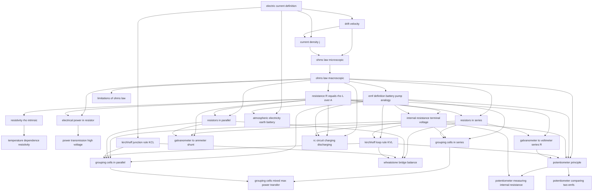

# T34 — Current Electricity  *(Class 12)*

> Dependency-ordered teaching pathway for physics-teacher review.
> **28 atomic + 13 nano = 41 concept-simulations.**

**How to use this:** teach top-to-bottom. Everything in a level only depends on earlier levels. Each **atomic** is a full teachable idea (= one simulation); the **↳ nanos** under it are its sub-points (one symbol / term / edge-case each).

**Foundations (teach first, nothing in this chapter comes before them):** electric_current_definition

## Concept dependency graph (atomic backbone)

## Teaching pathway (dependency-ordered)

### Level 0 — foundations

- **`electric_current_definition`** — i = dQ/dt. Sign convention: direction of positive-charge motion. Edge case: in electrolyte both ± ions contribute and currents ADD (HCV §32.1 + DCP Ex 23.1)

### Level 1

- **`drift_velocity`** — v_d = eEτ/m (NCERT) or v_d = eEτ/(2m) (some older Indian texts — DCP §23.4 explicitly addresses this discrepancy and sides with eEτ/m). Magnitude: ~10⁻⁴ m/s in copper at 1 A through 1 mm²
- **`kirchhoff_junction_rule_KCL`** — Σi_in = Σi_out. Charge conservation at node. **Direct conceptual bridge to T29 A9 superposition**

### Level 2

- **`current_density_j`** — j = i/A = nev_d. Vector along E. **Per CE-G1: separate from drift** because scene differs (j is field-line-like; v_d is electron-track)

### Level 3

- **`ohms_law_microscopic`** — j⃗ = σE⃗. Derived from drift: σ = ne²τ/m. The microscopic Ohm's law

### Level 4

- **`ohms_law_macroscopic`** — V = IR derived from j=σE via R = ρL/A. **EPIC-C STATE_1 wrong belief (per CE-G2): "V=IR IS Ohm's law" — NO, it's a relation that always holds for V, I, R defined; Ohm's law is the linearity claim that R doesn't depend on V**

### Level 5

- **`resistance_R_equals_rho_L_over_A`** — R = ρL/A. Geometry × material. EPIC-C STATE_1 wrong belief: "thinner wire ⇒ lower R" (NO; thinner → smaller A → higher R)
- **`limitations_of_ohms_law`** — Per CE-G3: three deviation classes. (a) Non-linear V-I (Fig.3.5), (b) sign-dependent — diode (Fig.3.6, asymmetric V-I), (c) multivalued — GaAs negative-resistance (Fig.3.7). Critical for understanding diodes (T44) and transistors (T45)
- **`emf_definition_battery_pump_analogy`** — ε = W_b/q. DCP overhead-tank analogy. EPIC-C STATE_1 wrong belief: "emf is a force" — NO, it's work-per-charge (the name is misleading per HCV §32.5)

### Level 6

- **`resistivity_rho_intrinsic`** — ρ = m/(ne²τ). Material property only, independent of geometry. Table 3.1 NCERT shows 5 orders of magnitude span from Ag (1.6e-8) to fused quartz (10¹⁶)
- **`electrical_power_in_resistor`** — P = VI = I²R = V²/R. Joule heating. EPIC-C STATE_1 wrong belief: "high resistance always means high power dissipation" — NO, depends on whether V or I is fixed
- **`internal_resistance_terminal_voltage`** — Per CE-G4: standalone atomic. V = ε − Ir (discharging) or V = ε + Ir (charging). Short-circuit: V = 0, i_max = ε/r
- **`resistors_in_series`** — R_eq = R₁ + R₂ + ... Same current through all. **Inverse-analogy bridge to T31: capacitors in PARALLEL add the same way (per T31 catalog)**
- **`resistors_in_parallel`** — 1/R_eq = 1/R₁ + 1/R₂ + ... Same voltage across all. **Inverse-analogy bridge to T31: capacitors in SERIES combine as 1/C_eq = sum**
- **`atmospheric_electricity_earth_battery`** — NCERT §3.13 inset + HCV §32.14. Earth's surface −600 kC; ionosphere +; potential diff 400 kV; 1800 A current flows continuously; thunderstorms recharge the "atmospheric battery." **Strong Indian-context anchor: monsoon lightning frequency (one of highest globally — Odisha, MP, Bihar lightning death statistics)**

### Level 7

- **`temperature_dependence_resistivity`** — ρ(T) = ρ₀[1 + α(T-T₀)]. Conductors: α > 0 (T↑ ⇒ ρ↑ via more collisions). Semiconductors: α < 0 (T↑ ⇒ more carriers). EPIC-C STATE_1 wrong belief: "all materials have positive α" — semiconductors and graphite are negative
- **`power_transmission_high_voltage`** — NCERT-unique. P_c = P²R_c/V². Why long-distance transmission uses 11 kV / 220 kV: P_c inversely proportional to V². **Strong Indian-context anchor: high-tension towers along NH, step-down transformers at colonies**
- **`kirchhoff_loop_rule_KVL`** — Σ V_drops in a closed loop = 0. Energy conservation. DCP's "H for high, L for low" sign-mnemonic is the canonical pedagogy
- **`grouping_cells_in_series`** — ε_eq = Σε_i; r_eq = Σr_i. **EPIC-C STATE_1 wrong belief: "polarity reversal doesn't matter" — NO; reversed cell SUBTRACTS its emf and ADDS its r** (per CE-G5)
- **`galvanometer_to_ammeter_shunt`** — S = (i_g/(i − i_g)) × G. Low-R shunt in PARALLEL. Ideal ammeter R → 0. Common JEE problem
- **`galvanometer_to_voltmeter_series_R`** — R_series = V/i_g − G. High R in SERIES. Ideal voltmeter R → ∞. Inverse of A22
- **`rc_circuit_charging_discharging`** — **Critical bridge atomic.** q(t) = εC(1−e^(−t/τ)) charging; q(t) = Q₀e^(−t/τ) discharging. τ = RC = time constant. 63% rule (1 τ → 63% of final value). **Closes the T31 ↔ T34 bidirectional bridge documented in T31 catalog Section J**

### Level 8

- **`grouping_cells_in_parallel`** — For identical cells: ε_eq = ε, r_eq = r/n. For different cells: ε_eq = Σ(ε_i/r_i) / Σ(1/r_i). Used when high current needed at fixed terminal voltage
- **`wheatstone_bridge_balance`** — R₁/R₂ = R₃/R₄ → no current in galvanometer arm. Lab-practical canonical. Indian-context: CBSE board practical lists Wheatstone bridge as mandatory experiment
- **`potentiometer_principle`** — Null-deflection method. ε_unknown = (l/L) × ε_known. Why preferred over voltmeter: zero current drawn during measurement

### Level 9

- **`grouping_cells_mixed_max_power_transfer`** — Per CE-G5. n cells per row × m rows. i = nE/(R + nr/m). Maximum when R = nr/m → external = internal. **Max-power-transfer theorem.** JEE Advanced canonical
- **`potentiometer_comparing_two_emfs`** — ε₁/ε₂ = l₁/l₂. The cleanest emf-comparison method. No calibration needed if used in ratio form
- **`potentiometer_measuring_internal_resistance`** — r = R(l₁/l₂ − 1). Bridge from potentiometer principle to internal-r measurement (HCV §32.13 + DCP §23.12)

### Other sub-concepts (parent atomic is in another chapter)

  - ↳ `current_is_scalar_not_vector` — NCERT subtle but critical: i is scalar, j is vector. Common misconception
  - ↳ `random_thermal_motion_vs_drift` — Thermal speed ~10⁵ m/s vs drift ~10⁻⁴ m/s → ratio 10⁹. The "tiny drift superposed on huge random" insight
  - ↳ `relaxation_time_tau` — τ ~ 10⁻¹⁴ s in copper. Average time between collisions. Decreases with temperature (DCP §23.6)
  - ↳ `current_conserved_along_nonuniform_wire` — i = const, but j and v_d both ∝ 1/A. Tapered-wire example
  - ↳ `resistor_color_code` — 4-band code (digit, digit, multiplier, tolerance). NCERT Table 3.2
  - ↳ `wire_stretched_4x_R_quadruples` — If length doubles (V=const), R = ρL²/V scales as L². Classic JEE problem (DCP Ex 23.10–23.12)
  - ↳ `nichrome_low_alpha_for_heaters` — α_nichrome ≈ 0.0004 (10× smaller than copper). Why heating elements use nichrome: resistance stays stable. Indian anchor: electric iron, immersion rod, geyser coil
  - ↳ `superconductor_zero_resistance` — Hg at 4.2 K (Onnes 1911). Forward-ref to T48. Indian-anchor candidate: BARC + IUAC superconductor research (anchor mine in Stage-5)
  - ↳ `toaster_geyser_electric_iron_indian_examples` — Joule heating applications: 1500W geyser, 750W toaster, 1000W iron. Indian household electrical-appliance anchor
  - ↳ `open_circuit_terminal_voltage_equals_emf` — When I=0, V=ε. Why ideal voltmeters have R→∞
  - ↳ `sign_convention_emf_traversal` — When traversing battery − to + : +ε (rise); + to − : −ε (drop). Classic source of student errors
  - ↳ `balance_condition_independent_of_battery_emf` — Doubling the battery emf doubles all currents but balance condition unchanged. Important conceptual insight
  - ↳ `time_constant_tau_equals_RC` — Dimensional check: [R][C] = (V/A)(C/V) = C/A = s ✓. Physical: 1τ ≈ 63%, 2τ ≈ 86%, 5τ ≈ 99%. After 5τ, treat as fully charged
