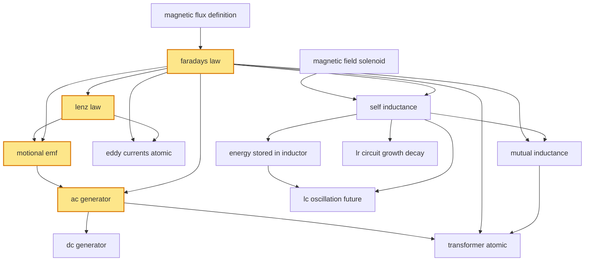

# T35 — EM Induction  *(Class 12)*

> Dependency-ordered teaching pathway for physics-teacher review.
> **14 atomic + 21 nano = 35 concept-simulations.**  4 💎 diamond (highest-impact).

**How to use this:** teach top-to-bottom. Everything in a level only depends on earlier levels. Each **atomic** is a full teachable idea (= one simulation); the **↳ nanos** under it are its sub-points (one symbol / term / edge-case each).

**Foundations (teach first, nothing in this chapter comes before them):** magnetic_flux_definition, magnetic_field_solenoid

## Concept dependency graph (atomic backbone)

## Teaching pathway (dependency-ordered)

### Level 0 — foundations

- **`magnetic_flux_definition`** — Φ_B = ∫B·dA = B·A·cosθ; SI unit weber (Wb)
  - ↳ `flux_through_loop_orientation_nano` — Φ varies as cosθ between B and area-vector
  - ↳ `weber_unit_nano` — 1 Wb = 1 T·m² = 1 V·s; conversion to maxwell (1 Wb = 10⁸ Mx)
- **`magnetic_field_solenoid`** — B = μ₀ n I inside long solenoid (cross-link to T36)

### Level 1

- **`faradays_law`** 💎 — ε = −dΦ_B/dt; an EMF is induced whenever flux through a loop changes
  - ↳ `lenz_law_sign_convention` — The minus sign means induced EMF opposes the CHANGE OF FLUX (not the flux itself) — EI-G8 cognitive-error-prevention
  - ↳ `faraday_loop_with_n_turns_nano` — ε = −N dΦ_B/dt; each loop contributes its own EMF in series

### Level 2

- **`lenz_law`** 💎 — Induced current direction opposes the change that caused it (energy conservation)
  - ↳ `falling_magnet_in_copper_tube_nano` — Iconic demo: bar magnet falls slowly through hollow Cu pipe — Lenz's law in action
- **`self_inductance`** — ε_L = −L (dI/dt); L is a geometric property of the coil; Φ = LI
  - ↳ `solenoid_inductance_derivation_nano` — L = μ₀N²A/ℓ derivation from flux per turn
  - ↳ `inductor_symbol_circuit_nano` — Coil symbol in circuit diagrams; "choke" / "reactor" naming

### Level 3

- **`motional_emf`** 💎 — ε = (v × B)·L for a conducting rod moving in B; mechanical work → electrical energy
  - ↳ `rod_on_rails_force_balance_nano` — F_applied = BIL (to maintain v); P_mechanical = P_electrical
  - ↳ `rotating_rod_in_uniform_B_nano` — ε = ½Bωℓ² for rod rotating about one end — JEE Mains favourite numerical
- **`eddy_currents_atomic`** — Bulk-conductor circulating currents induced by changing B; cause heating + braking
  - ↳ `laminated_core_nano` — Thin insulated laminations suppress eddy-current loss in transformers + motors
  - ↳ `electromagnetic_brake_nano` — Eddy-current brake in trains, free-fall amusement rides
  - ↳ `induction_heating_nano` — High-frequency eddy currents heat ferromagnetic pan; non-contact cooking
- **`mutual_inductance`** — M between two coils: ε₂ = −M (dI₁/dt); reciprocity M₁₂ = M₂₁
  - ↳ `coefficient_of_coupling_nano` — k = M / √(L₁L₂); 0 ≤ k ≤ 1; tightly-wound transformer → k≈1
- **`energy_stored_in_inductor`** — U = ½LI² — magnetic energy stored in B-field of coil
  - ↳ `energy_density_magnetic_field_nano` — u_B = B²/(2μ₀) per unit volume — parallel to electric u_E = ε₀E²/2
- **`lr_circuit_growth_decay`** — I(t) = I_max(1−e^(−t/τ)) growth; I(t) = I_0 e^(−t/τ) decay; τ = L/R
  - ↳ `lr_time_constant_nano` — τ = L/R; physically the "settling time" of the inductor current

### Level 4

- **`ac_generator`** 💎 — Rotating coil in uniform B → sinusoidal EMF ε = NBAω sin(ωt)
  - ↳ `slip_rings_nano` — Stationary brushes contact rotating rings — preserve AC polarity
  - ↳ `peak_emf_NBAω_nano` — ε₀ = NBAω derivation from Faraday's law on rotating coil
- **`lc_oscillation_future`** — Energy oscillates between L (½LI²) and C (½CV²); ω = 1/√(LC)

### Level 5

- **`dc_generator`** — Rotating coil + commutator (split-ring) → rectified DC output
  - ↳ `commutator_split_ring_nano` — Split-ring rectification — reverses connection every half-cycle
- **`transformer_atomic`** — Mutual-inductance device; V_s/V_p = N_s/N_p (ideal); steps up/down AC voltage
  - ↳ `ideal_transformer_equations_nano` — V_s/V_p = N_s/N_p; I_s/I_p = N_p/N_s; conservation of power
  - ↳ `step_up_vs_step_down_nano` — High-voltage transmission (220 kV / 400 kV / 765 kV grids) reduces I²R losses
  - ↳ `transformer_losses_nano` — Copper loss (I²R), iron loss (hysteresis + eddy), flux leakage
