# T36 — Moving Charges Magnetism  *(Class 12)*

> Dependency-ordered teaching pathway for physics-teacher review.
> **34 atomic + 43 nano = 77 concept-simulations.**  1 💎 diamond (highest-impact).

**How to use this:** teach top-to-bottom. Everything in a level only depends on earlier levels. Each **atomic** is a full teachable idea (= one simulation); the **↳ nanos** under it are its sub-points (one symbol / term / edge-case each).

**Foundations (teach first, nothing in this chapter comes before them):** magnetic_field_concept_B

## Concept dependency graph (atomic backbone)

```mermaid
graph TD
  c0["magnetic field concept B"]
  c1["oersted experiment current creates magnetic field"]
  c2["lorentz magnetic force F equals qv cross B"]
  c3["magnetic force direction right hand rule"]
  c4["magnetic force perpendicular no work done KE constant"]
  c5["magnetic force zero when v parallel to B"]
  c6["magnetic force on current carrying wire F equals IL cross B"]
  c7["closed loop in uniform B net force zero"]
  c8["magnetic field long straight wire B equals mu0 I over 2pi r"]
  c9["right hand thumb rule direction around wire"]
  c10["magnetic dipole moment m equals NIA"]
  c11["torque on current loop tau equals m cross B"]
  c12["current loop acts as magnetic dipole"]
  c13["lorentz force in combined E and B F equals qE plus qv cross B"]
  c14["circular motion charge in uniform B perpendicular"]
  c15["cyclotron radius r equals mv over qB"]
  c16["cyclotron period T equals 2pi m over qB"]
  c17["cyclotron period independent of speed and radius"]
  c18["helical motion when v has component along B"]
  c19["helix pitch p equals 2pi m v parallel over qB"]
  c20["velocity selector perpendicular E and B fields v equals E over B"]
  c21["cyclotron device principle KE equals q2B2R2 over 2m"]
  c22["biot savart law dB equals mu0 over 4pi IdL cross r over r2"]
  c23["magnetic field axis circular loop B axial x"]
  c24["magnetic field center circular loop B0 equals mu0 I over 2R"]
  c25["magnetic field finite straight wire B equals mu0 I over 4pi d sin alpha plus sin beta"]
  c26["amperes circuital law loop integral B dot dL equals mu0 I enc"]
  c27["solenoid field inside B equals mu0 n I"]
  c28["toroid field B equals mu0 N I over 2pi r"]
  c29["force between parallel currents attract or repel"]
  c30["ampere si unit definition from parallel currents"]
  c31["magnetic dipole potential energy U equals minus m dot B"]
  c32["magnetic dipole moment of revolving electron mu l equals minus e over 2m L"]
  c33["force on curved wire in uniform B equals force on straight wire between endpoints"]
  c0 --> c1
  c0 --> c2
  c2 --> c3
  c2 --> c4
  c2 --> c5
  c2 --> c6
  c6 --> c7
  c22 --> c8
  c26 --> c8
  c0 --> c9
  c8 --> c9
  c6 --> c10
  c7 --> c10
  c6 --> c11
  c7 --> c11
  c10 --> c11
  c23 --> c12
  c10 --> c12
  c2 --> c13
  c2 --> c14
  c4 --> c14
  c14 --> c15
  c14 --> c16
  c15 --> c16
  c16 --> c17
  c5 --> c18
  c14 --> c18
  c18 --> c19
  c16 --> c19
  c2 --> c20
  c13 --> c20
  c14 --> c21
  c16 --> c21
  c17 --> c21
  c20 --> c21
  c0 --> c22
  c22 --> c23
  c23 --> c24
  c22 --> c25
  c0 --> c26
  c26 --> c27
  c24 --> c27
  c26 --> c28
  c27 --> c28
  c6 --> c29
  c8 --> c29
  c29 --> c30
  c10 --> c31
  c11 --> c31
  c10 --> c32
  c6 --> c33
  classDef diamond fill:#fde68a,stroke:#d97706,stroke-width:2px;
  class c8 diamond;
```

## Teaching pathway (dependency-ordered)

### Level 0 — foundations

- **`magnetic_field_concept_B`** — A magnetic field B is a vector field produced by moving charges or currents; exerts force on other moving charges/currents. SI unit Tesla.
  - ↳ `tesla_and_gauss_units` — 1 T = 10⁴ G. Earth's field ~10⁻⁵ T; lab fields ~1 T; neutron star ~10⁸ T (orders-of-magnitude table)
  - ↳ `B_field_visualisation_with_iron_filings` — Iron filings around a wire form concentric circles → reveals B-field geometry

### Level 1

- **`oersted_experiment_current_creates_magnetic_field`** — 1820 Oersted observation: compass needle deflects near current-carrying wire → moving charges create magnetic field. Foundational discovery linking electricity and magnetism.
- **`lorentz_magnetic_force_F_equals_qv_cross_B`** — Force on a charged particle q moving at velocity v in magnetic field B: **F = q(v × B)**. Magnitude F = qvB sin θ.
  - ↳ `force_magnitude_F_equals_qvB_sin_theta` — F = qvB sin θ; θ = angle between v and B
  - ↳ `combined_lorentz_force_E_plus_v_cross_B` — Total electromagnetic force: F = q[E + v×B]. When both E and B present.
  - ↳ `force_on_negative_charge_opposite_direction` — Reversing q sign reverses F direction
- **`biot_savart_law_dB_equals_mu0_over_4pi_IdL_cross_r_over_r2`** — Magnetic field due to current element: dB = (μ₀/4π) · (I dL × r̂)/r². μ₀/4π = 10⁻⁷ T·m/A.
  - ↳ `mu0_4pi_equals_10_minus_7_Tm_per_A` — Permeability of free space; defines SI ampere
  - ↳ `magnitude_dB_proportional_to_sin_theta_over_r_squared` — |dB| = (μ₀/4π) · I·dL·sin θ / r². Zero along the dL line (sin 0 = 0).
  - ↳ `direction_perpendicular_to_dL_and_r_plane` — dB ⊥ plane containing dL and r̂; by right-hand screw rule
  - ↳ `comparison_biot_savart_vs_coulombs_law` — Both 1/r²; both linear superposition; both long-range. But: source for Coulomb = scalar (q); for Biot-Savart = vector (IdL). And Biot-Savart has sin θ angle-dependence.
- **`amperes_circuital_law_loop_integral_B_dot_dL_equals_mu0_I_enc`** — ∮B · dL = μ₀ I_enclosed. Line integral of B around any closed loop = μ₀ × total current through any surface bounded by that loop.
  - ↳ `enclosed_current_sign_convention_right_hand_rule` — Curl fingers in traversal direction around loop; thumb gives + current direction
  - ↳ `BL_equals_mu0_Ie_for_symmetry` — When B is tangential and constant on the chosen path: BL = μ₀ I_e (simplified form).
  - ↳ `amperes_law_for_wire_internal_field_B_proportional_to_r` — Inside a wire of radius a with uniform current: B = (μ₀I/2πa²)·r for r < a; B = μ₀I/(2πr) for r > a.

### Level 2

- **`magnetic_force_direction_right_hand_rule`** — Direction of F = qv × B given by right-hand rule (or screw rule, or Fleming's left-hand rule for current-carrying wires)
  - ↳ `flemings_left_hand_rule_for_force_on_current` — Forefinger=B, central finger=v(+q) or I, thumb=F. For +charge or current direction.
  - ↳ `right_hand_rule_vector_form` — Curl fingers from v toward B; thumb gives F direction (for +q)
  - ↳ `dot_cross_notation_into_page_out_of_page` — ⊙ = out of page; ⊗ = into page. Convention for 3D vectors in 2D diagrams.
- **`magnetic_force_perpendicular_no_work_done_KE_constant`** — F ⊥ v always → magnetic force never does work → kinetic energy never changes. Only direction changes, never speed.
- **`magnetic_force_zero_when_v_parallel_to_B`** — F = qvB sin θ; if v parallel or antiparallel to B, sin θ = 0 → F = 0 → particle moves in straight line
- **`magnetic_force_on_current_carrying_wire_F_equals_IL_cross_B`** — Force on a straight current-carrying wire of length L in field B: F = I(L × B); for arbitrary wire dF = I(dl × B), integrate.
  - ↳ `derivation_from_force_on_individual_charges` — Sum F = nAL · q(v_d × B) = (nAv_d q)L × B = I(L × B), since I = nAv_d q
  - ↳ `dF_equals_I_dl_cross_B_arbitrary_wire` — Differential form: dF = I dl × B; integrate for curved wires
- **`magnetic_field_long_straight_wire_B_equals_mu0_I_over_2pi_r`** 💎 — Field magnitude at perpendicular distance r from an infinitely long straight wire carrying current I: B = μ₀I/(2πr)
  - ↳ `cylindrical_symmetry_around_wire` — B has same magnitude on any circle around the wire; direction tangent to circle
  - ↳ `B_inversely_proportional_to_r` — B ∝ 1/r; halve distance → double field; far from wire B→0
- **`lorentz_force_in_combined_E_and_B_F_equals_qE_plus_qv_cross_B`** — Total electromagnetic force on a charge: F = q[E + v×B]. Generalization of A3 when both fields present.
- **`magnetic_field_axis_circular_loop_B_axial_x`** — On axis of circular current loop of radius R, distance x from center: B = (μ₀ I R²)/[2(x² + R²)^(3/2)]
- **`magnetic_field_finite_straight_wire_B_equals_mu0_I_over_4pi_d_sin_alpha_plus_sin_beta`** — For a finite straight wire, field at perpendicular distance d: B = (μ₀I)/(4πd) · (sin α + sin β), where α, β are angles to the ends

### Level 3

- **`closed_loop_in_uniform_B_net_force_zero`** — For any closed current loop (any shape) in uniform B: net force = 0 (since ∮dl = 0 for closed loop). Loop can still experience TORQUE.
  - ↳ `force_curved_wire_in_uniform_B_equals_force_straight_wire_endpoints` — For curved wire ACD in uniform B: F = I(AD × B), where AD is the straight-line vector from start to end
  - ↳ `closed_loop_can_have_torque_but_not_net_force` — F_net = 0 but τ ≠ 0 in general → loop rotates but doesn't translate
- **`right_hand_thumb_rule_direction_around_wire`** — Grasp wire with right hand, thumb in current direction; fingers curl in direction of B
- **`circular_motion_charge_in_uniform_B_perpendicular`** — When v ⊥ B: charged particle traces a **circle** in the plane perpendicular to B. F = qvB acts as centripetal force.
  - ↳ `centripetal_force_qvB_equals_mv2_over_r` — qvB = mv²/r (centripetal balance)
- **`velocity_selector_perpendicular_E_and_B_fields_v_equals_E_over_B`** — Crossed E and B fields perpendicular to v: particle undeflected only when qE = qvB → v = E/B. Selects particles by velocity (used in mass spectrometer, J.J. Thomson's e/m).
- **`magnetic_field_center_circular_loop_B0_equals_mu0_I_over_2R`** — At center of loop (x = 0): B₀ = μ₀I/(2R). Special case of A23.
  - ↳ `right_hand_thumb_rule_for_loop_curled_fingers_show_current_thumb_shows_B` — Curl right-hand fingers along current direction; thumb points along B at center (and along loop axis)
  - ↳ `N_turns_coil_field_B_equals_mu0_NI_over_2R` — For N turns: B = μ₀NI/(2R). Linear superposition.
- **`force_between_parallel_currents_attract_or_repel`** — Two parallel wires carrying currents I_a, I_b separated by distance d: force per unit length f = μ₀ I_a I_b / (2πd). **Parallel currents attract; antiparallel currents repel.**
  - ↳ `parallel_currents_attract_antiparallel_repel` — I_a, I_b same direction → attract; opposite direction → repel
  - ↳ `force_per_length_f_equals_mu0_Ia_Ib_over_2pi_d` — f_ba = (μ₀ I_a I_b)/(2πd) per metre length
  - ↳ `force_consistent_with_newton_third_law` — F_ba = −F_ab for steady currents (parallel conductors). Time-varying currents may violate.
- **`force_on_curved_wire_in_uniform_B_equals_force_on_straight_wire_between_endpoints`** — For ANY curved wire ACD in uniform B carrying current i: total force F = i(AD × B), where AD is the straight-line vector from start to end.

### Level 4

- **`magnetic_dipole_moment_m_equals_NIA`** — Current loop's magnetic dipole moment: m = NIA (N turns, I current, A area-vector with right-hand-rule direction). Unit A·m².
  - ↳ `area_vector_direction_right_hand_rule` — Curl fingers in current direction; thumb gives A-vector direction (and dipole-moment direction)
  - ↳ `south_to_north_convention_for_loop` — Looking at the loop face where current appears clockwise = south pole; opposite face = north pole. m points S→N.
  - ↳ `magnetic_moment_units_amp_meter_squared` — [m] = A·m²
- **`cyclotron_radius_r_equals_mv_over_qB`** — Radius of circle: r = mv/qB. Equivalently r = p/qB = √(2mK)/qB = √(2mqV)/qB (for K=qV)
  - ↳ `radius_proportional_to_momentum` — r ∝ mv = p; larger momentum → larger circle
  - ↳ `radius_proportional_to_sqrt_K_for_same_q_B` — For same q, B: r ∝ √K (kinetic energy). Used in JEE for proton/deuteron/alpha comparisons.
  - ↳ `radius_proportional_to_sqrt_qV_when_accelerated_through_V` — If accelerated through potential V: K = qV, so r = √(2mV/q)/B. Used in mass spectrometers.
- **`helical_motion_when_v_has_component_along_B`** — If v has both ⊥ and || components to B: || component unchanged, ⊥ component traces circle → resultant trajectory is a **helix**
  - ↳ `v_decomposed_into_parallel_and_perpendicular` — v = v_||·B̂ + v_⊥. Force only acts on v_⊥.
  - ↳ `auroras_charged_particles_helix_along_earth_field_lines` — Aurora Borealis: solar wind particles spiral along Earth's magnetic field lines, collide with atmosphere at poles → green/pink light. **Indian-context shift:** also visible from northern parts of India in major geomagnetic storms.
- **`solenoid_field_inside_B_equals_mu0_n_I`** — Long solenoid (length >> radius): B = μ₀nI inside (uniform), B ≈ 0 outside. n = turns per unit length.
  - ↳ `solenoid_field_uniform_inside_zero_outside` — Inside: B uniform along axis. Outside: B → 0 for ideal long solenoid.
  - ↳ `n_turns_per_unit_length` — n = N/L; SI unit m⁻¹
- **`ampere_si_unit_definition_from_parallel_currents`** — One ampere = current in each of two parallel wires (1 m apart, vacuum) producing force 2×10⁻⁷ N/m between them. Theoretical definition adopted 1946.

### Level 5

- **`torque_on_current_loop_tau_equals_m_cross_B`** — Torque on dipole in uniform B: **τ = m × B**; magnitude τ = mB sin θ; zero at θ=0 (stable equilibrium); max at θ=π/2
  - ↳ `torque_zero_when_m_parallel_to_B_stable` — When m parallel to B (θ=0): τ=0, stable equilibrium (any rotation creates restoring torque)
  - ↳ `torque_zero_when_m_antiparallel_to_B_unstable` — When m antiparallel to B (θ=π): τ=0, unstable equilibrium
  - ↳ `torque_max_when_m_perpendicular_to_B` — At θ=π/2: τ = mB (maximum)
- **`current_loop_acts_as_magnetic_dipole`** — Far-field (x >> R): a current loop's B-field is mathematically equivalent to a magnetic dipole's field. **No magnetic monopoles exist** — the current loop IS the elementary magnetic source.
  - ↳ `B_axial_dipole_2m_over_4pi_x3` — On axis: B = (μ₀/4π)(2m/x³). Same form as electric dipole field on axis (with m↔p_e, μ₀↔1/ε₀).
  - ↳ `B_equatorial_dipole_m_over_4pi_x3` — On equatorial plane: B = (μ₀/4π)(m/x³), opposite to m. Half the axial magnitude.
  - ↳ `no_magnetic_monopoles_exist` — Unlike electric dipole (built of ±q), magnetic dipole is the most elementary unit. No isolated north/south pole observed.
- **`cyclotron_period_T_equals_2pi_m_over_qB`** — Time period of circular motion: T = 2πm/qB. Angular frequency ω = qB/m. Frequency f = qB/(2πm).
- **`toroid_field_B_equals_mu0_N_I_over_2pi_r`** — Toroid (donut-shaped solenoid): B = μ₀NI/(2πr) inside the toroidal coil, 0 elsewhere
- **`magnetic_dipole_moment_of_revolving_electron_mu_l_equals_minus_e_over_2m_L`** — Electron orbiting a nucleus (Bohr model) constitutes a current loop → has magnetic moment μ_l = −(e/2m_e)L, where L = orbital angular momentum. Bohr magneton μ_B = eħ/(2m_e).

### Level 6

- **`cyclotron_period_independent_of_speed_and_radius`** — T, f, ω are independent of v (and of r). Counterintuitive: faster particle traces larger circle in same time.
- **`helix_pitch_p_equals_2pi_m_v_parallel_over_qB`** — Pitch (distance per revolution along B): p = v_|| · T = (2πm v_||)/qB = (2πm v cos θ)/qB
- **`magnetic_dipole_potential_energy_U_equals_minus_m_dot_B`** — Potential energy of dipole in B: U = −m·B = −mB cos θ. Minimum at θ=0 (parallel = stable); max at θ=π.

### Level 7

- **`cyclotron_device_principle_KE_equals_q2B2R2_over_2m`** — Cyclotron: charged particle accelerated by alternating E-field between dees, magnetic field bends path. Resonance condition: ν_applied = ν_cyclotron = qB/(2πm). Exit KE = q²B²R²/(2m).
