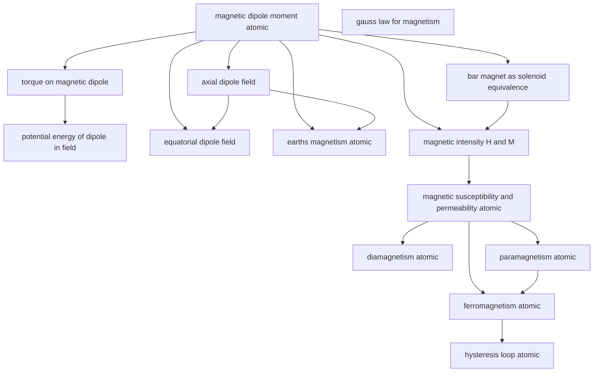

# T37 — Magnetism And Matter  *(Class 12)*

> Dependency-ordered teaching pathway for physics-teacher review.
> **14 atomic + 16 nano = 30 concept-simulations.**

**How to use this:** teach top-to-bottom. Everything in a level only depends on earlier levels. Each **atomic** is a full teachable idea (= one simulation); the **↳ nanos** under it are its sub-points (one symbol / term / edge-case each).

**Foundations (teach first, nothing in this chapter comes before them):** magnetic_dipole_moment_atomic, gauss_law_for_magnetism

## Concept dependency graph (atomic backbone)

## Teaching pathway (dependency-ordered)

### Level 0 — foundations

- **`magnetic_dipole_moment_atomic`** — m = NIA for a current loop; vector along right-hand-rule normal. Equivalent dipole-moment of bar magnet
  - ↳ `vector_direction_via_rhr_nano` — Right-hand-rule for m direction from current direction
- **`gauss_law_for_magnetism`** — ∮B·dA = 0 — no magnetic monopoles; B-field lines are closed loops
  - ↳ `b_lines_always_closed_nano` — Unlike E-field lines which start on +charges, B-field lines have no start/end

### Level 1

- **`bar_magnet_as_solenoid_equivalence`** — Every bar magnet ≡ a finite solenoid carrying bound surface current; m = M·V
  - ↳ `bound_surface_currents_nano` — Aligned atomic dipoles produce net surface current at magnet's lateral face
- **`torque_on_magnetic_dipole`** — τ = m × B; aligns dipole with external field
  - ↳ `oscillating_dipole_period_nano` — Small-angle oscillation T = 2π√(I/mB) — angular SHM
- **`axial_dipole_field`** — B_axial = (μ₀/4π) · (2m/r³) along the dipole axis (r >> magnet length)

### Level 2

- **`potential_energy_of_dipole_in_field`** — U = −m·B; minimum when m parallel to B
  - ↳ `work_to_rotate_dipole_nano` — W = mB(cosθ₁ − cosθ₂)
- **`equatorial_dipole_field`** — B_eq = (μ₀/4π) · (m/r³) on the perpendicular bisector
- **`earths_magnetism_atomic`** — Earth's magnetic field ≈ a giant dipole tilted ~11° from geographic axis
  - ↳ `declination_dip_horizontal_component_nano` — 3 quantities decomposing geomagnetic field at a point: declination D (true-north vs magnetic-north angle), dip θ (down angle from horizontal), B_H = B cos θ
  - ↳ `geomagnetic_pole_vs_geographic_pole_nano` — Magnetic north ≠ geographic north; current location near Ellesmere Island; drifts
- **`magnetic_intensity_H_and_M`** — B = μ₀(H + M); H = applied auxiliary field; M = magnetisation (dipole moment per unit volume)
  - ↳ `h_units_amperes_per_metre_nano` — H measured in A/m; same units as M; B in tesla

### Level 3

- **`magnetic_susceptibility_and_permeability_atomic`** — M = χH; μᵣ = 1 + χ; relates material response to applied H

### Level 4

- **`diamagnetism_atomic`** — χ < 0 (small, ~ −10⁻⁵); induced opposing moment via Lenz-on-orbital-electrons; T-independent
  - ↳ `meissner_effect_nano` — Superconductors expel B (χ = −1, perfect diamagnetism); levitates magnets
- **`paramagnetism_atomic`** — χ > 0 (small, ~ +10⁻⁵); permanent atomic moments align weakly with B; χ ∝ 1/T (Curie's law)
  - ↳ `curies_law_nano` — χ = C/T (Curie constant divided by absolute temperature)
  - ↳ `three_material_classes_response_to_B_nano` — Tabulate: dia (χ < 0, very small, T-independent), para (χ > 0, small, χ ∝ 1/T), ferro (χ >> 0, T < T_Curie). Cognitive-error-prevention.

### Level 5

- **`ferromagnetism_atomic`** — χ >> 0 (10² to 10⁶); domain structure with spontaneous alignment within domain; Curie temperature T_C above which → paramagnetic
  - ↳ `domain_structure_nano` — Below T_C, atomic moments align spontaneously within ~μm-sized domains; applied B aligns domains, not individual spins
  - ↳ `curie_temperature_nano` — Above T_C ferromagnet becomes paramagnet (Fe: 770°C, Ni: 358°C, Co: 1115°C)

### Level 6

- **`hysteresis_loop_atomic`** — B-H loop for ferromagnets: retentivity B_r (B at H=0), coercivity H_c (H to bring B=0), loop-area = energy dissipated per cycle per volume
  - ↳ `soft_vs_hard_magnetic_materials_nano` — Soft (low H_c, low B_r, small loop area → transformer cores) vs Hard (high H_c, high B_r, large loop → permanent magnets)
  - ↳ `electromagnet_vs_permanent_magnet_nano` — Electromagnet = current loop around soft-iron core (low H_c → reversible); permanent = hard-magnet shaped + magnetised

### Other sub-concepts (parent atomic is in another chapter)

  - ↳ `permanent_magnet_applications_nano` — Nd-Fe-B + Sm-Co + Alnico — high coercivity. Indian Rare Earths Ltd (Kollam, Kerala) + DRDO BLDC motors
