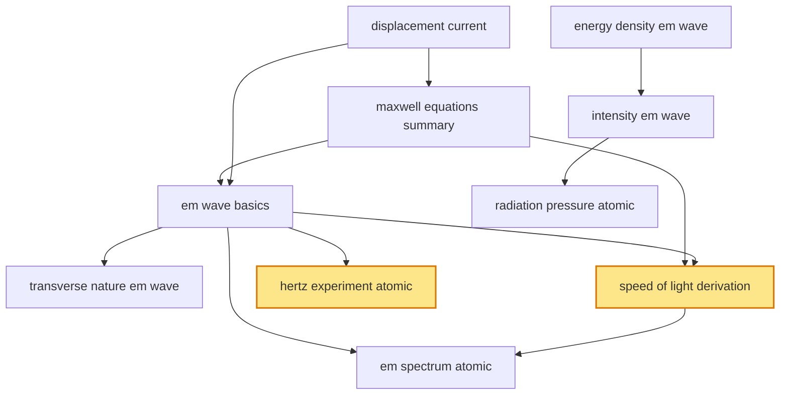

# T38 — EM Waves  *(Class 12)*

> Dependency-ordered teaching pathway for physics-teacher review.
> **10 atomic + 14 nano = 24 concept-simulations.**  2 💎 diamond (highest-impact).

**How to use this:** teach top-to-bottom. Everything in a level only depends on earlier levels. Each **atomic** is a full teachable idea (= one simulation); the **↳ nanos** under it are its sub-points (one symbol / term / edge-case each).

**Foundations (teach first, nothing in this chapter comes before them):** displacement_current, energy_density_em_wave

## Concept dependency graph (atomic backbone)

## Teaching pathway (dependency-ordered)

### Level 0 — foundations

- **`displacement_current`** — i_d = ε₀ (dΦ_E/dt) — Maxwell's correction to Ampère's law; closes the loop for charging capacitor
  - ↳ `capacitor_charging_ampere_paradox_nano` — Ampère loop straddles capacitor plate vs gap — i_d resolves the paradox
- **`energy_density_em_wave`** — u = ½ε₀E² + B²/(2μ₀); average u_E = u_B (equipartition between E and B)

### Level 1

- **`maxwell_equations_summary`** — Four equations unifying E + B: Gauss (E), Gauss (B), Faraday, Ampère-Maxwell
  - ↳ `unification_e_b_optics_nano` — Maxwell unified electricity, magnetism, AND optics — light is an EM phenomenon
- **`intensity_em_wave`** — I = c·u_avg = ½ε₀cE₀² = poynting vector magnitude (time-averaged)

### Level 2

- **`em_wave_basics`** — Self-propagating wave of mutually-inducing E and B fields; propagates at c in vacuum
  - ↳ `e_and_b_orthogonal_to_propagation_nano` — E ⊥ B ⊥ k̂; right-hand-rule for direction
  - ↳ `e_b_ratio_E_over_B_equals_c_nano` — E₀/B₀ = c at every point in the wave
- **`radiation_pressure_atomic`** — EM wave carries momentum; P = I/c (absorbed) or 2I/c (reflected)

### Level 3

- **`transverse_nature_em_wave`** — E and B oscillate perpendicular to propagation direction (and to each other)
  - ↳ `em_wave_identification_criteria_nano` — (1) speed = c, (2) transverse, (3) self-propagating E↔B, (4) carries momentum + energy — EW-G8
- **`speed_of_light_derivation`** 💎 — c = 1/√(μ₀ε₀); pure-constants result from Maxwell's equations
  - ↳ `c_numerical_value_nano` — c ≈ 3 × 10⁸ m/s; Indian astronomers verified historically
- **`hertz_experiment_atomic`** 💎 — Spark-gap oscillator + resonant receiver → first experimental confirmation of EM waves (1887)
  - ↳ `resonance_in_receiver_loop_nano` — LC tuning in receiver matches transmitter frequency

### Level 4

- **`em_spectrum_atomic`** — Continuous frequency/wavelength axis spanning 10⁰ – 10²⁴ Hz; 7 named bands
  - ↳ `radio_waves_nano` — f < 10⁹ Hz; λ > 0.3 m; antenna sources; AM/FM/TV/cellular
  - ↳ `microwaves_nano` — f 10⁹–10¹² Hz; λ 1 mm – 30 cm; klystron/magnetron sources; radar + 5G + ovens
  - ↳ `infrared_nano` — f 10¹²–10¹⁴ Hz; thermal radiation; remote controls; greenhouse
  - ↳ `visible_light_nano` — f 4-7.5 × 10¹⁴ Hz; λ 400-700 nm; ROYGBIV; only band our eyes detect
  - ↳ `ultraviolet_nano` — f 10¹⁵–10¹⁶ Hz; sterilisation, fluorescence; ozone layer blocks most
  - ↳ `x_rays_nano` — f 10¹⁶–10¹⁹ Hz; Coolidge tube source; AIIMS imaging
  - ↳ `gamma_rays_nano` — f > 10¹⁹ Hz; nuclear decay source; Bhabha Atomic gamma-knife
