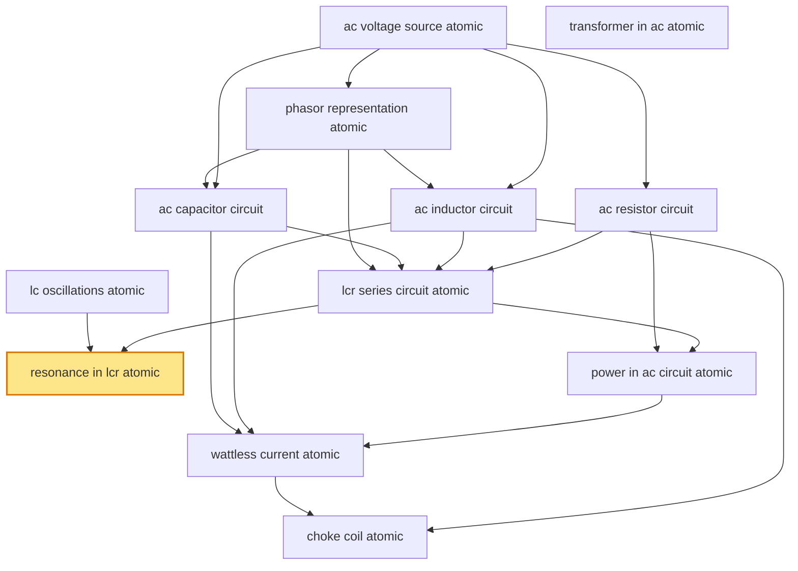

# T39 — AC Circuits  *(Class 12)*

> Dependency-ordered teaching pathway for physics-teacher review.
> **12 atomic + 17 nano = 29 concept-simulations.**  1 💎 diamond (highest-impact).

**How to use this:** teach top-to-bottom. Everything in a level only depends on earlier levels. Each **atomic** is a full teachable idea (= one simulation); the **↳ nanos** under it are its sub-points (one symbol / term / edge-case each).

**Foundations (teach first, nothing in this chapter comes before them):** ac_voltage_source_atomic, lc_oscillations_atomic, transformer_in_ac_atomic

## Concept dependency graph (atomic backbone)

## Teaching pathway (dependency-ordered)

### Level 0 — foundations

- **`ac_voltage_source_atomic`** — v(t) = V₀ sin ωt; V_rms = V₀/√2; ω = 2πf; T = 1/f
  - ↳ `rms_vs_peak_vs_average_nano` — V_rms = V₀/√2; V_avg over half-cycle = 2V₀/π; over full = 0. Derivation via ⟨sin²ωt⟩ = ½
  - ↳ `frequency_50hz_indian_grid_nano` — India: 50 Hz; US: 60 Hz; BIS IS 12360 standard
- **`lc_oscillations_atomic`** — Energy oscillates between L (½LI²) and C (½CV²) at ω = 1/√(LC); analogous to SHM with q ↔ x
  - ↳ `q_obeys_shm_equation_nano` — d²q/dt² = −q/(LC); compare to d²x/dt² = −ω²x with ω² = 1/LC
  - ↳ `energy_partition_oscillation_nano` — At t=0 all energy in C; at quarter-period all in L; full period returns; ½LI₀² = ½CV₀²
- **`transformer_in_ac_atomic`** — V_s/V_p = N_s/N_p (turn ratio); I_s/I_p = N_p/N_s (ideal); soft-iron core minimises hysteresis loss; step-up vs step-down
  - ↳ `transformer_losses_nano` — 4 loss mechanisms: copper (I²R), hysteresis (T37 area-of-B-H-loop), eddy currents (T35 → laminated core), flux leakage. Efficiency η typically 96-99%
  - ↳ `step_up_vs_step_down_nano` — N_s > N_p → step-up (high-voltage transmission); N_s < N_p → step-down (consumer end). India: 11 kV / 33 kV / 132 kV / 220 kV / 400 kV / 765 kV grid
  - ↳ `ac_traction_application_nano` — Indian Railways: 25 kV / 50 Hz overhead → on-board step-down + rectifier + traction motor. ~70% of route-km electrified

### Level 1

- **`phasor_representation_atomic`** — Sinusoidal quantity ↔ rotating vector in complex plane; phase angle = rotation angle; magnitude = peak value
  - ↳ `phase_relationship_intuition_nano` — Inductor: V leads I (V must rise to drive change in I against L); Capacitor: I leads V (I delivers charge before V builds across plates)
  - ↳ `impedance_triangle_nano` — Z² = R² + (X_L − X_C)²; tan φ = (X_L − X_C)/R
- **`ac_resistor_circuit`** — V and I in phase; I = V/R same as DC; P_avg = V_rms²/R

### Level 2

- **`ac_inductor_circuit`** — V leads I by π/2; X_L = ωL (inductive reactance); no power dissipation
  - ↳ `inductive_reactance_x_l_units_nano` — X_L = ωL has units of ohms; X_L(50Hz) for 1H coil = 314 Ω
- **`ac_capacitor_circuit`** — I leads V by π/2; X_C = 1/(ωC) (capacitive reactance); no power dissipation
  - ↳ `capacitive_reactance_x_c_units_nano` — X_C = 1/(ωC) has units of ohms; X_C(50Hz) for 1μF cap = 3.18 kΩ

### Level 3

- **`lcr_series_circuit_atomic`** — Impedance Z = √(R² + (X_L − X_C)²); phase φ = arctan((X_L − X_C)/R); I = V₀/Z

### Level 4

- **`resonance_in_lcr_atomic`** 💎 — At ω₀ = 1/√(LC), X_L = X_C → Z minimized = R → I maximized; sharpness Q = ω₀L/R
  - ↳ `q_factor_nano` — Q = ω₀L/R = (1/R)·√(L/C); also Q = ω₀/Δω (bandwidth ratio)
  - ↳ `bandwidth_delta_omega_nano` — Δω = R/L = ω₀/Q; half-power frequencies bracket resonance
  - ↳ `radio_tuning_application_nano` — LC tuning in radio receiver selects one station from EM spectrum by matching ω₀
- **`power_in_ac_circuit_atomic`** — P_avg = V_rms·I_rms·cos φ (real); S = V_rms·I_rms (apparent); Q_react = V_rms·I_rms·sin φ (reactive); cos φ = power factor
  - ↳ `power_factor_correction_nano` — Industrial loads add capacitor banks to push cos φ → 1; reduces I_rms for same P_avg → lowers I²R losses in transmission. CEA tariff penalises low cos φ
  - ↳ `real_vs_apparent_vs_reactive_table_nano` — Side-by-side table: name, formula, units (W vs VA vs VAR), physical meaning

### Level 5

- **`wattless_current_atomic`** — Purely inductive or purely capacitive circuit → cos φ = 0 → P_avg = 0 although I_rms ≠ 0

### Level 6

- **`choke_coil_atomic`** — Inductor used to limit AC current without dissipating power; replaces resistor in fluorescent tube ballast
  - ↳ `choke_in_fluorescent_lamp_nano` — Fluorescent tube ballast = choke coil in series with tube; limits current after ionisation
