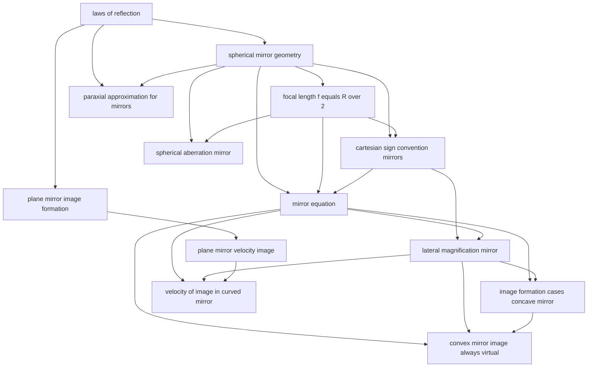

# T41 — Ray Optics Mirrors  *(Class 12)*

> Dependency-ordered teaching pathway for physics-teacher review.
> **13 atomic + 19 nano = 32 concept-simulations.**

**How to use this:** teach top-to-bottom. Everything in a level only depends on earlier levels. Each **atomic** is a full teachable idea (= one simulation); the **↳ nanos** under it are its sub-points (one symbol / term / edge-case each).

**Foundations (teach first, nothing in this chapter comes before them):** laws_of_reflection

## Concept dependency graph (atomic backbone)

## Teaching pathway (dependency-ordered)

### Level 0 — foundations

- **`laws_of_reflection`** — i=r + normal-incidence + coplanarity. Atomic per RO-G1. EPIC-C STATE_1 wrong belief: "angle of incidence is measured from the mirror surface, not the normal" — universal Class 12 error

### Level 1

- **`plane_mirror_image_formation`** — v = -u (image distance = object distance on opposite side); lateral inversion; image is virtual, erect, same size. EPIC-C STATE_1 wrong belief: "image is on the mirror surface" — students locate image AT the glass
- **`spherical_mirror_geometry`** — Pole P, centre of curvature C, radius of curvature R, principal axis, aperture, focal plane. Foundation atomic for all mirror-related math. EPIC-C STATE_1 wrong belief: "the pole is the centre of curvature" — common confusion

### Level 2

- **`focal_length_f_equals_R_over_2`** — NCERT §9.2.2 derivation via Fig.9.4 geometry. For paraxial rays, f = R/2. The "1/2" surprise — students expect f = R or f = 2R
- **`plane_mirror_velocity_image`** — If object moves with velocity v⃗ relative to mirror, image moves with v⃗ reflected across the mirror plane (parallel component preserved, perpendicular component reversed). Bridge to T6 kinematics. JEE-tested. EPIC-C STATE_1 wrong belief: "image moves at same speed as object" — only true for perpendicular motion
- **`paraxial_approximation_for_mirrors`** — All mirror formulas assume rays close to principal axis and small angles (sin θ ≈ tan θ ≈ θ). The justification atomic for f = R/2 and 1/v + 1/u = 1/f. When violated → A11 spherical aberration. EPIC-C STATE_1 wrong belief: "mirror formula works for any aperture" — fails for large-aperture beams

### Level 3

- **`cartesian_sign_convention_mirrors`** — Per RO-G2: own atomic. Pole as origin; incident-light direction positive; heights upward positive. The sign table for the 6 image-formation cases. Most common failure point in mirror-formula problems
- **`spherical_aberration_mirror`** — Per RO-G5: own atomic. Marginal rays focus closer to mirror than paraxial rays; produces caustic curve + circle of least confusion. Fix: parabolic mirror (all parallel rays focus at one point). Indian anchors: automobile headlight reflector (Bajaj/TVS), solar cooker (MNRE SOLBOX program), satellite dish parabola

### Level 4

- **`mirror_equation`** — 1/v + 1/u = 1/f. NCERT derivation via similar triangles A'B'F and ABP. HCV derivation via exterior angle. Per RO-G3: distinct atomic from lens equation despite similar form

### Level 5

- **`lateral_magnification_mirror`** — m = h'/h = -v/u. Negative m ⇒ inverted (real image); positive m ⇒ erect (virtual image). Per RO-G3 split: lens magnification is m = +v/u (sign convention difference) — common confusion

### Level 6

- **`image_formation_cases_concave_mirror`** — Per RO-G4: 6-state atomic. Cases: (i) ∞ → F (real, dim, inv); (ii) beyond C → between F-C (real, dim, inv); (iii) at C → at C (real, same-size, inv); (iv) between C-F → beyond C (real, mag, inv); (v) at F → ∞; (vi) between P-F → virtual, behind mirror, erect, mag. Plus +1 convex case (A9). The CBSE-board canonical case-table
- **`velocity_of_image_in_curved_mirror`** — Per RO-G6: own atomic. v_I_longitudinal = m² v_O; v_I_perpendicular = m v_O. JEE-Adv staple. Derived by differentiating mirror equation. NCERT Example 9.4 (jogger in side mirror) is the entry-level case

### Level 7

- **`convex_mirror_image_always_virtual`** — For any real object: image is virtual, erect, diminished, behind the mirror. Single visual scene. EPIC-C STATE_1 wrong belief: "convex mirror can form a real image with a real object" — fails dimensional check

### Other sub-concepts (parent atomic is in another chapter)

  - ↳ `normal_to_curved_surface` — Normal at any point on a sphere = the radius (line from C through point). Bridge to A4 spherical-mirror geometry
  - ↳ `coplanarity_of_incident_normal_reflected` — All three lie in the plane of incidence. Pedagogically subtle — students draw 3D crossings
  - ↳ `lateral_inversion_left_right` — Right-hand becomes left-hand. Ambulance "AMBULANCE" mirror-inversion painted text is the Indian-context anchor
  - ↳ `minimum_mirror_height_for_full_image` — h_min = H/2 for full-body view. NCERT Exercise + DCP Q.8 canonical. Indian-context: bathroom mirror sizing
  - ↳ `multiple_images_two_mirrors_at_angle` — N = 360°/θ - 1 (or 360°/θ if asymmetric). Indian-context: kaleidoscope toy + 2-mirror parallel barber-shop infinite reflection
  - ↳ `mirror_rotation_ray_rotates_2theta` — When mirror rotates by θ, reflected ray rotates by 2θ. Classroom galvanometer-scale demonstration; JEE-tested annually
  - ↳ `concave_vs_convex_distinction` — Concave: silvered on outside, reflects on inside (caves inward toward C). Convex: silvered on inside, reflects on outside (bulges toward observer). Indian-context: shaving (concave) vs scooter rear-view (convex)
  - ↳ `aperture_must_be_small_for_clean_focus` — Bridge to A11 spherical aberration: if aperture is large, paraxial approximation fails
  - ↳ `concave_mirror_real_focus` — Parallel rays converge to a real F in front of the mirror. Sign: f negative per Cartesian convention
  - ↳ `convex_mirror_virtual_focus` — Parallel rays appear to diverge from a virtual F behind the mirror. Sign: f positive
  - ↳ `direction_of_incident_light_sets_positive_x` — If light travels left-to-right, +x is rightward (and distances toward mirror are positive). If light is reversed (multi-element systems), sign convention can flip mid-problem
  - ↳ `real_image_in_front_of_mirror_negative_v` — For concave mirror with real object: v negative (image on the same side as object, opposite to incident-light direction beyond pole)
  - ↳ `derivation_via_similar_triangles` — The MPF ~ A'B'F similarity is the key insight. Pedagogically rigorous
  - ↳ `sign_of_m_tells_image_orientation` — Negative m means inverted; positive m means erect. Magnitude tells size
  - ↳ `scooter_side_mirror_anchor` — Indian-context anchor: every Bajaj/TVS scooter, every auto-rickshaw rear-view. "Objects in mirror are closer than they appear" (the diminished image makes them seem far)
  - ↳ `security_dome_mirror_anchor` — Convex dome mirrors at supermarket corners + Metro station ceilings + bank ATM vestibules. Wide field of view at cost of magnification
  - ↳ `parabolic_mirror_perfect_for_parallel_rays` — Geometric proof: parabola defined as locus equidistant from focus + directrix ⇒ all parallel rays parallel to axis converge at focus exactly
  - ↳ `reflecting_telescope_uses_parabolic_primary` — Cassegrain telescope: parabolic primary + hyperbolic secondary. Indian anchor: 2.34m reflecting telescope at Kavalur, IIA Bangalore (NCERT §9.9.3 §"Cassegrain")
  - ↳ `differentiate_mirror_eq_to_get_dv_du` — d/dt(1/v + 1/u = 1/f) ⇒ -1/v² dv/dt - 1/u² du/dt = 0 ⇒ dv/dt = -(v²/u²) du/dt = -m² (du/dt)
