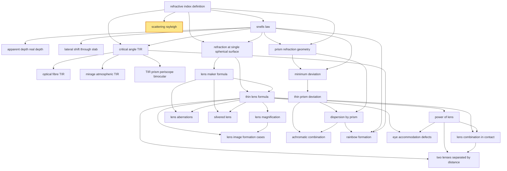

# T42 — Refraction Lenses Prism  *(Class 12)*

> Dependency-ordered teaching pathway for physics-teacher review.
> **26 atomic + 37 nano = 63 concept-simulations.**  3 💎 diamond (highest-impact).

**How to use this:** teach top-to-bottom. Everything in a level only depends on earlier levels. Each **atomic** is a full teachable idea (= one simulation); the **↳ nanos** under it are its sub-points (one symbol / term / edge-case each).

**Foundations (teach first, nothing in this chapter comes before them):** refractive_index_definition

## Concept dependency graph (atomic backbone)

## Teaching pathway (dependency-ordered)

### Level 0 — foundations

- **`refractive_index_definition`** — μ = c/v; frequency unchanged across interface; wavelength changes (λ_medium = λ_vacuum/μ). Chain rule μ₁₂ × μ₂₃ × μ₃₁ = 1. EPIC-C STATE_1 wrong belief: "denser optical medium = denser mass" — water > air optically but kerosene < water mass-density yet kerosene > water optically

### Level 1

- **`snells_law`** — μ₁ sin i = μ₂ sin r. Denser → rarer: ray bends away from normal. Rarer → denser: bends toward normal. Per RF-G1: own atomic. EPIC-C STATE_1 wrong belief: "ray bends because it 'wants to' minimize path" — actually Fermat's-principle minimization of TIME, not path (the drowning-child analogy in NCERT §9.3 box)
- **`scattering_rayleigh`** 💎 — Per RF-G5: own atomic. Intensity scattered ∝ 1/λ⁴. Shorter λ (blue, violet) scatter more. Sky appears blue (violet scattered even more but eye less sensitive). Sunset/sunrise red (long path through atmosphere strips blue/violet, leaves red). Indian-context anchor: every Indian evening sky + diamond/peacock-feather iridescence

### Level 2

- **`apparent_depth_real_depth`** — μ = real_depth / apparent_depth (for normal-incidence viewing from above). Object appears raised. Multi-medium: total apparent shift = Σ (1 - 1/μ_i) × t_i. EPIC-C STATE_1 wrong belief: "image is at same depth as object" — fishermen learn this empirically
- **`lateral_shift_through_slab`** — For a parallel slab of thickness t and μ: lateral_shift = t × (1 - 1/μ) (normal-shift formula via DCP §31.4). Per RF-G1: own atomic. EPIC-C STATE_1 wrong belief: "ray inside slab moves the image" — the displacement is purely a side-shift, image is at same depth-line
- **`critical_angle_TIR`** — sin i_c = 1/μ (going from denser μ to rarer 1). For i > i_c, total internal reflection — NO refracted ray. EPIC-C STATE_1 wrong belief: "some light always transmits" — at TIR, ZERO transmits (idealized). Indian classroom demo: laser pointer in turbid water from below
- **`refraction_at_single_spherical_surface`** — μ₂/v - μ₁/u = (μ₂ - μ₁)/R. Foundation for lens-maker's formula. Derived via paraxial + Snell at the curved interface. Sign convention: incident-light direction positive. EPIC-C STATE_1 wrong belief: "this formula is only for lenses" — it works for any single curved interface (e.g., a glass-rod end, an air-bubble in glass)
- **`prism_refraction_geometry`** — δ = (i + e) - A; r₁ + r₂ = A (where A = prism angle). The 4-angle quadrilateral geometry at the prism cross-section. EPIC-C STATE_1 wrong belief: "deviation depends only on prism material" — actually depends on incidence angle i too

### Level 3

- **`optical_fibre_TIR`** — Core + cladding (n_core > n_cladding); successive TIRs at every wall bounce; >95% transmission over 1km (NCERT). Per RF-G3: own atomic. Indian anchors: BSNL/Reliance Jio fibre rollout in tier-2 cities; medical endoscope (gastroscope) for stomach exam (HCV §18.7)
- **`mirage_atmospheric_TIR`** — Hot road heats air near surface; air layers near ground have lower μ (less dense, hotter); successive refraction bends light upward; at high enough incidence angle → TIR → observer sees inverted "puddle of sky" near road. Per RF-G3: own atomic. Indian-context: every May/June highway between Delhi-Jaipur, Mumbai-Pune
- **`TIR_prism_periscope_binocular`** — 45°-45°-90° prism with light entering perpendicular to short side: TIR off the hypotenuse, exits perpendicular to other short side. Used to bend light by 90° or 180°, OR to invert an image without flipping (NCERT Fig.9.15 a,b,c). Per RF-G3: own atomic. Indian-context: Indian Army periscope, classroom binoculars, naval submarine periscope
- **`lens_maker_formula`** — Per RF-G2: own atomic. 1/f = (μ_lens/μ_medium - 1)(1/R₁ - 1/R₂). In air (μ_medium=1): 1/f = (μ-1)(1/R₁ - 1/R₂). DERIVATION question — "what f does this lens have, given material + curvature?"
- **`minimum_deviation`** — At δ_min: i = e, r₁ = r₂ = A/2. Refractive index formula: μ = sin((A + δ_m)/2) / sin(A/2). The standard lab method to measure μ of a prism material in physics-practical class. Indian classroom anchor: every CBSE Class 12 physics-practical

### Level 4

- **`thin_lens_formula`** — Per RF-G2: own atomic. 1/v - 1/u = 1/f. **Note the sign — different from mirror formula (1/v + 1/u = 1/f).** USAGE question — "where is the image, given u + f?" EPIC-C STATE_1 wrong belief: "lens formula is 1/v + 1/u = 1/f like mirrors" — common Class 12 error from over-generalization
- **`thin_prism_deviation`** — For small A: δ = (μ - 1) A. Simpler formula, used in achromatic-prism design. Direct-vision spectroscope uses combination of thin prisms with no net deviation but full dispersion

### Level 5

- **`lens_magnification`** — m = v/u (lens) vs m = -v/u (mirror) — see N11.1. For real images: m negative ⇒ inverted; for virtual: m positive ⇒ erect. Same magnitude-interpretation as mirror but opposite sign convention
- **`power_of_lens`** — P = 1/f (where f in metres). Unit: dioptre (D). Positive for converging (convex), negative for diverging (concave). Indian-context anchor: optometrist's "−1.5 D" or "+2.5 D" spectacle prescription
- **`lens_aberrations`** — Spherical aberration (marginal rays focus shorter f than paraxial — HCV §18.17 + Fig.18.29–18.30) + chromatic aberration (μ varies with λ → red f longer than violet f, HCV Fig.18.33). Coma + astigmatism + curvature + distortion are sub-types. HCV-only. JEE-Adv sleeper. EPIC-C STATE_1 wrong belief: "real lenses are perfect" — every camera lens has multiple elements specifically to cancel aberrations
- **`silvered_lens`** — DCP-unique. Half-silvered lens behaves like a curved mirror with effective focal length: 1/f_eff = 2/f_lens + 1/f_mirror_back. Ray path: refract — reflect (off silver back) — refract again. JEE-Adv staple. DCP §31.6 Important Point #8 + Fig.31.82 + Example 31.28
- **`dispersion_by_prism`** — μ varies with λ (Table 9.2: crown glass μ_violet=1.533 > μ_red=1.515; flint glass μ_violet=1.663 > μ_red=1.622). Hence δ varies with λ. White light splits into VIBGYOR. Indian-context anchor: every Class 12 physics-practical prism experiment

### Level 6

- **`lens_combination_in_contact`** — Per RF-G4: own atomic. 1/F = 1/f₁ + 1/f₂ (in contact, d→0). Powers add: P = P₁ + P₂. Used to design achromatic doublets (chromatic-aberration cancellation). NCERT Exercise 9.10 + 9.21
- **`lens_image_formation_cases`** — 6 cases for convex lens: (i) ∞ → F (real, dim, inv); (ii) beyond 2F → between F-2F (real, dim, inv); (iii) at 2F → at 2F (real, same-size, inv); (iv) between F-2F → beyond 2F (real, mag, inv); (v) at F → ∞ (used in collimation); (vi) between O-F → virtual, same-side, erect, mag. Plus 1 concave case (always virtual, erect, diminished). DCP Table 31.1 + Fig.31.39–31.44 canonical
- **`achromatic_combination`** — Two prisms (one crown + one flint) of different angles can combine to produce: (a) deviation without dispersion (achromatic prism — used in periscopes that need to bend light a fixed angle without color-fringing), OR (b) dispersion without deviation (direct-vision spectroscope — used in astronomy to identify Fraunhofer lines without bending the beam). NCERT Exercise 9.23
- **`rainbow_formation`** — Per RF-G5: own atomic. Primary rainbow: sunlight refracts into water droplet → internally reflects ONCE → refracts out at 42° to incoming sunlight (red outer, violet inner). Secondary rainbow: TWO internal reflections → 50° angle (red inner, violet outer — REVERSED order). Indian-context anchor: monsoon-rainbow universal experience. NCERT Fig.9.27 (a)+(b)+(c)
- **`eye_accommodation_defects`** — Per RF-G6: bundled atomic. Eye lens varies focal length via ciliary muscle (accommodation). Defects: (i) Myopia (near-sighted, f too short) → fix with concave (diverging) lens; (ii) Hypermetropia (far-sighted, f too long) → fix with convex (converging); (iii) Astigmatism (cornea non-spherical) → fix with cylindrical lens; (iv) Presbyopia (age-related accommodation loss) → fix with bifocals. Indian anchors: Lenskart / Titan Eye+ / school eye-camps. NCERT §9.9.1 + Examples 9.10–9.12

### Level 7

- **`two_lenses_separated_by_distance`** — Per RF-G4: own atomic. 1/F = 1/f₁ + 1/f₂ - d/(f₁f₂). When d = f₁ + f₂: configuration becomes telescope (zero net power but angular magnification). EPIC-C STATE_1 wrong belief: "separation doesn't matter, only individual powers" — wrong for d > 0

### Other sub-concepts (parent atomic is in another chapter)

  - ↳ `frequency_invariance_across_interface` — f doesn't change at boundary (consequence of boundary continuity). Only λ and v change
  - ↳ `refractive_index_table_common_substances` — Water 1.33, crown glass 1.52, dense flint 1.62, diamond 2.42 (NCERT Table 9.1). Just the values 💎
  - ↳ `mu_chain_rule` — μ_AB × μ_BC × μ_CA = 1. Useful for multi-medium problems
  - ↳ `bending_direction_rule` — Toward normal (rarer→denser) vs away from normal (denser→rarer). The "memorize-one-case" trick
  - ↳ `parallel_emergence_from_parallel_slab` — If both boundaries parallel and same μ on both sides: emergent ray is parallel to incident. Internal angles cancel
  - ↳ `apparent_depth_normal_incidence_assumption` — The μ = real/apparent formula assumes small-angle (normal viewing). Oblique viewing gives more complex shift
  - ↳ `multi_layer_water_oil_apparent_shift` — h_app = h_1/μ_1 + h_2/μ_2. Indian-context: kerosene-on-water layered demos
  - ↳ `fisherman_spear_offset_anchor` — A spear aimed at where a fish APPEARS misses — must aim BELOW. Indian-coastal fisherfolk anecdote anchor
  - ↳ `slab_in_front_of_mirror_normal_shift` — If a slab sits between object and mirror, object appears closer by (1 - 1/μ)t. DCP Example 31.11
  - ↳ `critical_angle_values_common_media` — Water 48.75°, crown glass 41.14°, dense flint 37.31°, diamond 24.41°. The "smaller critical angle = more brilliant" insight 💎
  - ↳ `TIR_must_be_denser_to_rarer` — TIR cannot happen rarer→denser. Common misconception correction
  - ↳ `core_cladding_index_relationship` — n_core > n_cladding so light incident at core-cladding boundary exceeds critical angle. Numerical aperture concept
  - ↳ `telecommunication_2000_signals_per_fibre` — NCERT: "about 2000 telephone signals" multiplexed per fibre. Indian-telecom rollout anchor
  - ↳ `superior_mirage_cold_polar_seas` — Inverse case: cold air below, warm above (in seas near poles). Ships appear "floating in sky." Not Indian but worth a callout.
  - ↳ `TIR_prism_better_than_mirror` — TIR has 100% reflection (no silver-tarnish loss). Mirrors lose ~5-10% per bounce; binoculars with 4-6 reflections must use prisms for brightness
  - ↳ `air_bubble_in_glass_diverges_light` — Glass μ=1.5, air bubble μ=1.0 (lower). Light passing through behaves like a concave (diverging) lens. DCP Example 31.16 + Fig.31.49
  - ↳ `sign_of_R1_and_R2_per_convention` — R₁: positive if first surface convex toward incident light. R₂: positive if second surface convex toward outgoing light. The biconvex lens: R₁>0, R₂<0
  - ↳ `biconvex_R_equal_magnitude_focal_length_R` — For biconvex (R₁=R, R₂=-R) lens with μ=1.5: f = R. Useful "memorize this" result for problems
  - ↳ `lens_in_water_focal_length_4x` — For glass (μ=1.5) lens in water (μ=4/3): f_water = 4 × f_air. (Because μ_g/μ_w - 1 = 1.5/1.33 - 1 = 0.125, vs. μ_g - 1 = 0.5 in air — ratio 4×). DCP Example 31.16 + NCERT Example 9.8(iii)
  - ↳ `mirror_vs_lens_sign_difference` — The sign difference traces to incident-light direction: in mirror reflection, light reverses; in lens transmission, light continues. Sign-convention applies the difference cleanly
  - ↳ `dioptre_unit_inverse_metres` — 1 D = 1 m⁻¹. The unit. A lens of f=50cm has P = +2 D. NCERT Example 9.8(i)
  - ↳ `three_lens_combination` — 1/F = 1/f₁ + 1/f₂ + 1/f₃ for three lenses in contact. Linear extension
  - ↳ `telescope_configuration_d_equals_f_o_plus_f_e` — When d = f₁ + f₂, the system has effective f = -f₁f₂/(0) — degenerate, behaves as angular magnifier (telescope). Bridge to T43 instruments
  - ↳ `achromatic_doublet_crown_flint` — Crown lens (low dispersion) + flint lens (high dispersion) combined in contact: same μ for design wavelength but opposite chromatic-correction. Eyepieces of school microscopes are achromats
  - ↳ `parabolic_telescope_avoids_spherical` — Big telescopes use parabolic primary mirror instead of spherical lens to avoid both spherical and chromatic aberrations. Indian anchor: 2.34m Cassegrain at Kavalur IIA
  - ↳ `r1_plus_r2_equals_A` — From the AQNR quadrilateral: ∠A + ∠QNR = 180° (since both Q and R are 90°). And r₁+r₂+∠QNR = 180° from triangle. Hence r₁+r₂ = A
  - ↳ `delta_vs_i_plot_shape` — δ-vs-i plot is U-shaped with minimum at i=e. Two different i values give same δ (symmetric). NCERT Fig.9.24
  - ↳ `newton_recombination_experiment` — Newton's classic: first prism splits → second inverted prism recombines into white. NCERT Fig.9.26
  - ↳ `violet_bends_most_red_least_VIBGYOR` — Shorter λ → higher μ → larger δ. Violet bends most, red least. The "VIBGYOR top-to-bottom in rainbow" order
  - ↳ `primary_red_outside_secondary_red_inside` — The color-order reversal in secondary rainbow is the diagnostic. If you see only one, it's primary; if both, check which is brighter (primary is) and which has red on top (primary does)
  - ↳ `rainbow_requires_sun_behind_observer` — Sun on one side of sky (~western horizon at sunset rainbow), rain on other side. The "back to sun" rule
  - ↳ `white_clouds_a_greater_than_lambda` — When scatterers (water droplets) are much larger than λ: all wavelengths scatter equally → white. Hence clouds appear white, sky appears blue
  - ↳ `red_danger_signals_long_wavelength` — NCERT explicit note: red used for traffic signals + ambulance lights because least scattered → reaches farthest. Indian-traffic universal anchor
  - ↳ `myopic_far_point_finite` — Myopic person's far point is closer than infinity (e.g., 80 cm in NCERT Example 9.11). Required power of corrective lens: P = -1/(far point in m). For 80cm: P = -1.25 D (concave)
  - ↳ `hypermetropic_near_point_far` — Hypermetropic person's near point > 25cm (e.g., 75cm in NCERT Example 9.12). For comfortable reading at 25cm: needs +2.67 D (convex). Common in elderly Indians
  - ↳ `astigmatism_cornea_non_spherical` — Cornea has different curvature in vertical vs horizontal plane. Vertical lines clear but horizontal blurred (or vice versa). Cylindrical lens with axis aligned correctly compensates
  - ↳ `presbyopia_age_related_bifocals` — After ~40 years, ciliary muscle weakens, lens can't deform enough for near vision. Many Indians need both — distance correction + reading correction → bifocal/progressive spectacles
