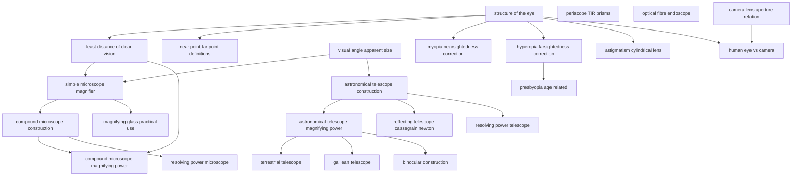

# T43 — Optical Instruments  *(Class 12)*

> Dependency-ordered teaching pathway for physics-teacher review.
> **24 atomic + 12 nano = 36 concept-simulations.**

**How to use this:** teach top-to-bottom. Everything in a level only depends on earlier levels. Each **atomic** is a full teachable idea (= one simulation); the **↳ nanos** under it are its sub-points (one symbol / term / edge-case each).

**Foundations (teach first, nothing in this chapter comes before them):** structure_of_the_eye, visual_angle_apparent_size, periscope_TIR_prisms, optical_fibre_endoscope, camera_lens_aperture_relation

## Concept dependency graph (atomic backbone)

## Teaching pathway (dependency-ordered)

### Level 0 — foundations

- **`structure_of_the_eye`** — Anatomy + accommodation of human eye (cornea / iris / lens / ciliary / retina)
- **`visual_angle_apparent_size`** — Apparent size ∝ angle subtended on eye, not linear size; instruments **increase visual angle** artificially
- **`periscope_TIR_prisms`** — Two 45°-prisms in submarine/army periscope; uses TIR (no mirrors to corrode)
- **`optical_fibre_endoscope`** — Light pipes via TIR; medical endoscope, telecommunication
- **`camera_lens_aperture_relation`** — f-number = f/D_aperture; depth-of-field; exposure

### Level 1

- **`least_distance_of_clear_vision`** — D = 25 cm for normal eye; varies with age (7–8 cm child → 1–2 m elder)
- **`near_point_far_point_definitions`** — Near point = closest clear; far point = farthest clear (normal eye = ∞)
- **`astronomical_telescope_construction`** — Large-aperture, long-f objective + short-f eyepiece, both converging; objects at ∞
- **`myopia_nearsightedness_correction`** — f_max < eye-retina distance → distant rays focus before retina; correction = **diverging (concave) lens**, P = −1/x where x = max clear distance
- **`hyperopia_farsightedness_correction`** — f_min > required for near vision → near objects focus past retina; correction = **converging (convex) lens** of appropriate power
- **`astigmatism_cylindrical_lens`** — Cornea/lens curvature non-spherical; correction = **cylindrical lens** along specific axis
- **`human_eye_vs_camera`** — Both have variable-aperture diaphragm + adjustable lens + photo-sensitive surface; eye accommodates by changing f, camera changes v

### Level 2

- **`simple_microscope_magnifier`** — Single converging lens, object between F and lens; virtual erect magnified image at D or ∞
- **`astronomical_telescope_magnifying_power`** — m = −f_o/f_e (normal adjustment); m = (f_o/f_e)(1 + f_e/D) (near-point); L = f_o + f_e
- **`reflecting_telescope_cassegrain_newton`** — Parabolic mirror objective (no chromatic aberration, large aperture feasible); Newtonian secondary plane mirror @ 45° vs Cassegrain hyperbolic-secondary through hole in primary
- **`resolving_power_telescope`** — RP = 1/Δθ = a/(1.22λ); Δθ ≈ 1.22λ/a
- **`presbyopia_age_related`** — Ciliary muscles weaken → near-point recedes; remedy = bifocal (convex bottom, plain top)

### Level 3

- **`compound_microscope_construction`** — Objective (short f_o, small aperture) + eyepiece (longer f_e, larger field); ray diagram
- **`terrestrial_telescope`** — Adds inverting lens (f) between O and E; L = f_o + 4f + f_e; image now erect
- **`galilean_telescope`** — Convex objective + **concave** (diverging) eyepiece; intercepts converging rays before image; L = f_o − \|f_e\|; **erect image, shorter tube**
- **`binocular_construction`** — Two TIR-prism subsystems (one per eye) compress long telescope length into compact L
- **`magnifying_glass_practical_use`** — Single convex lens for reading; m = 1 + D/f; choose f ≈ 2–10 cm

### Level 4

- **`compound_microscope_magnifying_power`** — m = (L/f_o)·(D/f_e) for normal adjustment; m = (L/f_o)·(1 + D/f_e) for near-point
- **`resolving_power_microscope`** — RP = 2n sinβ / (1.22λ); n sinβ = numerical aperture

### Other sub-concepts (parent atomic is in another chapter)

  - ↳ `cornea_aqueous_refraction` — Most bending happens at cornea (n ≈ 1.336/1.396)
  - ↳ `accommodation_mechanism` — Ciliary muscles bend lens; f changes from f_max (relaxed) to f_min (strained)
  - ↳ `same_object_far_vs_close` — 52" boy at 4m subtends 13"/m; 55" boy at 5m subtends 11"/m → first looks taller
  - ↳ `magnifier_normal_adjustment` — Image at ∞: m = D/f
  - ↳ `magnifier_max_magnification` — Image at near-point D: m = 1 + D/f
  - ↳ `tube_length_l_approx_v` — L = v + f_e (separation between O and E); for f_o ≪ v, m ≈ (L/f_o)(D/f_e)
  - ↳ `objective_short_focal_length` — Why f_o is small — to maximize v/u factor
  - ↳ `inverted_image_disadvantage` — Final image is inverted — fine for stars, bad for terrestrial use
  - ↳ `why_reflectors_dominate_modern_astronomy` — No chromatic aberration + larger aperture + cheaper than refractors at large size
  - ↳ `rayleigh_criterion_telescope_specific` — Two stars just resolved when central max of one ≈ first dark ring of other
  - ↳ `oil_immersion_objective` — Replace air gap with oil (n ≈ 1.5) to increase n sinβ → better RP
  - ↳ `resolving_vs_magnifying_power` — RP ≠ magnification; high m without high RP shows blurry larger image
