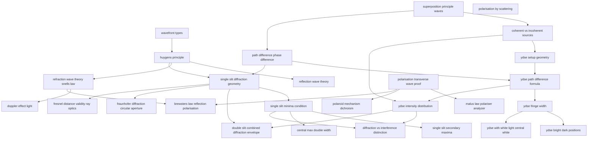

# T44 — Wave Optics  *(Class 12)*

> Dependency-ordered teaching pathway for physics-teacher review.
> **27 atomic + 6 nano = 33 concept-simulations.**

**How to use this:** teach top-to-bottom. Everything in a level only depends on earlier levels. Each **atomic** is a full teachable idea (= one simulation); the **↳ nanos** under it are its sub-points (one symbol / term / edge-case each).

**Foundations (teach first, nothing in this chapter comes before them):** wavefront_types, superposition_principle_waves, polarisation_transverse_wave_proof, polarisation_by_scattering

## Concept dependency graph (atomic backbone)

## Teaching pathway (dependency-ordered)

### Level 0 — foundations

- **`wavefront_types`** — Plane / spherical / cylindrical wavefronts; locus of in-phase points
- **`superposition_principle_waves`** — Resultant displacement = vector sum of individual displacements at a point
- **`polarisation_transverse_wave_proof`** — Two-polaroid experiment: rotate analyzer relative to polarizer → intensity varies from full to zero → light is transverse
- **`polarisation_by_scattering`** — Rayleigh scattering polarises light; explains why sky-blue and why polaroid sunglasses block sky glare

### Level 1

- **`huygens_principle`** — Every point on wavefront = source of secondary spherical wavelets; new wavefront = tangent envelope after time τ
- **`coherent_vs_incoherent_sources`** — Coherent = constant phase relationship → stable interference; incoherent = random phase → intensities add (I = 2I₀)
- **`path_difference_phase_difference`** — Δφ = (2π/λ)·Δx; constructive: Δx = nλ; destructive: Δx = (n+½)λ
- **`malus_law_polariser_analyzer`** — I = I₀ cos²θ where θ = angle between polariser and analyzer transmission axes
- **`polaroid_mechanism_dichroism`** — Polaroid material absorbs E-vector along one axis, transmits perpendicular axis (selective absorption)

### Level 2

- **`reflection_wave_theory`** — Derivation of law of reflection (i = r) using Huygens construction (BC = vτ = AE)
- **`refraction_wave_theory_snells_law`** — Derivation of n_1 sin i = n_2 sin r using BC = v_1τ and AE = v_2τ; n_2/n_1 = v_1/v_2
- **`ydse_setup_geometry`** — Two pinholes S₁, S₂ behind master pinhole S; spherical waves interfere on distant screen
- **`single_slit_diffraction_geometry`** — Slit width a, screen at distance D, divide into N parallel secondary sources (Huygens); path difference between edges = a sinθ ≈ aθ

### Level 3

- **`doppler_effect_light`** — Δν/ν = −v_radial/c for v ≪ c; red shift (galaxy receding) vs blue shift (approaching)
- **`ydse_path_difference_formula`** — Δx = xd/D for x, d ≪ D (binomial approximation)
- **`single_slit_minima_condition`** — Zero intensity at aθ = nλ, n = ±1, ±2, ...; halve-and-cancel argument
- **`fraunhofer_diffraction_circular_aperture`** — Airy pattern: central disk of radius r_0 ≈ 1.22λf/(2a); concentric rings
- **`fresnel_distance_validity_ray_optics`** — z_F = a²/λ; beyond z_F diffraction spreading dominates over geometric aperture; ray optics breaks down
- **`brewsters_law_reflection_polarisation`** — At Brewster's angle iB where tan iB = n, reflected light is fully polarised perpendicular to plane of incidence

### Level 4

- **`ydse_fringe_width`** — β = λD/d (fringe spacing); uniform spacing between consecutive bright OR dark
- **`ydse_intensity_distribution`** — I = 4I₀cos²(φ/2); periodic pattern between 0 and 4I₀
- **`single_slit_secondary_maxima`** — Weaker peaks at aθ = (n+½)λ; intensity drops off rapidly
- **`central_max_double_width`** — Central bright fringe = 2λ/a wide; secondary maxima = λ/a wide

### Level 5

- **`ydse_bright_dark_positions`** — Bright at x_n = nλD/d; dark at x_n = (n+½)λD/d
- **`ydse_with_white_light_central_white`** — Central fringe = white (all λ overlap at Δx = 0); side fringes = coloured (red farthest, then no clear pattern)
- **`diffraction_vs_interference_distinction`** — Few sources → "interference"; many sources → "diffraction" (Feynman quote); intensity-redistribution explanation
- **`double_slit_combined_diffraction_envelope`** — Real YDSE pattern = double-slit cos² × single-slit (sinα/α)² envelope; missing orders when d/a is integer

### Other sub-concepts (parent atomic is in another chapter)

  - ↳ `backward_wave_problem` — Why secondary wavelets don't generate backward wave — historical hand-wave, resolved by Kirchhoff diffraction theory
  - ↳ `wave_speed_changes_freq_does_not` — At a medium boundary, ν stays; λ and v change
  - ↳ `time_average_intensity_2I0` — When φ rapidly varies, ⟨cos²(φ/2)⟩ = 1/2 → I = 2I₀
  - ↳ `thomas_young_locking_phases` — Master pinhole S "locks" phases — any abrupt phase change in S transfers identically to S₁, S₂
  - ↳ `s_over_S_less_than_lambda_over_d` — Source-slit condition s/S < λ/d for fringes to be visible
  - ↳ `string_analogy_for_polarisation` — Slot polariser on long string: only wave parallel to slot passes
