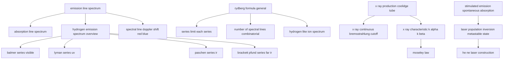

# T45 — Atomic Spectra  *(Class 12)*

> Dependency-ordered teaching pathway for physics-teacher review.
> **19 atomic + 5 nano = 24 concept-simulations.**

**How to use this:** teach top-to-bottom. Everything in a level only depends on earlier levels. Each **atomic** is a full teachable idea (= one simulation); the **↳ nanos** under it are its sub-points (one symbol / term / edge-case each).

**Foundations (teach first, nothing in this chapter comes before them):** emission_line_spectrum, rydberg_formula_general, x_ray_production_coolidge_tube, stimulated_emission_spontaneous_absorption

## Concept dependency graph (atomic backbone)

## Teaching pathway (dependency-ordered)

### Level 0 — foundations

- **`emission_line_spectrum`** — Hot rarefied gas emits at discrete wavelengths only; "fingerprint" of element; appears as bright lines on dark background
- **`rydberg_formula_general`** — 1/λ = RZ²(1/n_f² − 1/n_i²); R = 1.097 × 10⁷ m⁻¹; derived theoretically from Bohr energy formula
  - ↳ `rydberg_constant_theoretical_vs_empirical` — R = me⁴/(8ε₀²h³c); theoretical R = 1.03 × 10⁷ m⁻¹ very close to empirical 1.097 × 10⁷ m⁻¹. **Direct confirmation of Bohr model.**
- **`x_ray_production_coolidge_tube`** — Filament + metal target + high voltage (~kV); accelerated electrons strike target; X-rays emerge through Be window
- **`stimulated_emission_spontaneous_absorption`** — 3 processes: (a) absorption: photon kicks atom from E₁→E₂; (b) spontaneous: E₂→E₁ random emission (Einstein A); (c) stimulated: photon causes E₂→E₁ emission of identical photon (Einstein B)

### Level 1

- **`absorption_line_spectrum`** — White light through cool gas → dark lines at same wavelengths as emission; gas absorbs only matching photons
- **`hydrogen_emission_spectrum_overview`** — H spectrum has 5 visible+UV+IR series: Lyman, Balmer, Paschen, Brackett, Pfund. Each series = transitions to same final n_f
- **`series_limit_each_series`** — n_i → ∞: 1/λ_min = R Z²/n_f². Balmer limit = 364.6 nm; Lyman limit = 91.2 nm; Paschen limit = 820 nm
- **`number_of_spectral_lines_combinatorial`** — From state n_max, atoms can transition to any lower state → total possible lines = n(n−1)/2
- **`hydrogen_like_ion_spectrum`** — For He⁺ (Z=2), Li²⁺ (Z=3): wavelengths scale as 1/Z². Same Lyman/Balmer/Paschen structure but Z² shorter
- **`spectral_line_doppler_shift_red_blue`** — Moving source: λ_observed = λ_emitted (1 ± v/c); receding stars → red shift; approaching → blue shift
- **`x_ray_continuous_bremsstrahlung_cutoff`** — Decelerating electrons emit continuous-wavelength X-rays; cutoff wavelength λ_min = hc/eV (depends ONLY on accelerating voltage); independent of target material
- **`x_ray_characteristic_k_alpha_k_beta`** — Sharp peaks at specific wavelengths characteristic of target material; K_α = transition L→K; K_β = M→K; depends on Z of target
- **`laser_population_inversion_metastable_state`** — Normally N₂ < N₁ (Boltzmann); need pumping to invert (N₂ > N₁); metastable state (lifetime ~ms not ~ns) accumulates population

### Level 2

- **`balmer_series_visible`** — n_f = 2; 1/λ = R(1/4 − 1/n²) for n = 3, 4, 5...; H_α = 656.3 nm (red), H_β = 486.1 nm (blue-green), H_γ = 434.1 nm (violet); series limit = 364.6 nm
- **`lyman_series_uv`** — n_f = 1; transitions n → 1; 1/λ = R(1 − 1/n²); 91.2–121.6 nm; ALL in UV (invisible to eye)
- **`paschen_series_ir`** — n_f = 3; transitions n → 3; 820–1875 nm range; ALL in IR
- **`brackett_pfund_series_far_ir`** — Brackett: n_f = 4; Pfund: n_f = 5; both far-IR. Formulas analogous
- **`moseley_law`** — √ν = a(Z − b); X-ray frequency √ proportional to (Z − screening constant); led to ordering elements by Z not atomic mass
- **`he_ne_laser_construction`** — He (90%) + Ne (10%) gas mixture; He excited by discharge → resonantly pumps Ne to E₂ = 20.66 eV → lasing transition E₂ → E₁ at 632.8 nm (red)

### Other sub-concepts (parent atomic is in another chapter)

  - ↳ `kirchoffs_radiation_law_emission_absorption` — A good emitter at a wavelength is also a good absorber at that wavelength
  - ↳ `einstein_a_and_b_coefficients` — Spontaneous emission rate = A₂₁; stimulated rate = B₂₁ · u(ν); detailed balance gives A/B = 8πhν³/c³
  - ↳ `laser_properties_coherent_monochromatic_directional` — All photons same wavelength + same phase + same direction; Δλ/λ ~ 10⁻⁶; beam diverges <1 mrad
  - ↳ `laser_uses_indian_context` — Aravind Eye Hospital LASIK + medical surgery + CD/DVD readers + barcode scanners + Indian Army range-finders + fiber-optic communication (BharatNet)
