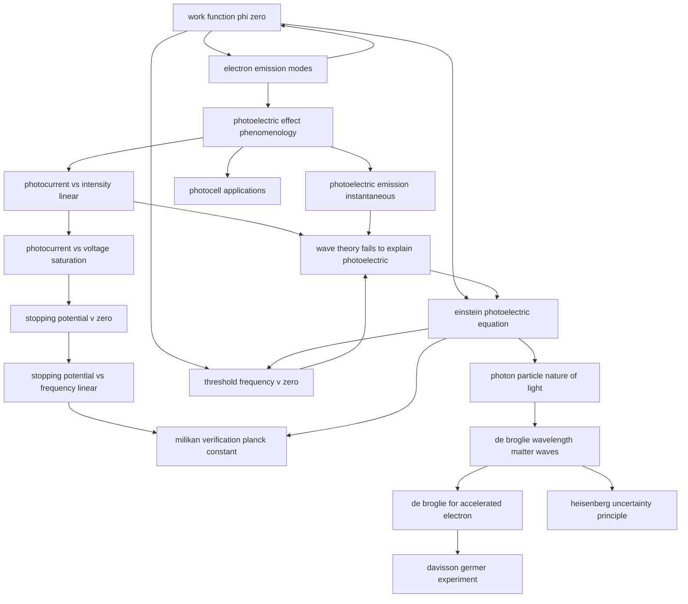

# T46 — Dual Nature  *(Class 12)*

> Dependency-ordered teaching pathway for physics-teacher review.
> **18 atomic + 4 nano = 22 concept-simulations.**

**How to use this:** teach top-to-bottom. Everything in a level only depends on earlier levels. Each **atomic** is a full teachable idea (= one simulation); the **↳ nanos** under it are its sub-points (one symbol / term / edge-case each).

**Foundations (teach first, nothing in this chapter comes before them):** work_function_phi_zero, electron_emission_modes, photoelectric_effect_phenomenology, photocurrent_vs_intensity_linear, photocurrent_vs_voltage_saturation, stopping_potential_v_zero, stopping_potential_vs_frequency_linear, photoelectric_emission_instantaneous, photon_particle_nature_of_light, de_broglie_wavelength_matter_waves, de_broglie_for_accelerated_electron, davisson_germer_experiment, heisenberg_uncertainty_principle, photocell_applications

> ⚠ **18 concept(s) have circular prerequisites** in the source catalogue (marked ⟲ below) — i.e. they list each other as prerequisites. The level placement for these is a best-effort break of the loop; worth a human review of the intended order.

## Concept dependency graph (atomic backbone)

## Teaching pathway (dependency-ordered)

### Level 0 — foundations

- **`work_function_phi_zero`** ⟲ — Min energy required for electron to escape metal surface. φ₀ in eV. Cs lowest (2.14), Pt highest (5.65). Depends on metal + surface
- **`electron_emission_modes`** ⟲ — 3 ways electrons escape: (i) thermionic (heating), (ii) field emission (~10⁸ V/m), (iii) photoelectric (light)
- **`photoelectric_effect_phenomenology`** ⟲ — Hertz 1887 + Hallwachs/Lenard 1886-1902: UV light on metal → electron emission → photocurrent. Photosensitive substances.
- **`photocurrent_vs_intensity_linear`** ⟲ — At fixed ν > ν₀ and fixed positive V: photocurrent ∝ intensity (linear). Saturation current = N_photoelectrons/sec
- **`photocurrent_vs_voltage_saturation`** ⟲ — At fixed ν, fixed intensity: photocurrent saturates at high +V (all photoelectrons collected); reverses to 0 at retarding −V (stopping potential V₀)
- **`stopping_potential_v_zero`** ⟲ — The minimum negative V₀ at which photocurrent = 0; relates to K_max of most energetic photoelectron via eV₀ = K_max
- **`stopping_potential_vs_frequency_linear`** ⟲ — V₀ vs ν straight line: slope = h/e (universal), y-intercept = −φ₀/e (metal-specific); below threshold frequency ν₀, no photoemission
- **`photoelectric_emission_instantaneous`** ⟲ — Emission starts within ~10⁻⁹ s of light striking surface, even at very dim light. NOT energy-accumulation as wave theory predicts
- **`photon_particle_nature_of_light`** ⟲ — 5 properties: (i) E = hν, (ii) p = hν/c = h/λ, (iii) all photons of given ν have same E, p; intensity = N·E (count, not energy/photon); (iv) electrically neutral; (v) energy+momentum conserved in photon-particle collisions
- **`de_broglie_wavelength_matter_waves`** ⟲ — All particles have a wavelength λ = h/p = h/(mv); massive objects → tiny λ (unobservable); electrons → measurable λ ~ X-ray range; **theory by symmetry: if waves are particles, particles must be waves**
- **`de_broglie_for_accelerated_electron`** ⟲ — Electron accelerated through V: K = eV, p = √(2meV), λ = h/√(2meV) = 1.227/√V nm (V in volts). For V = 100 V, λ = 0.123 nm
- **`davisson_germer_experiment`** ⟲ — 1927: electron gun → Ni crystal → diffraction peaks at θ=50° for V=54 V. Measured λ = 0.165 nm matches de Broglie 0.167 nm. Nobel 1937 (Davisson+Thomson)
- **`heisenberg_uncertainty_principle`** ⟲ — Δx · Δp ≈ ℏ (or ℏ/2 rigorously). Cannot simultaneously measure position and momentum precisely. Fundamental, not measurement-error
- **`photocell_applications`** ⟲ — Photoelectric device used in automatic doors, fire alarms, burglar alarms, light meters, traffic counters, motion-picture audio playback

### Level 1

- **`threshold_frequency_v_zero`** ⟲ — ν₀ = φ₀/h; minimum frequency for photoemission. Below ν₀ NO emission no matter how bright the light
- **`wave_theory_fails_to_explain_photoelectric`** ⟲ — 4 failures: (1) K_max should depend on intensity (doesn't — depends on ν); (2) no ν₀ should exist (does); (3) emission should be slow at dim light (instantaneous); (4) wave can't pump energy into one electron only
- **`einstein_photoelectric_equation`** ⟲ — K_max = hν − φ₀ = (1/2)mv²_max = eV₀. Each photon = 1 quantum hν; absorbed by 1 electron; explains ALL 4 observations
- **`milikan_verification_planck_constant`** ⟲ — Millikan 1906-1916: measured V₀ vs ν slope for sodium → calculated h. Got h ≈ 6.626 × 10⁻³⁴ J·s, matching Planck. Nobel 1923

### Other sub-concepts (parent atomic is in another chapter)

  - ↳ `stopping_potential_independent_of_intensity` — For fixed ν, V₀ does NOT depend on intensity — only on frequency + metal
  - ↳ `photoelectric_intensity_increases_count_not_energy` — Higher intensity = more photons/sec → more electrons/sec, but EACH electron still gets hν energy (not more)
  - ↳ `electron_diffraction_extends_to_other_particles` — 1989 double-slit electron interference; 1994 iodine-molecule interference (10⁶× heavier than electron). Wave nature is universal
  - ↳ `wave_packet_position_momentum_spread` — Localized wave packet → range of wavelengths → range of momenta. Visualizes Δx-Δp tradeoff
