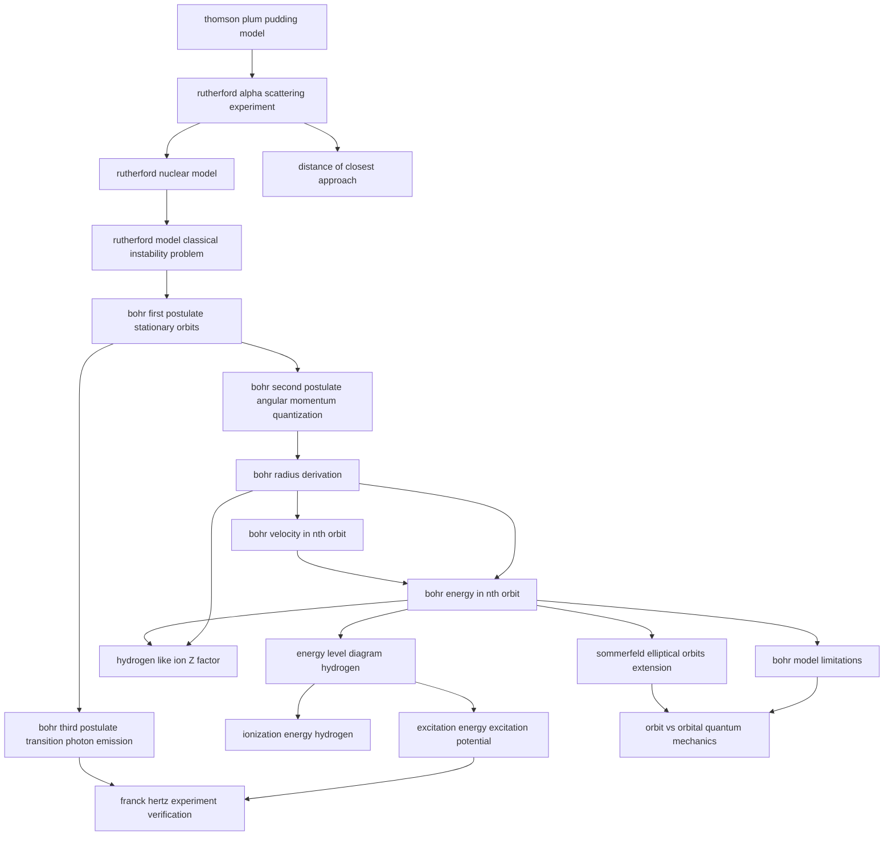

# T47 — Atomic Models  *(Class 12)*

> Dependency-ordered teaching pathway for physics-teacher review.
> **19 atomic + 5 nano = 24 concept-simulations.**

**How to use this:** teach top-to-bottom. Everything in a level only depends on earlier levels. Each **atomic** is a full teachable idea (= one simulation); the **↳ nanos** under it are its sub-points (one symbol / term / edge-case each).

**Foundations (teach first, nothing in this chapter comes before them):** thomson_plum_pudding_model

## Concept dependency graph (atomic backbone)

## Teaching pathway (dependency-ordered)

### Level 0 — foundations

- **`thomson_plum_pudding_model`** — Atom = positive sphere with electrons embedded like seeds in a watermelon (J.J. Thomson 1898)

### Level 1

- **`rutherford_alpha_scattering_experiment`** — Geiger-Marsden 1911 gold-foil setup; 5.5 MeV α from ²¹⁴Bi source; ZnS scintillation screen; observation that ~1 in 8000 deflected >90°

### Level 2

- **`rutherford_nuclear_model`** — All positive charge + most of mass concentrated in tiny nucleus (10⁻¹⁵ m); electrons orbit in surrounding empty space (10⁻¹⁰ m atomic radius)
- **`distance_of_closest_approach`** — d = 2Ze²/(4πε₀K); for 7.7 MeV α + gold (Z=79): d ≈ 3.0 × 10⁻¹⁴ m. Upper bound on nuclear radius.

### Level 3

- **`rutherford_model_classical_instability_problem`** — Classical EM theory: accelerating electron radiates → spirals into nucleus in ~10⁻⁸ s. Atoms shouldn't exist.

### Level 4

- **`bohr_first_postulate_stationary_orbits`** — Electron revolves in certain stable orbits WITHOUT emitting radiation (defies classical EM); these are "stationary states"

### Level 5

- **`bohr_second_postulate_angular_momentum_quantization`** — L = nh/2π; angular momentum is integer multiple of h/2π; n = principal quantum number
- **`bohr_third_postulate_transition_photon_emission`** — Electron jumps from higher energy E_i to lower E_f emitting photon of frequency ν: hν = E_i − E_f

### Level 6

- **`bohr_radius_derivation`** — Combining postulate 2 + Coulomb's law: rₙ = (n²/m)(h/2π)²(4πε₀/e²); a₀ = r₁ = 5.29 × 10⁻¹¹ m (Bohr radius); rₙ ∝ n²

### Level 7

- **`bohr_velocity_in_nth_orbit`** — vₙ = e/√(4πε₀mrₙ) = (1/n)(e²/4πε₀)(1/(h/2π)); v ∝ 1/n; v₁/c ≈ 1/137 (fine structure constant!)

### Level 8

- **`bohr_energy_in_nth_orbit`** — Eₙ = K + U = −me⁴/(8ε₀²h²n²) = −13.6/n² eV; ground state E₁ = −13.6 eV

### Level 9

- **`energy_level_diagram_hydrogen`** — E₁ = −13.6 eV, E₂ = −3.4 eV, E₃ = −1.51 eV, E₄ = −0.85 eV; levels converge to 0 at n = ∞; visualization
- **`hydrogen_like_ion_Z_factor`** — For He⁺, Li²⁺ (one electron, Z protons): rₙ = a₀n²/Z; Eₙ = −13.6 Z²/n² eV; vₙ proportional to Z/n
- **`bohr_model_limitations`** — (1) Only one-electron atoms work; (2) cannot explain fine structure splittings; (3) no intensity predictions; (4) no Zeeman effect; (5) violates uncertainty principle
- **`sommerfeld_elliptical_orbits_extension`** — Circular orbits → elliptical (under inverse-square force); same energy formula holds; introduces orbital angular momentum quantum number ℓ

### Level 10

- **`ionization_energy_hydrogen`** — Energy to take electron from ground state to ∞: 13.6 eV. Ionization potential = 13.6 V.
- **`excitation_energy_excitation_potential`** — Energy to raise atom from ground state to nth excited state. H first excited (n=2): E₂ − E₁ = 10.2 eV; potential = 10.2 V
- **`orbit_vs_orbital_quantum_mechanics`** — Bohr "orbit" = definite circular path. Quantum mechanics "orbital" = probability cloud ψ(r,t); ψ² is probability density

### Level 11

- **`franck_hertz_experiment_verification`** — Mercury vapor + variable-energy electron beam; energy absorbed only in discrete jumps (4.9 eV first); emitted at λ = 253 nm. Nobel 1925.

### Other sub-concepts (parent atomic is in another chapter)

  - ↳ `alpha_particle_impact_parameter_trajectory` — Trajectory of α depends on impact parameter b: small b → large deflection; large b → small deflection; head-on → 180° rebound
  - ↳ `atom_vs_solar_system_analogy_breaks` — NCERT Example 12.1: if atom scaled to solar system, electron would be 100× farther than Earth from Sun
  - ↳ `continuous_spectrum_prediction_failure` — Classical: spiraling electron emits continuous spectrum. Observation: hydrogen emits discrete line spectrum. Disagreement.
  - ↳ `de_broglie_wave_interpretation` — Standing-wave condition 2πr = nλ + de Broglie λ = h/p gives mvr = nh/2π — Bohr postulate as de Broglie matter-wave standing-wave
  - ↳ `probability_density_psi_squared` — P(r)dr = |ψ|² dV; for ground state hydrogen, P(r) peaks at r = a₀ (matches Bohr radius!)
