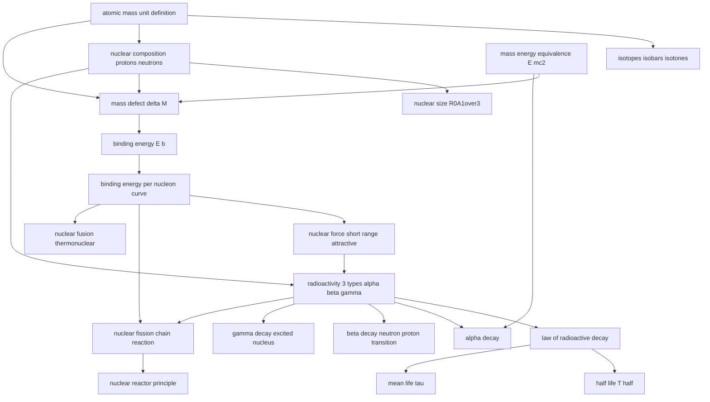

# T48 — Nuclei  *(Class 12)*

> Dependency-ordered teaching pathway for physics-teacher review.
> **19 atomic + 6 nano = 25 concept-simulations.**

**How to use this:** teach top-to-bottom. Everything in a level only depends on earlier levels. Each **atomic** is a full teachable idea (= one simulation); the **↳ nanos** under it are its sub-points (one symbol / term / edge-case each).

**Foundations (teach first, nothing in this chapter comes before them):** atomic_mass_unit_definition, mass_energy_equivalence_E_mc2

## Concept dependency graph (atomic backbone)

## Teaching pathway (dependency-ordered)

### Level 0 — foundations

- **`atomic_mass_unit_definition`** — 1u = (mass of ¹²C atom)/12 = 1.6605 × 10⁻²⁷ kg; m_p = 1.00727 u; m_n = 1.00866 u; m_e = 0.00055 u
- **`mass_energy_equivalence_E_mc2`** — Einstein 1905: E = mc². 1 u ≡ 931.5 MeV. Energy "stored" in mass; convertible

### Level 1

- **`isotopes_isobars_isotones`** — Isotopes: same Z, different N (¹H, ²H, ³H); Isobars: same A, different Z (³H, ³He); Isotones: same N, different Z (¹⁹⁸Hg, ¹⁹⁷Au)
- **`nuclear_composition_protons_neutrons`** — Nucleus = Z protons + N neutrons; A = Z + N (mass number); chemical identity from Z (atomic number)

### Level 2

- **`nuclear_size_R0A1over3`** — R = R₀ A^(1/3) with R₀ = 1.2 fm = 1.2 × 10⁻¹⁵ m. Volume ∝ A. Universal across all nuclei
- **`mass_defect_delta_M`** — ΔM = [Z·m_p + (A−Z)·m_n] − M_nucleus. Always positive. The "missing mass" went into binding

### Level 3

- **`binding_energy_E_b`** — E_b = ΔM·c². Energy needed to break nucleus into separate nucleons. Measures nuclear stability

### Level 4

- **`binding_energy_per_nucleon_curve`** — E_bn = E_b/A. Plot vs A: peaks ~8.75 MeV at A=56 (Fe), drops to ~7.6 MeV at A=238 (U). Light nuclei A<30 + heavy A>170 have lower E_bn

### Level 5

- **`nuclear_force_short_range_attractive`** — Strong, short-range (~few fm), attractive at r > 0.8 fm, repulsive at r < 0.8 fm. Independent of charge (n-p, p-p, n-n all same). Much stronger than EM
- **`nuclear_fusion_thermonuclear`** — Light nuclei (²H + ³H → ⁴He + n + 17.6 MeV) fuse at extreme T (~10⁸ K) into heavier nuclei. Releases energy because product has higher E_bn. Sun's energy source

### Level 6

- **`radioactivity_3_types_alpha_beta_gamma`** — Unstable nuclei spontaneously decay via: α (helium nucleus ⁴He), β (electron/positron), γ (high-energy photon)

### Level 7

- **`law_of_radioactive_decay`** — dN/dt = −λN; N(t) = N₀ e^(−λt). λ = decay constant. Activity R = λN = R₀ e^(−λt)
- **`alpha_decay`** — ᴬZX → ᴬ⁻⁴_{Z−2}Y + ⁴₂He. Mass number drops 4, atomic number drops 2. Q-value = (m_X − m_Y − m_He)c²
- **`beta_decay_neutron_proton_transition`** — β⁻: n → p + e⁻ + ν̄ (Z→Z+1, A unchanged); β⁺: p → n + e⁺ + ν (Z→Z−1, A unchanged). Neutrino preserves energy-momentum conservation
- **`gamma_decay_excited_nucleus`** — Excited daughter nucleus (after α or β decay) emits γ-photon to reach ground state. Z, A unchanged. Energies hundreds of keV to MeV
- **`nuclear_fission_chain_reaction`** — Heavy nucleus (²³⁵U, ²³⁹Pu) absorbs neutron → splits into 2 medium nuclei + 2-3 neutrons + ~200 MeV. Neutrons cause further fissions = chain reaction

### Level 8

- **`half_life_T_half`** — T_{1/2} = ln2/λ ≈ 0.693/λ. Time for N to halve. After n half-lives, N/N₀ = (1/2)ⁿ
- **`mean_life_tau`** — τ = 1/λ; time at which N drops to N₀/e. T_{1/2} = τ·ln2 ≈ 0.693τ. Distinct from half-life
- **`nuclear_reactor_principle`** — Controlled fission: fuel (²³⁵U) + moderator (D₂O, graphite) slows neutrons + control rods (Cd, B) absorb excess neutrons + coolant extracts heat → drives turbine

### Other sub-concepts (parent atomic is in another chapter)

  - ↳ `free_neutron_unstable_inside_stable` — Free neutron decays in ~1000s (β⁻ → proton + e⁻ + ν̄); but stable inside nucleus due to nuclear force
  - ↳ `nuclear_density_constant` — ρ_nuclear = mass/volume = A·u / [(4/3)π R₀³ A] = constant ≈ 2.3 × 10¹⁷ kg/m³. **Independent of A.** Comparable to neutron star density
  - ↳ `activity_unit_becquerel_curie` — 1 Bq = 1 decay/sec; 1 Ci = 3.7 × 10¹⁰ Bq (older unit).
  - ↳ `indian_nuclear_power_program` — Tarapur 1969 (TAPS) + Kakrapar + Rawatbhata + Kudankulam (Indo-Russian) + Madras Atomic Power Station + Kaiga. ~7-8 GW installed. AERB regulator. BARC Mumbai R&D.
  - ↳ `stellar_nucleosynthesis_pp_chain` — Sun: 4 protons → ⁴He + 2e⁺ + 2ν + 26.7 MeV via p-p chain reactions. Source of all sunlight
  - ↳ `iter_india_fusion_program` — India is one of 7 partners in **ITER (Cadarache, France)** — fusion reactor under construction. **IPR Gandhinagar** is India's fusion R&D lead. SST-1 tokamak operational
