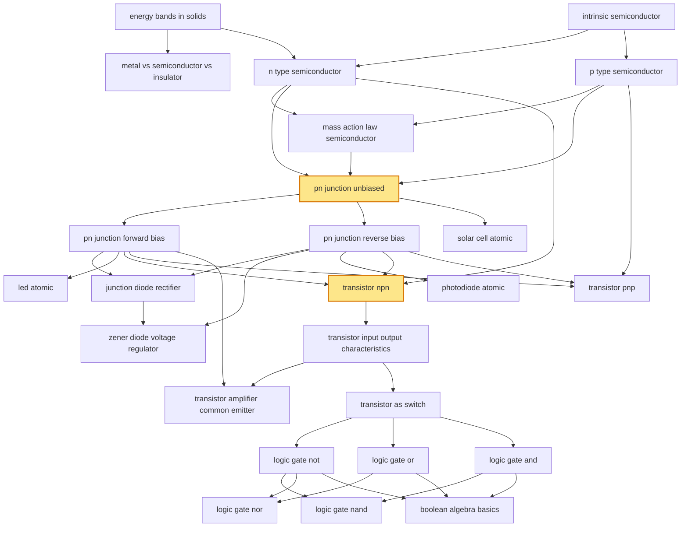

# T49 — Semiconductor  *(Class 12)*

> Dependency-ordered teaching pathway for physics-teacher review.
> **25 atomic + 16 nano = 41 concept-simulations.**  2 💎 diamond (highest-impact).

**How to use this:** teach top-to-bottom. Everything in a level only depends on earlier levels. Each **atomic** is a full teachable idea (= one simulation); the **↳ nanos** under it are its sub-points (one symbol / term / edge-case each).

**Foundations (teach first, nothing in this chapter comes before them):** energy_bands_in_solids, intrinsic_semiconductor

## Concept dependency graph (atomic backbone)

## Teaching pathway (dependency-ordered)

### Level 0 — foundations

- **`energy_bands_in_solids`** — Valence band, conduction band, energy gap in crystalline solids
  - ↳ `band_gap_metal` — Overlapping VB/CB → free electrons at 0 K
  - ↳ `band_gap_semiconductor` — Eg ≈ 1.1 eV (Si), 0.7 eV (Ge) — thermally bridgeable
  - ↳ `band_gap_insulator` — Eg > 3 eV — no thermal carriers
- **`intrinsic_semiconductor`** — Pure Si/Ge — electron-hole pair generation, n_e = n_h = n_i
  - ↳ `hole_concept_nano` — "Hole" = missing electron in covalent bond, behaves as +q carrier
  - ↳ `thermal_generation_recombination` — Pair generation + recombination dynamic equilibrium

### Level 1

- **`metal_vs_semiconductor_vs_insulator`** — Three-band-diagram side-by-side classification
- **`n_type_semiconductor`** — Pentavalent dopant (P, As, Sb) → donor level → electron majority
  - ↳ `donor_level_nano` — Donor energy state just below CB
- **`p_type_semiconductor`** — Trivalent dopant (B, Al, Ga, In) → acceptor level → hole majority
  - ↳ `acceptor_level_nano` — Acceptor energy state just above VB

### Level 2

- **`mass_action_law_semiconductor`** — n_e × n_h = n_i² at thermal equilibrium

### Level 3

- **`pn_junction_unbiased`** 💎 — Depletion region formation, built-in potential V_bi, no external current
  - ↳ `depletion_region_nano` — Charged ion-core region devoid of mobile carriers
  - ↳ `built_in_potential_nano` — V_bi ≈ 0.3 V (Ge), 0.7 V (Si)

### Level 4

- **`pn_junction_forward_bias`** — p→+, n→−; depletion narrows; majority carriers flow; exponential I-V above V_knee
- **`pn_junction_reverse_bias`** — p→−, n→+; depletion widens; tiny reverse saturation current I_s; breakdown at V_z
  - ↳ `reverse_saturation_current_nano` — I_s ≈ μA (Ge), nA (Si); temperature-doubles-per-10°C
- **`solar_cell_atomic`** — Large-area pn junction, no external bias; photogenerated EHP → V_oc + I_sc
  - ↳ `open_circuit_voltage_nano` — V_oc ≈ 0.5-0.7 V per Si cell
  - ↳ `short_circuit_current_nano` — I_sc proportional to incident intensity

### Level 5

- **`junction_diode_rectifier`** — Half-wave + full-wave (centre-tap + bridge) rectifier circuits
  - ↳ `half_wave_rectifier_nano` — One diode, 50% utilization, ripple frequency = supply
  - ↳ `full_wave_bridge_nano` — Four diodes, 100% utilization, ripple frequency = 2× supply
- **`led_atomic`** — Forward-biased direct-bandgap junction emits photons at hν ≈ Eg
- **`photodiode_atomic`** — Reverse-biased junction; incident hν > Eg generates measurable photocurrent
- **`transistor_npn`** 💎 — NPN BJT: emitter-base forward, base-collector reverse; α and β current gains
  - ↳ `alpha_beta_relationship_nano` — α = I_C/I_E, β = I_C/I_B, β = α/(1−α)
- **`transistor_pnp`** — PNP variant; current/voltage signs reverse

### Level 6

- **`zener_diode_voltage_regulator`** — Reverse-biased Zener at V_z provides constant output across varying input
- **`transistor_input_output_characteristics`** — I_B-vs-V_BE input curve + I_C-vs-V_CE output curve (CE config)

### Level 7

- **`transistor_amplifier_common_emitter`** — Active-region operation; A_v = −β × (R_C / r_in); 180° phase inversion
  - ↳ `phase_inversion_nano` — Output 180° out of phase with input — Class 12 board mark
- **`transistor_as_switch`** — Operating in cutoff (OFF) or saturation (ON) — never linear active

### Level 8

- **`logic_gate_not`** — NOT: output = NOT input; single transistor inverter
- **`logic_gate_or`** — OR: output = A + B; truth table 4 rows
- **`logic_gate_and`** — AND: output = A · B

### Level 9

- **`logic_gate_nand`** — NAND: output = NOT(A·B); universal gate
- **`logic_gate_nor`** — NOR: output = NOT(A+B); universal gate
- **`boolean_algebra_basics`** — Identity laws, commutation, De Morgan's theorems
