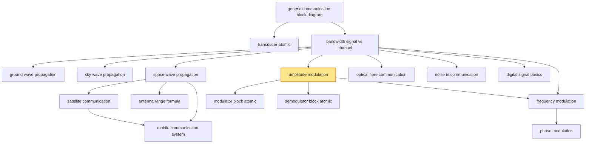

# T50 — Communication Systems  *(Class 12)*

> Dependency-ordered teaching pathway for physics-teacher review.
> **17 atomic + 7 nano = 24 concept-simulations.**  1 💎 diamond (highest-impact).

**How to use this:** teach top-to-bottom. Everything in a level only depends on earlier levels. Each **atomic** is a full teachable idea (= one simulation); the **↳ nanos** under it are its sub-points (one symbol / term / edge-case each).

**Foundations (teach first, nothing in this chapter comes before them):** generic_communication_block_diagram

## Concept dependency graph (atomic backbone)

## Teaching pathway (dependency-ordered)

### Level 0 — foundations

- **`generic_communication_block_diagram`** — Message → transducer → modulator → channel → demodulator → transducer → receiver

### Level 1

- **`transducer_atomic`** — Energy converter at input/output (mic → e-signal; speaker → sound)
- **`bandwidth_signal_vs_channel`** — Signal bandwidth = max(f) − min(f); channel bandwidth = capacity available
  - ↳ `audio_bandwidth_nano` — Speech ≈ 3 kHz, music ≈ 20 kHz
  - ↳ `video_bandwidth_nano` — TV signal ≈ 4.2 MHz; HDTV ≈ 6 MHz

### Level 2

- **`ground_wave_propagation`** — Surface-following EM wave; <2 MHz; AM medium-wave broadcast
- **`sky_wave_propagation`** — Ionospheric reflection; 2-30 MHz; HF amateur, defence comms
- **`space_wave_propagation`** — Line-of-sight; >30 MHz; FM, TV, microwave
- **`amplitude_modulation`** 💎 — Carrier amplitude varied with message; c(t) = (A_c + A_m sin ω_m t) sin ω_c t
  - ↳ `modulation_index_nano` — μ = A_m / A_c; μ < 1 to avoid distortion
  - ↳ `am_sidebands_nano` — (f_c − f_m) lower sideband + (f_c + f_m) upper sideband; bandwidth = 2 f_m
- **`optical_fibre_communication`** — TIR-guided light pulses in glass fibre; LED/laser source + photodiode detector
  - ↳ `acceptance_angle_nano` — Maximum cone angle for TIR-guided propagation
  - ↳ `fibre_bandwidth_advantage_nano` — THz-range channel bandwidth vs MHz copper
- **`noise_in_communication`** — Thermal + shot + atmospheric noise sources; SNR concept
- **`digital_signal_basics`** — Discrete-level encoding (binary); sampling theorem (advisory)

### Level 3

- **`satellite_communication`** — Geostationary uplink/downlink; transponder; coverage footprint
- **`antenna_range_formula`** — Line-of-sight range: d = √(2hR); d_LOS = √(2h_T R) + √(2h_R R)
  - ↳ `height_of_antenna_nano` — Mathematical derivation from Pythagoras on curved Earth
- **`frequency_modulation`** — Carrier frequency varied with message amplitude; better SNR than AM
- **`modulator_block_atomic`** — Combines message with carrier; uses non-linear element (diode or transistor) + tuned circuit
- **`demodulator_block_atomic`** — Recovers message from modulated carrier; envelope detector (diode + RC filter)

### Level 4

- **`phase_modulation`** — Carrier phase varied with message; mathematically equivalent to FM after derivative
- **`mobile_communication_system`** — Cellular cell structure, frequency reuse, handover
