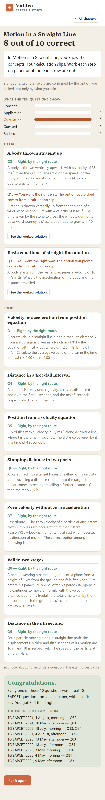
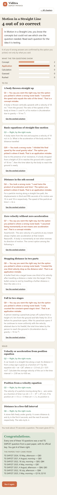
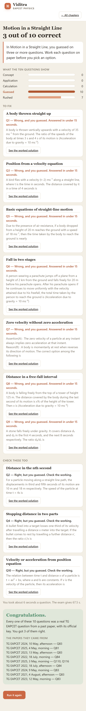
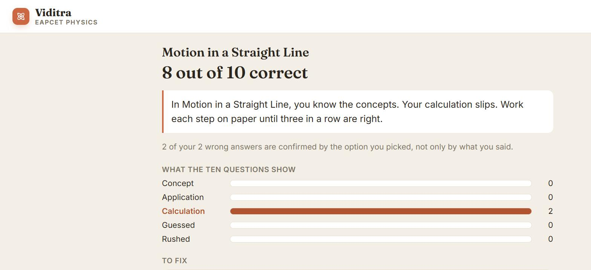

# Three students on Motion in a Straight Line (p1-02) — 2026-09-09

Release built 2026-09-09T03:29:22+02:00; 15 verified questions, 15 with audited routes, 9 shapes. Every student below is a rule over the public facts of a question, so what the app must conclude is derived from the draw, not typed in. The run is played with a test clock (each student's time per question is exact) and a pinned draw, so it replays byte for byte.

## How to replay a student on your phone

1. Open the site in a fresh private window (a new device gets its own draw — the sheet below covers every pool question, so any draw works).
2. Physics → Motion in a Straight Line.
3. For each question on screen, find its row in the student's sheet by the first words. Tap the option the row says, then the route text the row says.
4. Pradeep and Rahul wait more than 15 seconds before each answer; Yashwanth answers within 15 seconds.
5. Compare the result screen with the student's truth table. The last line of each student says for how many of the possible draws the truth holds.

## Pradeep — knows the physics, slips on numbers

**Designed truth:** weakness = calculation (when two or more of his slips are drawn); no mismatches; every wrong answer confirmed by its option. Time per question: 45 s.

### Answer sheet (every pool question, in pool order)

| # | Question (first words) | Tap option | Then tap | Expected outcome |
|---|---|---|---|---|
| 1 | A stone falls freely under gravity. It covers distance… ◀ drawn | (1) 8 | “I subtracted the first four seconds from the total by twelve” | solid |
| 2 | Assertion(A) : The zero velocity of a particle at… ◀ drawn | (4) (A) is false but (R) is true | “I tested it on a ball at the top of its throw” | solid |
| 3 | The ratio of the displacements of a freely falling… | (2) 1:3:5 | “I found the distance in each second using the odd-number rule” | solid |
| 4 | A stone is thrown vertically up from the top… ◀ drawn | (3) 1.0 s | “I used the return speed to time the fall through the window” | slip |
| 5 | Due to the presence of air resistance, if a… | (1) 2.2 s | “I used the average of the initial and final speeds” | solid |
| 6 | The velocity of a particle moving along the x… | (3) 4 m | “I integrated the velocity function to get the position” | slip |
| 7 | A body starts from the rest and acquires a… ◀ drawn | (2) 5 m/s² and 5 m | “I found the acceleration first and then the distance” | slip |
| 8 | The relation between time t and distance x of… | (3) −2av³ | “I multiplied the derivative of velocity by velocity itself” | solid |
| 9 | A body is falling freely from the top of… | (1) 9 | “I used the nth-second formula including the g factor” | slip |
| 10 | A person wearing a parachute jumps off a plane… ◀ drawn | (2) 101 s | “I added the free-fall time to the constant-speed time” | solid |
| 11 | A car travels in a straight line along a… ◀ drawn | (1) 2.28 m/s | “I divided the change in position by the change in time” | solid |
| 12 | A bullet fired into a target losses one-third of… ◀ drawn | (3) 4/5 | “I applied the same speed-distance equation to both stages” | solid |
| 13 | A bird flies with a velocity (t−2) ms⁻¹ along… ◀ drawn | (2) 4 m | “I split the motion at the reversal point and added distances” | solid |
| 14 | A body is thrown vertically upwards with a velocity… ◀ drawn | (2) 1 : 1 | “I evaluated the velocity at both times and compared their sizes” | solid |
| 15 | For a particle moving along a straight line path,… ◀ drawn | (3) 16 ms⁻¹ | “I used v equals u plus at, evaluated at the fourth second” | solid |

### What the app said (seed `student-pradeep`, draw 11, 14, 7, 1, 13, 12, 2, 10, 15, 4)



```text
Motion in a Straight Line
8 out of 10 correct

In Motion in a Straight Line, you know the concepts. Your calculation slips. Work each step on paper until three in a row are right.

2 of your 2 wrong answers are confirmed by the option you picked, not only by what you said.

WHAT THE TEN QUESTIONS SHOW
Concept
0
Application
0
Calculation
2
Guessed
0
Rushed
0
TO FIX
A body thrown straight up
Q2 — Right, by the right route.
A body is thrown vertically upwards with a velocity of 35 ms⁻¹ from the ground. The ratio of the speeds of the body at times 3 s and 4 s of its motion is (Acceleration due to gravity = 10 ms⁻²)
Q10 — You went the right way. The option you picked comes from a calculation slip.
A stone is thrown vertically up from the top end of a window of height 1.8 m with a velocity of 8 ms⁻¹. The time taken by the stone to cross the window during its downward journey is (Acceleration due to gravity = 10 ms⁻²)
See the worked solution
Basic equations of straight-line motion
Q3 — You went the right way. The option you picked comes from a calculation slip.
A body starts from the rest and acquires a velocity of 10 m/s in 2s. What is the acceleration of the body and the distance travelled
See the worked solution
SOLID
Velocity or acceleration from position equation
Q1 — Right, by the right route.
A car travels in a straight line along a road. Its distance 'x' from a stop sign is given as a function of 't' by the equation x(t) = αt + βt³, where α = 2.0 m/s, β = 0.01 m/s³. Calculate the average velocity of the car in the time interval t = 2.00 sec to 4.00 sec.
Distance in a free-fall interval
Q4 — Right, by the right route.
A stone falls freely under gravity. It covers distance d₁ and d₂ in the first 4 seconds, and the next 8 seconds respectively. The ratio d₂/d₁ is
Position from a velocity equation
Q5 — Right, by the right route.
A bird flies with a velocity (t−2) ms⁻¹ along a straight line, where t is the time in seconds. The distance covered by it in a time of 4 seconds is
Stopping distance in two parts
Q6 — Right, by the right route.
A bullet fired into a target losses one-third of its velocity after travelling a distance x meter into the target. If the bullet comes to rest by travelling a further distance x′, then the ratio x′/x is
Zero velocity without zero acceleration
Q7 — Right, by the right route.
Assertion(A) : The zero velocity of a particle at any instant always implies zero acceleration at that instant. Reason(R) : A body is momentarily at rest when reverses its direction of motion. The correct option among the following is
Fall in two stages
Q8 — Right, by the right route.
A person wearing a parachute jumps off a plane from a height of 2 km from the ground and falls freely for 20 m before his parachute opens. After his parachute opens if he continues to move uniformly with the velocity attained due to his freefall, the total time taken by the person to reach the ground is (Acceleration due to gravity = 10 ms⁻²)
Distance in the nth second
Q9 — Right, by the right route.
For a particle moving along a straight line path, the displacements in third and fifth seconds of its motion are 10 m and 18 m respectively. The speed of the particle at time t = 4s is

You took about 45 seconds a question. The exam gives 67.5 s.

Congratulations.

Every one of these 10 questions was a real TG EAPCET question from a past paper, with its official key. You got 8 of them right.

THE PAPERS THEY CAME FROM
TG EAPCET 2021, 4 August, morning — Q83
TG EAPCET 2024, 10 May, afternoon — Q83
TG EAPCET 2022, 18 July, morning — Q83, Q84
TG EAPCET 2021, 4 August, afternoon — Q83
TG EAPCET 2023, 13 May, afternoon — Q83
TG EAPCET 2022, 18 July, afternoon — Q84
TG EAPCET 2025, 3 May, morning — Q116
TG EAPCET 2025, 4 May, morning — Q81
TG EAPCET 2024, 9 May, afternoon — Q83
Run it again
```

### Truth against verdict

| Field | Derived for this draw | App said | Match |
|---|---|---|---|
| weakness | calculation | calculation | yes |
| concept | 0 | 0 | yes |
| application | 0 | 0 | yes |
| calculation | 2 | 2 | yes |
| guessed | 0 | 0 | yes |
| rushed | 0 | 0 | yes |
| mismatches | 0 | 0 | yes |
| confirmed / wrong | 2 / 2 | 2 / 2 | yes |
| score | 8 | 8 | yes |

Shapes on the result: Velocity or acceleration from position equation (solid); A body thrown straight up (fix); Basic equations of straight-line motion (fix); Distance in a free-fall interval (solid); Position from a velocity equation (solid); Stopping distance in two parts (solid); Zero velocity without zero acceleration (solid); Fall in two stages (solid); Distance in the nth second (solid).

Sibling retry from tg_eapcet_2022_20220718_fn_q083: shape `basic_equations_of_motion`, same shape true, picked (1), route `r` → right. The app said: “1 of 3 right by the right route in a row.”.

What the page sent Vidi (ids and enums only): `{"question_id":"tg_eapcet_2022_20220718_fn_q083","picked":2,"route":"r","solid_shapes":["velocity_from_position_equation","free_fall_interval_distance","position_from_velocity_equation","deceleration_two_segment_ratio","zero_velocity_nonzero_acceleration","multi_phase_vertical_motion","nth_second_distance"],"weak_shapes":["vertical_projectile_up_and_down","basic_equations_of_motion"],"streak":0}`.

**Holds for every draw?** 3003 of 3003 possible ten-question draws of this chapter give Pradeep the designed verdict.

## Rahul — confident, with wrong concepts

**Designed truth:** weakness = concept or application (whichever his picks make larger; a tie goes to concept); at least one mismatch; zero calculation. Time per question: 70 s.

### Answer sheet (every pool question, in pool order)

| # | Question (first words) | Tap option | Then tap | Expected outcome |
|---|---|---|---|---|
| 1 | A stone falls freely under gravity. It covers distance… ◀ drawn | (1) 8 | “I subtracted the first four seconds from the total by twelve” | solid |
| 2 | Assertion(A) : The zero velocity of a particle at… ◀ drawn | (1) (A) is true, (R) is true and (R) is the correct explanation for (A) | “I tested it on a ball at the top of its throw” | wrong_route (mismatch) |
| 3 | The ratio of the displacements of a freely falling… | (1) 1:1:1 | “I assumed the body covers equal distance every second” | wrong_route |
| 4 | A stone is thrown vertically up from the top… | (1) 0.8 s | “I used the return speed to time the fall through the window” | wrong_route (mismatch) |
| 5 | Due to the presence of air resistance, if a… ◀ drawn | (3) 1.8 s | “I divided the final speed by the usual gravity value” | wrong_route |
| 6 | The velocity of a particle moving along the x… ◀ drawn | (2) 2 m | “I integrated the velocity function to get the position” | solid |
| 7 | A body starts from the rest and acquires a… ◀ drawn | (1) 5 m/s² and 10 m | “I found the acceleration first and then the distance” | solid |
| 8 | The relation between time t and distance x of… | (3) −2av³ | “I multiplied the derivative of velocity by velocity itself” | solid |
| 9 | A body is falling freely from the top of… | (2) 36 | “I used the nth-second formula including the g factor” | solid |
| 10 | A person wearing a parachute jumps off a plane… ◀ drawn | (1) 99 s | “I added the free-fall time to the constant-speed time” | wrong_route (mismatch) |
| 11 | A car travels in a straight line along a… ◀ drawn | (1) 2.28 m/s | “I divided the change in position by the change in time” | solid |
| 12 | A bullet fired into a target losses one-third of… ◀ drawn | (2) 1/3 | “I applied the same speed-distance equation to both stages” | wrong_route (mismatch) |
| 13 | A bird flies with a velocity (t−2) ms⁻¹ along… | (1) 2 m | “I stopped after finding only the first stage's distance” | wrong_route |
| 14 | A body is thrown vertically upwards with a velocity… ◀ drawn | (1) 3 : 4 | “I evaluated the velocity at both times and compared their sizes” | wrong_route (mismatch) |
| 15 | For a particle moving along a straight line path,… ◀ drawn | (1) 32 ms⁻¹ | “I used twice the product of acceleration and time” | wrong_route |

### What the app said (seed `student-rahul`, draw 14, 11, 7, 15, 6, 1, 2, 12, 10, 5)



```text
Motion in a Straight Line
4 out of 10 correct

In Motion in a Straight Line, you know the concepts but could not see which one the question needed. Read each question for the idea it is testing.

6 of your 6 wrong answers are confirmed by the option you picked, not only by what you said.

WHAT THE TEN QUESTIONS SHOW
Concept
2
Application
4
Calculation
0
Guessed
0
Rushed
0
TO FIX
A body thrown straight up
Q1 — You say you went the right way, but the option you picked is where a wrong route leads: “I assumed the speed ratio equals the ratio of the times”. That is a concept mistake.
A body is thrown vertically upwards with a velocity of 35 ms⁻¹ from the ground. The ratio of the speeds of the body at times 3 s and 4 s of its motion is (Acceleration due to gravity = 10 ms⁻²)
See the worked solution
Basic equations of straight-line motion
Q3 — Right, by the right route.
A body starts from the rest and acquires a velocity of 10 m/s in 2s. What is the acceleration of the body and the distance travelled
Q10 — You took a wrong route: “I divided the final speed by the usual gravity value”. The option you picked is where it leads. That is an application mistake.
Due to the presence of air resistance, if a body dropped from a height of 20 m reaches the ground with a speed of 18 ms⁻¹, then the time taken by the body to reach the ground is nearly
See the worked solution
Distance in the nth second
Q4 — You took a wrong route: “I used twice the product of acceleration and time”. The option you picked is where it leads. That is an application mistake.
For a particle moving along a straight line path, the displacements in third and fifth seconds of its motion are 10 m and 18 m respectively. The speed of the particle at time t = 4s is
See the worked solution
Zero velocity without zero acceleration
Q7 — You say you went the right way, but the option you picked is where a wrong route leads: “I assumed being momentarily at rest means zero acceleration too”. That is a concept mistake.
Assertion(A) : The zero velocity of a particle at any instant always implies zero acceleration at that instant. Reason(R) : A body is momentarily at rest when reverses its direction of motion. The correct option among the following is
See the worked solution
Stopping distance in two parts
Q8 — You say you went the right way, but the option you picked is where a wrong route leads: “I treated the one-third velocity drop as the distance ratio”. That is an application mistake.
A bullet fired into a target losses one-third of its velocity after travelling a distance x meter into the target. If the bullet comes to rest by travelling a further distance x′, then the ratio x′/x is
See the worked solution
Fall in two stages
Q9 — You say you went the right way, but the option you picked is where a wrong route leads: “I only counted the constant-speed stage's time”. That is an application mistake.
A person wearing a parachute jumps off a plane from a height of 2 km from the ground and falls freely for 20 m before his parachute opens. After his parachute opens if he continues to move uniformly with the velocity attained due to his freefall, the total time taken by the person to reach the ground is (Acceleration due to gravity = 10 ms⁻²)
See the worked solution
SOLID
Velocity or acceleration from position equation
Q2 — Right, by the right route.
A car travels in a straight line along a road. Its distance 'x' from a stop sign is given as a function of 't' by the equation x(t) = αt + βt³, where α = 2.0 m/s, β = 0.01 m/s³. Calculate the average velocity of the car in the time interval t = 2.00 sec to 4.00 sec.
Position from a velocity equation
Q5 — Right, by the right route.
The velocity of a particle moving along the x - axis varies as a function of time t as v(t) = (1 − 3t² + 2t³) m/s. If its position at t = 0 is x = 0 then at t = 2 s, its position is
Distance in a free-fall interval
Q6 — Right, by the right route.
A stone falls freely under gravity. It covers distance d₁ and d₂ in the first 4 seconds, and the next 8 seconds respectively. The ratio d₂/d₁ is

You took about 70 seconds a question. The exam gives 67.5 s.

Congratulations.

Every one of these 10 questions was a real TG EAPCET question from a past paper, with its official key. You got 4 of them right.

THE PAPERS THEY CAME FROM
TG EAPCET 2024, 10 May, afternoon — Q83
TG EAPCET 2021, 4 August, morning — Q83
TG EAPCET 2022, 18 July, morning — Q83, Q84
TG EAPCET 2025, 4 May, morning — Q81
TG EAPCET 2021, 4 August, afternoon — Q84, Q83
TG EAPCET 2022, 18 July, afternoon — Q84
TG EAPCET 2025, 3 May, morning — Q116, Q110
Run it again
```

### Truth against verdict

| Field | Derived for this draw | App said | Match |
|---|---|---|---|
| weakness | application | application | yes |
| concept | 2 | 2 | yes |
| application | 4 | 4 | yes |
| calculation | 0 | 0 | yes |
| guessed | 0 | 0 | yes |
| rushed | 0 | 0 | yes |
| mismatches | 4 | 4 | yes |
| confirmed / wrong | 6 / 6 | 6 / 6 | yes |
| score | 4 | 4 | yes |

Shapes on the result: A body thrown straight up (fix); Velocity or acceleration from position equation (solid); Basic equations of straight-line motion (fix); Distance in the nth second (fix); Position from a velocity equation (solid); Distance in a free-fall interval (solid); Zero velocity without zero acceleration (fix); Stopping distance in two parts (fix); Fall in two stages (fix).

Sibling retry from tg_eapcet_2024_20240510_an_q083: shape `vertical_projectile_up_and_down`, same shape true, picked (1), route `r` → wrong. The app said: “The streak starts again. Right by the right route, three in a row, makes this strong.”.

What the page sent Vidi (ids and enums only): `{"question_id":"tg_eapcet_2024_20240510_an_q083","picked":1,"route":"r","solid_shapes":["velocity_from_position_equation","position_from_velocity_equation","free_fall_interval_distance"],"weak_shapes":["vertical_projectile_up_and_down","basic_equations_of_motion","nth_second_distance","zero_velocity_nonzero_acceleration","deceleration_two_segment_ratio","multi_phase_vertical_motion"],"streak":0}`.

**Holds for every draw?** 3002 of 3003 possible ten-question draws of this chapter give Rahul the designed verdict — the exceptions are draws that hold too few of Rahul's target questions.

## Yashwanth — guesses under time pressure

**Designed truth:** weakness = guessed; rushed = every wrong answer; no type named; his score is the number of drawn questions whose key is (3). Time per question: 6 s.

### Answer sheet (every pool question, in pool order)

| # | Question (first words) | Tap option | Then tap | Expected outcome |
|---|---|---|---|---|
| 1 | A stone falls freely under gravity. It covers distance… ◀ drawn | (3) 16 | “I guessed” | guessed_wrong |
| 2 | Assertion(A) : The zero velocity of a particle at… ◀ drawn | (3) (A) is true but (R) is false | “I guessed” | guessed_wrong |
| 3 | The ratio of the displacements of a freely falling… | (3) 1:2:3 | “I guessed” | guessed_wrong |
| 4 | A stone is thrown vertically up from the top… | (3) 1.0 s | “I guessed” | guessed_wrong |
| 5 | Due to the presence of air resistance, if a… ◀ drawn | (3) 1.8 s | “I guessed” | guessed_wrong |
| 6 | The velocity of a particle moving along the x… | (3) 4 m | “I guessed” | guessed_wrong |
| 7 | A body starts from the rest and acquires a… | (3) 5 m/s² and 6 m | “I guessed” | guessed_wrong |
| 8 | The relation between time t and distance x of… ◀ drawn | (3) −2av³ | “I guessed” | guessed_right |
| 9 | A body is falling freely from the top of… ◀ drawn | (3) 25 | “I guessed” | guessed_wrong |
| 10 | A person wearing a parachute jumps off a plane… ◀ drawn | (3) 100 s | “I guessed” | guessed_wrong |
| 11 | A car travels in a straight line along a… | (3) 3.34 m/s | “I guessed” | guessed_wrong |
| 12 | A bullet fired into a target losses one-third of… ◀ drawn | (3) 4/5 | “I guessed” | guessed_right |
| 13 | A bird flies with a velocity (t−2) ms⁻¹ along… ◀ drawn | (3) 6 m | “I guessed” | guessed_wrong |
| 14 | A body is thrown vertically upwards with a velocity… ◀ drawn | (3) 2 : 1 | “I guessed” | guessed_wrong |
| 15 | For a particle moving along a straight line path,… ◀ drawn | (3) 16 ms⁻¹ | “I guessed” | guessed_right |

### What the app said (seed `student-yashwanth`, draw 14, 15, 13, 12, 5, 10, 2, 9, 1, 8)



```text
Motion in a Straight Line
3 out of 10 correct

In Motion in a Straight Line, you guessed on three or more questions. Work each question on paper before you pick an option.

WHAT THE TEN QUESTIONS SHOW
Concept
0
Application
0
Calculation
0
Guessed
10
Rushed
7
TO FIX
A body thrown straight up
Q1 — Wrong, and you guessed. Answered in under 15 seconds.
A body is thrown vertically upwards with a velocity of 35 ms⁻¹ from the ground. The ratio of the speeds of the body at times 3 s and 4 s of its motion is (Acceleration due to gravity = 10 ms⁻²)
See the worked solution
Position from a velocity equation
Q3 — Wrong, and you guessed. Answered in under 15 seconds.
A bird flies with a velocity (t−2) ms⁻¹ along a straight line, where t is the time in seconds. The distance covered by it in a time of 4 seconds is
See the worked solution
Basic equations of straight-line motion
Q5 — Wrong, and you guessed. Answered in under 15 seconds.
Due to the presence of air resistance, if a body dropped from a height of 20 m reaches the ground with a speed of 18 ms⁻¹, then the time taken by the body to reach the ground is nearly
See the worked solution
Fall in two stages
Q6 — Wrong, and you guessed. Answered in under 15 seconds.
A person wearing a parachute jumps off a plane from a height of 2 km from the ground and falls freely for 20 m before his parachute opens. After his parachute opens if he continues to move uniformly with the velocity attained due to his freefall, the total time taken by the person to reach the ground is (Acceleration due to gravity = 10 ms⁻²)
See the worked solution
Zero velocity without zero acceleration
Q7 — Wrong, and you guessed. Answered in under 15 seconds.
Assertion(A) : The zero velocity of a particle at any instant always implies zero acceleration at that instant. Reason(R) : A body is momentarily at rest when reverses its direction of motion. The correct option among the following is
See the worked solution
Distance in a free-fall interval
Q8 — Wrong, and you guessed. Answered in under 15 seconds.
A body is falling freely from the top of a tower of height 125 m. The distance covered by the body during the last second of its motion is x% of the height of the tower. Then x is (Acceleration due to gravity = 10 ms⁻²)
See the worked solution
Q9 — Wrong, and you guessed. Answered in under 15 seconds.
A stone falls freely under gravity. It covers distance d₁ and d₂ in the first 4 seconds, and the next 8 seconds respectively. The ratio d₂/d₁ is
See the worked solution
CHECK THESE TOO
Distance in the nth second
Q2 — Right, but you guessed. Check the working.
For a particle moving along a straight line path, the displacements in third and fifth seconds of its motion are 10 m and 18 m respectively. The speed of the particle at time t = 4s is
See the worked solution
Stopping distance in two parts
Q4 — Right, but you guessed. Check the working.
A bullet fired into a target losses one-third of its velocity after travelling a distance x meter into the target. If the bullet comes to rest by travelling a further distance x′, then the ratio x′/x is
See the worked solution
Velocity or acceleration from position equation
Q10 — Right, but you guessed. Check the working.
The relation between time t and distance x of a particle is t = ax² + bx, where a and b are constants. If v is the velocity of the particle, then its acceleration is
See the worked solution

You took about 6 seconds a question. The exam gives 67.5 s.

Congratulations.

Every one of these 10 questions was a real TG EAPCET question from a past paper, with its official key. You got 3 of them right.

THE PAPERS THEY CAME FROM
TG EAPCET 2024, 10 May, afternoon — Q83
TG EAPCET 2025, 4 May, morning — Q81
TG EAPCET 2023, 13 May, afternoon — Q83
TG EAPCET 2022, 18 July, morning — Q84
TG EAPCET 2025, 3 May, morning — Q110, Q116
TG EAPCET 2022, 18 July, afternoon — Q84
TG EAPCET 2024, 9 May, morning — Q83
TG EAPCET 2021, 4 August, afternoon — Q83
TG EAPCET 2023, 12 May, morning — Q83
Run it again
```

### Truth against verdict

| Field | Derived for this draw | App said | Match |
|---|---|---|---|
| weakness | guessed | guessed | yes |
| concept | 0 | 0 | yes |
| application | 0 | 0 | yes |
| calculation | 0 | 0 | yes |
| guessed | 10 | 10 | yes |
| rushed | 7 | 7 | yes |
| mismatches | 0 | 0 | yes |
| confirmed / wrong | 0 / 7 | 0 / 7 | yes |
| score | 3 | 3 | yes |

Shapes on the result: A body thrown straight up (fix); Distance in the nth second (check); Position from a velocity equation (fix); Stopping distance in two parts (check); Basic equations of straight-line motion (fix); Fall in two stages (fix); Zero velocity without zero acceleration (fix); Distance in a free-fall interval (fix); Velocity or acceleration from position equation (check).

Sibling retry from tg_eapcet_2024_20240510_an_q083: shape `vertical_projectile_up_and_down`, same shape true, picked (3), route `guess` → wrong. The app said: “A guessed answer does not count toward a streak. It still helps to see the working.”.

What the page sent Vidi (ids and enums only): `{"question_id":"tg_eapcet_2024_20240510_an_q083","picked":3,"route":"guess","solid_shapes":[],"weak_shapes":["vertical_projectile_up_and_down","position_from_velocity_equation","basic_equations_of_motion","multi_phase_vertical_motion","zero_velocity_nonzero_acceleration","free_fall_interval_distance"],"streak":0}`.

**Holds for every draw?** 3003 of 3003 possible ten-question draws of this chapter give Yashwanth the designed verdict.

## Cross-checks

- No paper label was visible on any run card or retry card; the fix page names the paper; the result's reveal listed exactly the papers drawn.
- Every route the students tapped is stored as an id; the chat post carried ids and shape keys only, never a phrase.
- Shape labels the students read (founder to confirm): “Distance in a free-fall interval”, “Position from a velocity equation”, “Velocity or acceleration from position equation”, “Distance in the nth second”, “Fall in two stages”, “A body thrown straight up”, “Zero velocity without zero acceleration”, “Basic equations of straight-line motion”, “Stopping distance in two parts”.
## Pradeep, live, on the deployed site (2026-09-09, the founder's team device)

The same rule, played by hand-driven clicks on https://viditra-eapcet.nagapuripradeep02.workers.dev on device `ae890432-ffd7-42b3-a3b8-0fdf6c919971` (marked team and granted), with a real clock: at least 20 seconds on every question. The draw on that device was, in order, 2023-05-12 AN Q83, 2024-05-09 AN Q83, 2021-08-04 AN Q83, 2025-05-03 FN Q110, 2022-07-18 AN Q84, 2022-07-18 FN Q84, 2025-05-03 FN Q116, 2025-05-04 FN Q81, 2021-08-04 AN Q84, 2023-05-12 FN Q83 — one question from each of the nine shapes first, then one more.



**What the page said:** 8 out of 10 correct; "you know the concepts. Your calculation slips."; "2 of your 2 wrong answers are confirmed by the option you picked, not only by what you said."; bars Concept 0 / Application 0 / Calculation 2 / Guessed 0 / Rushed 0; TO FIX held "A body thrown straight up" (Q2 — "You went the right way. The option you picked comes from a calculation slip.") and "Position from a velocity equation" (Q9, the same line); SOLID held the other seven shapes, every item "Right, by the right route."; "You took about 20 seconds a question. The exam gives 67.5 s."; then the reward: "Congratulations. Every one of these 10 questions was a real TG EAPCET question from a past paper, with its official key. You got 8 of them right." and the eight papers they came from. No run card showed a paper name; the fix page did ("TG EAPCET 2024, 9 May, afternoon, Q83").

**What the backend recorded** (read back with SQL, not from the page):

- `ep_runs` (device above, chapter p1-02, finished 01:37:43 UTC): score 8; every one of the ten records carries `route: "r"` with `ms` between 20,167 and 39,287; `diagnosis` stored whole — params `{concept 0, application 0, calculation 2, guessed 0, rushed 0}`, weakness `calculation`, confirmed 2, mismatches 0, outcomes `solid` on eight, `slip` on 2024-05-09 AN Q83 and 2021-08-04 AN Q84.
- `ep_retries`: one row — from 2024-05-09 AN Q83 to its same-shape sibling 2024-05-10 AN Q83, `shape_key: vertical_projectile_up_and_down`, `route: r`, `same_shape: true`, picked (2), correct, 18,993 ms. The retry card showed no paper name; the page said "1 of 3 right by the right route in a row."
- `ai_usage_log` (one Vidi ask on the fix page, "Which step did I get wrong?"): `metadata.route: r`, `shape_key: vertical_projectile_up_and_down`, `weak_shapes: [vertical_projectile_up_and_down, position_from_velocity_equation]`, `solid_shapes`: the other seven keys, `picked: 3`; deepseek-chat, 1.8 s, $0.00097. Vidi's first sentence named the route: "You went the right route — using the return speed to time the fall through the window — but the mistake is in the arithmetic after that."

**One defect found by this walk, fixed and redeployed the same hour:** that ledger row said `mismatch: true` for a calculation-typed option under the right route, where the engine calls it a confirmed slip. The chat function now applies the engine's rule (a calculation or careless option under route `r` is a slip, not a disagreement); a probe of the same pick after the redeploy wrote `mismatch: false` and answered "Your route was right … The slip is in step 3".

